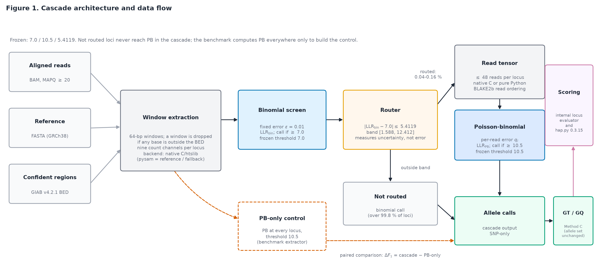
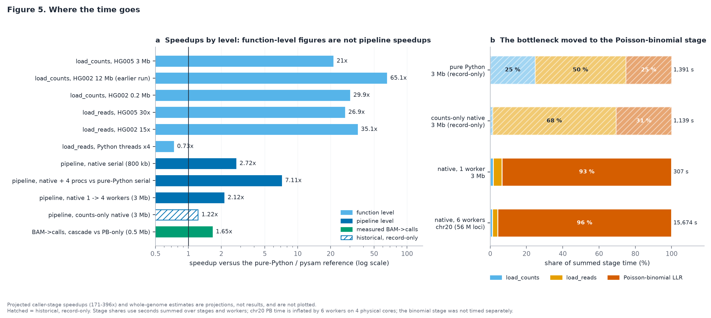

# AI_DNA_ANALYZER

### Adaptive statistical SNP variant calling with confidence-aware compute routing

   

> A cheap binomial screen calls every locus; a fixed router sends only the few loci near its decision boundary to a slower per-read Poisson-binomial model. The project measures whether that saves compute without changing the SNP calls.

**What it does.** Calls SNPs from short-read BAMs (GRCh38), infers genotypes with a closed-form posterior, and benchmarks the result against GIAB truth sets.
**Why it exists.** To test, with frozen constants and pre-registered verdicts, whether confidence routing can approximate an expensive caller.
**Status.** Research code with a frozen protocol (tag `research-freeze-2026-09-20`) and a manuscript. It is not a production caller and has no clinical validity.

> **On the name.** "AI" is historical: the project began as a neural sequence model. On real reads every neural stage was null or negative against the statistical baselines. The final pipeline is a **statistical cascade with no neural network**. It is not a deep-learning caller.



```text
BAM + reference + GIAB confident-region BED
        │
        ▼
64-bp window extraction (native C/htslib, pysam fallback)
        │
        ▼
Binomial screen  (ε = 0.01, call if LLR ≥ 7.0)
        │
   router: |LLR − 7.0| ≤ 5.4119
   ┌────┴─────────────┐
   ▼                  ▼
outside band       inside band (~0.04–0.16 % of loci)
binomial call      read tensor → Poisson-binomial (call if LLR ≥ 10.5)
   └────┬─────────────┘
        ▼
SNP calls → Method C genotype posterior (GT/GQ) → VCF
```

The benchmark extractor computes PB at every locus so that a PB-only control exists for a paired comparison. Routing is therefore an accuracy experiment; it is not yet a measured end-to-end saving (see Performance).

---

## Quick Start

There is **no bundled example dataset** (`data/` is git-ignored). What you can run straight after cloning is the test suite. A real run needs a BAM, a reference and a truth set that you download yourself.

### Requirements

Versions below are those the results were produced with (`research/REPRODUCIBILITY.md`); other versions are untested.

- Linux, x86-64 (developed on Fedora)
- Python 3.14.3, `numpy` 2.4.4, `scipy` 1.17.1, `pysam` 0.24.0; `pytest` for the tests
- For the native backend: `gcc`, Python headers (`python3-devel`) and a system `libhts.so.3` (build script links `-l:libhts.so.3`)
- For data preparation: `samtools`, `bcftools`, `curl`
- For hap.py scoring: Docker (`quay.io/biocontainers/hap.py:0.3.15--py27hcb73b3d_0`)

There is no `requirements.txt`, `pyproject.toml` or Dockerfile; install the packages yourself.

### Install and build

```bash
git clone git@github.com:Kramkost/AI_DNA_ANALYZER.git
cd AI_DNA_ANALYZER
python3 -m venv .venv && source .venv/bin/activate
pip install numpy scipy pysam pytest
bash native/build.sh          # optional but ~27–35x faster read loading
```

`native/build.sh` compiles `pileup_native` and `reads_native` next to the sources and prints `imports OK`. If the modules are missing, the code falls back to pure Python/pysam automatically (same output, much slower).

### Verify the checkout

```bash
python3 -m pytest test_cascade.py test_cheap_router.py test_native_pileup_equivalence.py \
  test_native_reads_equivalence.py test_hg005_extraction_integrity.py \
  test_counts_backend_fuzz.py test_bench_v12.py test_robustness_benchmark.py -q
```

Last run in this checkout: `117 passed, 21 xfailed, 5 xpassed` (about 90 s). The xfails are documented expected failures of the native counts backend on adversarial synthetic BAMs (see Limitations). `test_providers.py` does not currently collect.

### Minimal run on real data (small region)

This needs the inputs from the **Data** section. Paths below follow the layout used by the project scripts; replace them with yours.

```bash
D=data/giab_hg002_chr20
# 1. BAM -> per-locus evidence (counts, reads, Binomial LLR, PB LLR) for a 200-kb window
python3 extract_bench_v12.py \
  --fasta data/reference/chr20_full.fa --bam $D/chr20_15x.bam \
  --vcf $D/chr20.vcf.gz --bed $D/chr20_highconf.bed \
  --contig chr20 --region 33000000 33200000 --chunk-bp 500000 --features none \
  --out cache/smoke.npz

# 2. Frozen cascade + Method C -> VCFs (paths and names set by PIPE_* variables)
mkdir -p out
PIPE_OUT=out PIPE_CACHE=cache/smoke.npz PIPE_TAG=smoke \
  python3 experimental/chr20_validation/run_chr20_pipeline.py
```

The first command took about 35 s on the development machine (4-core desktop, native backend). Expected: a final log line of the form `Wrote cache/smoke.npz | 193792 loci | 203 SNP`. The second writes `out/ai_cascade_smoke.vcf`, `out/ai_pb_only_smoke.vcf`, `out/pipeline_meta_smoke.json` and `out/smoke_calls.npz`; on this window, 203 of 193,763 scored loci (0.10 %) were routed to PB and 204 SNPs were called.

Success means the VCFs contain `chr20 … PASS DP=… GT:GQ` records and the metadata JSON reports the routed fraction. This checks that the pipeline runs; it is not an accuracy result. The pipeline script is the chr20 validation driver reused with environment overrides. It also computes accuracy fields against the truth labels in the cache, so it is a benchmark tool, not a standalone caller that takes only a BAM.

### Full benchmark

Whole-chromosome HG002 chr20 (15×), the run behind the DEGRADED verdict:

```bash
bash experimental/chr20_validation/run_extract_chr20.sh   # BAM -> evidence; WORKERS=6 by default
python3 experimental/chr20_validation/run_chr20_pipeline.py
bash experimental/chr20_validation/run_happy_chr20.sh     # hap.py via Docker
python3 bench_v20_chr20.py                                # paired scoring, verdict
```

Inputs must sit in `data/giab_hg002_chr20/` and `data/reference/chr20_full.fa`. `run_happy_chr20.sh` additionally needs `data/giab_hg002_chr20/shared_ref/chr20_chrname.fa`, a copy of the chr20 FASTA with the contig renamed to `chr20`. Outputs go to `cache/chr20_validation/`, `experimental/chr20_validation/` and `results/bench_v20/`. This chain was **not re-run end to end for this README**; only the extraction and pipeline steps were exercised on a 200-kb window. Frozen outputs and checksums are in `experimental/chr20_validation/FROZEN_MANIFEST.json`. The earlier experiments (`bench_v13` to `bench_v19`) have their own `fetch_*`, `prepare_*` and `run_*_extract.sh` scripts.

---

## Data

**Included in the repository:** code, native sources, tests, research documents and figures, small frozen result files (`results/`, `experimental/*/`), and index files (`*.bai`, `*.tbi`) for the GIAB files.

**External (you download; not in git):**

| Item | Source used by the project |
|---|---|
| HG002 / HG003 / HG004 Illumina 2×250 novoalign BAMs, GRCh38 | GIAB, `ftp-trace.ncbi.nlm.nih.gov/ReferenceSamples/giab/data/AshkenazimTrio/` |
| Truth VCFs and confident-region BEDs (NIST v4.2.1, GRCh38) | GIAB release `.../giab/release/AshkenazimTrio/.../NISTv4.2.1/GRCh38/` |
| HG005 300× alignment (record-only, see Limitations) | GIAB; URLs in `experimental/stress_test/HG005_MANIFEST.json` |
| Reference FASTA | Ensembl release 110 GRCh38 per-chromosome FASTA, `ftp.ensembl.org/pub/release-110/fasta/homo_sapiens/dna/` |

`fetch_v14_data.sh` shows the recipe: `samtools view` of a region from the remote BAM, `bcftools view` of the truth VCF, and a BED cut to the region. Reference recipe: `fetch_v15_reference.sh`. Depth cells are made with `samtools view -s <seed.fraction>`. Whole-chromosome BAMs are large, so allow tens of GB of disk. Hap.py runs need roughly 12 GB free in addition.

---

## Results

Metric: F1 for SNPs; ΔF1 = cascade − PB-only, paired against the PB-only control. The "internal" evaluator (locus-level) and hap.py are **not comparable** with each other. Verdicts follow the pre-registered rule (PRESERVED / IMPROVED / DEGRADED). Source: `research/TABLES_FINAL.md`.

| Sample | Region | Evaluator | PB-only F1 | Cascade F1 | ΔF1 | Routed to PB | Verdict |
|---|---|---|---|---|---|---|---|
| HG002 | chr21 pool (13 regions)† | internal | 0.98162 | 0.98172 | +0.000103 | 0.108 % | PRESERVED (12/13), 1 IMPROVED |
| HG002 | chr20/19/4/1 four 1-Mb windows | internal | 0.955726 | 0.956306 | +0.000581 | 0.070 % | experiment **NEGATIVE** (chr20 1-Mb cell DEGRADED); pooled IMPROVED |
| HG002 | chr16/15/7/14 held out | internal | 0.925079 | 0.927766 | +0.002686 | 0.058 % | IMPROVED |
| HG002 | chr13:70–73 Mb | internal | 0.994600 | 0.994565 | −0.000035 | 0.039 % | PRESERVED |
| HG002 | chr17:18–21 Mb (segdup) | internal | 0.948070 | 0.949962 | +0.001892 | 0.058 % | IMPROVED |
| HG003 | chr13:70–73 Mb | internal | 0.993751 | 0.994013 | +0.000262 | 0.041 % | IMPROVED |
| HG004 | chr2/3/5 (3 Mb each) | internal | 0.986405 | 0.987419 | +0.001014 | 0.041 % | IMPROVED |
| HG002 | **chr20 whole, 15×** | internal | 0.97809 | 0.97803 | −0.0000564 | 0.137 % | **DEGRADED** (10 discordant loci) |
| HG002 | chr20 whole, 15× | hap.py | 0.96285 | 0.96280 | −0.000055 | 0.137 % | n/a |
| HG002 | chr21:32–44 Mb | hap.py | 0.9547 | 0.9546 | −0.00009 | — | n/a |
| HG005 | chr1:1–4 Mb (record-only) | hap.py | 0.9521 | 0.9519 | −0.00024 | 0.067 % | n/a |

† 3 of 13 regions lie inside the span where the constants were fitted.

**Reading it honestly.** Most cells are PRESERVED or IMPROVED, but not all: the v14 chr20 1-Mb cell and whole chr20 are DEGRADED. The chr20 effect is tiny (ΔF1 ≈ −0.0056 percentage points), yet it is a pre-registered DEGRADED verdict and is reported as such. The improvements come mainly from PB false positives in paralogous sequence that the cascade avoids. The cascade also loses some true SNPs: 9 events across v14–v19, 10 including chr20. The project does not claim that accuracy is preserved in every experiment.

Against other callers on one region (HG002 chr21:32–44 Mb, hap.py; not a ranking, and 8 of the 12 Mb overlap the constant-fitting span): AI cascade 0.9546, DeepVariant 1.6.1 0.9494, Clair3 0.9290, GATK 4.5.0.0 0.9682. Runtime of this project's pipeline at that scope was never measured like for like.

---

## Performance

Three different quantities are measured. They must not be combined into one "N× faster" number.

```text
                       Function-level     End-to-end pipeline
Native count stage        21–65×                  —
Native read tensor        26.9–35.1×              —
Pipeline (HG005)             —                  2.72× serial native vs serial Python
Pipeline, 4 processes        —                  7.11× vs serial Python (≈2.6× vs serial native)
```

- Count stage (`load_counts`): 29.9× (HG002 chr21 0.2 Mb), 21.03× (HG005 chr1:1–4 Mb, one call), 65.14× (HG002 chr21:32–44 Mb; from the original build, not re-run).
- Read tensor (`load_reads`): 26.9× on HG005 30×, 35.1× on HG002 15× (0.4 Mb, medians of 3, or n = 2 for the HG002 serial baseline).
- Pipeline, HG005 chr1:1.0–1.8 Mb: 271.7 s → 99.9 s (2.72×) with native serial; 38.2 s with native plus 4 processes (7.11× against pure-Python serial).
- The Poisson-binomial stage is now about 93–96 % of compute, and the Amdahl ceiling for removing read loading is about 3.06× (2.72× observed).
- Routing has been shown to cut end-to-end cost in one measurement only (1.65×, 0.5 Mb). Projected caller-stage speedups (171–396×) and whole-genome hour estimates are extrapolations, not results.
- Native equivalence with pysam: 0 mismatching cells in more than 6.7×10⁸ tensor cells on the validated inputs.



---

## Reproducibility

- **Frozen constants:** binomial threshold 7.0, PB threshold 10.5, router cutoff 5.411872376933351, Method C ε = 0.01. They were selected once on HG002 chr21:32–40 Mb at about 15× and defined in `cascade.py`; they are never refit.
- **Truth and reference:** GIAB NIST v4.2.1, GRCh38, SNP-only; Ensembl r110 FASTA; hap.py 0.3.15 in a pinned Docker image.
- **Determinism:** the extraction and cascade path consumes no random seed. Bootstrap and downsampling seeds are recorded per experiment.
- **Freeze:** git tag `research-freeze-2026-09-20`; hashes of `cascade.py`, `method_c_regression.py` and the native sources are in `research/FINAL_FREEZE_REPORT.md`.
- **Gaps:** no lockfile; HG005 raw artefacts were lost, so those numbers are a preserved record and not freshly reproducible; the full-benchmark chain above was not re-run for this README.

---

## Limitations

- SNP-only. Indels, MNPs and structural variants are out of scope and are not scored.
- HG002, HG003 and HG004 are one family trio (one batch, one pipeline); HG005 is one unrelated sample on 3 Mb. Illumina short reads with novoalign only; GIAB high-confidence regions only.
- chr20 is the same sample, library and depth as the constant-fitting data, and 1 Mb of it was already scored. The HG002 hap.py and external-caller region contains the fitting span.
- The chr20 verdict is DEGRADED and rests on 10 discordant loci. True-SNP losses exist (low-VAF loci in segmental duplications).
- About 1.4–3.5 % of truth SNPs fall in dropped windows and can never be called (the M-1 artefact; unresolved).
- The native counts backend is not claimed exact on adversarial synthetic BAMs with repeated read names and inconsistent mate fields. It matched pysam on all validated real regions.
- Raw HG005 post-fix artefacts are unavailable; the numbers stand as record only.
- One machine, mostly single timing runs; constants are specific to about 15× depth. No genome-wide, cross-platform or clinical validation.

Full list: [`research/LIMITATIONS_AND_OPEN_QUESTIONS.md`](research/LIMITATIONS_AND_OPEN_QUESTIONS.md).

```text
Research status
───────────────
✓ Frozen constants and pre-registered verdict rule
✓ Manuscript draft (not peer reviewed)
✓ Claim–evidence map and forensic audit
✓ Native C/htslib acceleration with equivalence tests
✓ Benchmark scripts for HG002 / HG003 / HG004 / HG005
⚠ SNP-only
⚠ HG005 raw artefacts unavailable
⚠ Known limitations documented, some open
```

## Publication

No DOI exists yet. The manuscript and supporting materials are included in `research/`:

- Manuscript: [`research/PAPER_MANUSCRIPT_V2.md`](research/PAPER_MANUSCRIPT_V2.md) (HTML: [`research/PAPER_MANUSCRIPT_V2.html`](research/PAPER_MANUSCRIPT_V2.html))
- Final tables: [`research/TABLES_FINAL.md`](research/TABLES_FINAL.md)
- Reproducibility: [`research/REPRODUCIBILITY.md`](research/REPRODUCIBILITY.md) (partly superseded; see its banner)
- Freeze report: [`research/FINAL_FREEZE_REPORT.md`](research/FINAL_FREEZE_REPORT.md)
- Forensic audit: [`research/FINAL_FORENSIC_AUDIT.md`](research/FINAL_FORENSIC_AUDIT.md)
- Chr20 validation: [`research/CHR20_VALIDATION_REPORT.md`](research/CHR20_VALIDATION_REPORT.md)
- Claim–evidence map: [`research/CLAIM_EVIDENCE_MAP.csv`](research/CLAIM_EVIDENCE_MAP.csv)
- AI-assistance disclosure: [`research/AI_ASSISTANCE_DISCLOSURE.md`](research/AI_ASSISTANCE_DISCLOSURE.md)

## Project structure

```text
AI_DNA_ANALYZER/
├── cascade.py                 frozen constants and routing functions
├── binomial_baseline.py       binomial screen
├── quality_error_model.py     Poisson-binomial LLR
├── pileup_counts.py           count extraction (native or pysam)
├── read_level_pileup.py       read-tensor extraction (native or pysam)
├── extract_bench_v12.py       BAM → per-locus evidence (benchmark extractor)
├── bench_v13 … bench_v20      pre-registered validation experiments
├── fetch_*.sh / prepare_*.sh  data acquisition recipes
├── native/                    C/htslib extensions and build.sh
├── test_*.py                  tests (flat layout, no tests/ directory)
├── experimental/              genotype layer (Method C), chr20 and HG005 pipelines, hap.py wrappers
├── results/                   frozen per-experiment outputs
├── research/                  manuscript, tables, audits, figures, LaTeX
└── History/                   development logs
```

Also in the tree: `checkpoints*/` and several `model_*.py` files hold the earlier neural experiments. The frozen cascade does not use them.

## License

GNU General Public License v3.0. See [`LICENSE`](LICENSE) for the full text. Citation metadata is in [`CITATION.cff`](CITATION.cff).
