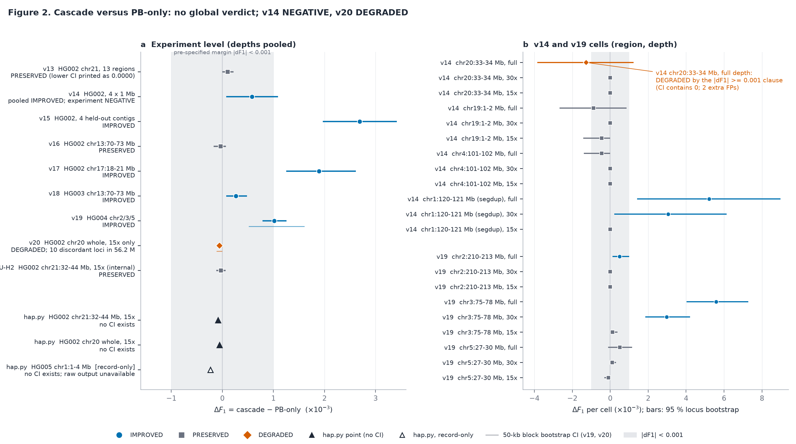
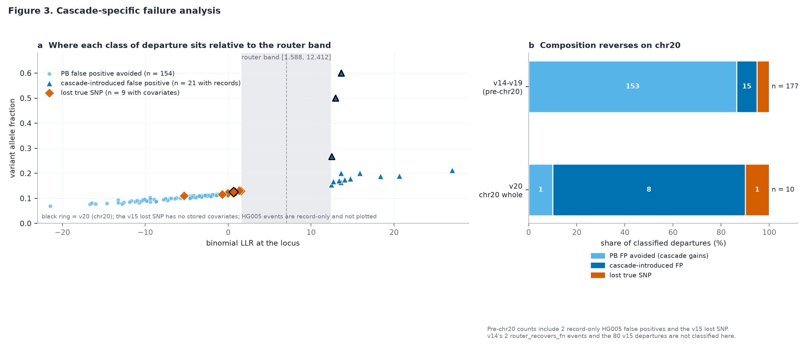
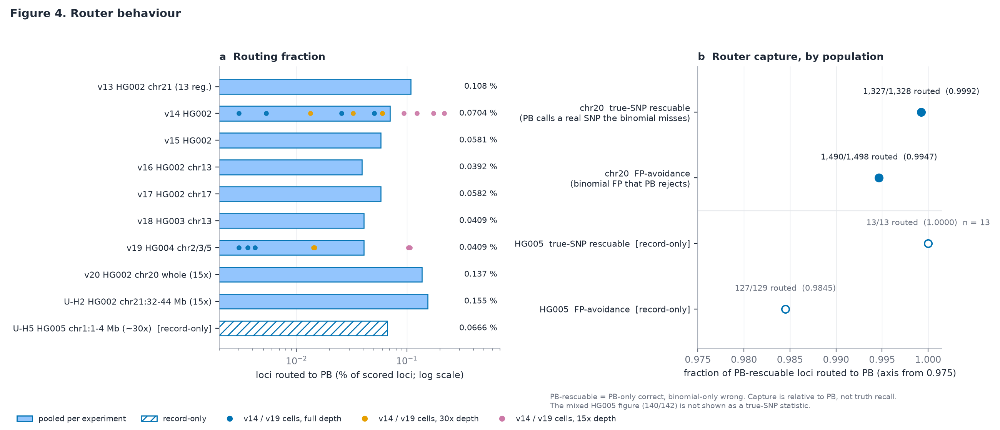
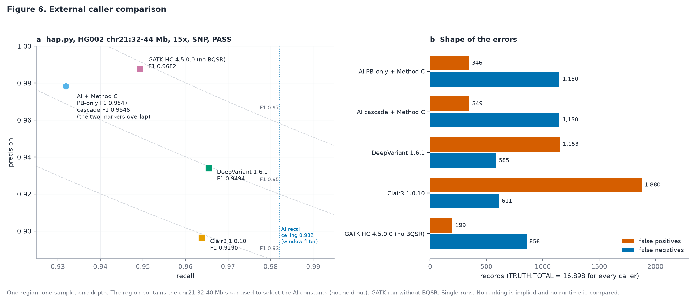

# Routing a binomial SNP screen to a Poisson-binomial caller: frozen-constant validation on GIAB samples, failure modes, and the compute bottleneck

*Rewrite draft of `PAPER_MANUSCRIPT.md`, prepared from `FINAL_FORENSIC_AUDIT.md`, `CLAIM_EVIDENCE_MAP.csv`, `TABLES_FINAL.md`, `CHR20_VALIDATION_REPORT.md` and the raw result files. No experiment, threshold or verdict was changed. Not peer reviewed. Placeholders in square brackets are unresolved on purpose. RO marks a number that rests on a project record whose raw artefact is no longer in the repository.*

---

## Abstract

A SNP call is a claim about one person's genome, so a change that saves compute has to be shown not to change the claim. We tested one such change. A fixed-error binomial screen calls every locus; a fixed-cutoff router sends only loci near the screen's decision boundary to a per-read Poisson-binomial (PB) model, several hundred times slower per locus. Three constants (binomial threshold 7.0, PB threshold 10.5, router cutoff 5.4119) were selected once on HG002 chr21:32–40 Mb at about 15× and never changed. The cascade was run unmodified on HG002, HG003, HG004 (a related trio) and HG005 (unrelated), scored against GIAB v4.2.1 (GRCh38, SNP-only) in eight experiments with an internal locus evaluator and in three hap.py evaluations.

The router sent 0.039–0.108 % of loci to PB in the seven regional experiments (pooled) and 0.137 % on whole chr20. Pooled ΔF1 against PB-only ran from −5.6×10⁻⁵ to +2.7×10⁻³. Under the pre-specified rule, two experiments were PRESERVED, five IMPROVED, and one DEGRADED: whole HG002 chr20 at 15× (56.2 M loci), with ΔF1 = −5.6×10⁻⁵ (95 % CI −1.05×10⁻⁴ to −1.4×10⁻⁵), ten discordant loci, and hap.py ΔF1 = −5.5×10⁻⁵. The experiment-level verdict of v14 was NEGATIVE because of one 1-Mb cell. The IMPROVED verdicts come from PB false positives in paralogous sequence that the cascade avoids; on chr20 that class is nearly absent. The cascade loses true SNPs: 9 events in v14–v19 and 10 with chr20, counted per validation cell, all at VAF 0.11–0.13. hap.py first scored the AI calls at F1 0.624, largely because every genotype was written 0/1; a closed-form genotype layer lifted genotype accuracy from 0.646 to 0.989 on a 16,124-call hold-out, and on the final call set hap.py F1 from 0.624 to 0.955, without changing any allele call. On chr21:32–44 Mb, a region that contains the constant-selection span, hap.py F1 was 0.955 (AI), 0.949 (DeepVariant), 0.929 (Clair3) and 0.968 (GATK); the comparison does not rank callers.

Native C/htslib backends made the count and read-tensor stages 21–65× and 26.9–35.1× faster as functions. The pipeline ran 2.72× faster serially (HG005, 800 kb) and 7.11× with four processes against the original serial code; PB is now 93–96 % of compute. Routing has not been shown to reduce end-to-end cost beyond one 1.65× measurement (0.5 Mb). HG005 results are record-only. The native counts backend matched pysam on all validated real data but not on adversarial synthetic BAMs with repeated read names.

**Keywords:** variant calling; SNP; Poisson-binomial; cascade; confidence routing; Genome in a Bottle; hap.py; htslib; Amdahl's law

---

## 1. Introduction

A SNP call is a claim about a specific person's genome, so a change to the caller that saves compute has to be shown not to change the claim.

Modelling each read's error probability separately improves discrimination at marginal loci over a single fixed error rate. The price is that the distribution of a sum of independent, non-identical Bernoulli events, a Poisson-binomial [1], must be evaluated at every candidate locus. Poisson-binomial modeling is also established in variant calling; LoFreq uses per-base sequencing-error probabilities to model the number of variant-supporting bases under a Poisson-binomial distribution [27]. In this project PB ran at roughly 6–10×10³ loci/s against 2.6–3.1×10⁶ loci/s for the binomial screen (throughput probes; document-level estimates of the ratio range from 240× to 520×).

A cascade defers only hard cases to the costly stage; cascaded classifiers are an established technique in vision [2]. Tiered designs already exist in variant calling: Clair3 sends most candidates through a fast pileup network and the more complicated ones through a full-alignment network [18]. The project sources do not document where the idea for this particular cascade came from, and only a brief literature search on its use in SNP calling was done. Related variant callers have also used selective processing of candidate loci: Psi-Caller assigns candidates to computational paths of differing cost using locus characteristics, while miniSNV separates high- and low-quality loci and applies binomial genotyping to the former and more expensive phasing and consensus procedures to the latter [25,26]. These approaches differ from the present cascade in that routing here is based on the log-likelihood evidence produced by the initial statistical classifier rather than on predefined locus-complexity or population-knowledge rules. No claim of novelty or priority is made. The question is empirical: does routing keep the accuracy of PB-everywhere, and where does the compute go?

The project started in August 2026 as a neural sequence caller trained on synthetic reads. On real reads, every neural stage was null or negative against the statistical baselines, apart from one weak positive (two of three seeds) on a side branch (Mamba-style models [16]; Supplement). The final method has three stages: binomial log-likelihood ratio (LLR), a symmetric router around the binomial decision boundary, and a PB LLR on routed loci. Evaluation uses GIAB truth [7,8] and hap.py [11].

This paper reports what happened when the constants were frozen and the cascade was tested on other regions, samples and one whole chromosome. It also reports the failures: one experiment-level NEGATIVE, one DEGRADED chromosome, ten lost true SNPs, an evaluator artefact that produced F1 0.624, and two native-code designs that failed their equivalence gates. It does not claim superiority over existing callers, genome-scale validity, cross-platform validity, or clinical validity.

---

## 2. Materials and Methods

### 2.1 Problem definition

Task: germline SNP calling at candidate loci from aligned short reads. Indels, MNPs and structural variants are neither called nor scored.

For a locus, let $n$ be the number of usable A/C/G/T observations and $k$ the count of the most-supported non-reference base. With fixed per-base error $\varepsilon = 0.01$, the binomial success probabilities for the ALT base are $p_0 = \varepsilon/3$, $p_{\mathrm{het}} = \tfrac12(1-\varepsilon) + \tfrac12(\varepsilon/3)$ and $p_{\mathrm{hom}} = (1-\varepsilon) + \varepsilon/3$, each clipped to $[10^{-12}, 1-10^{-12}]$:

$$\mathrm{LLR}_{\mathrm{bin}} = \max\{\log \mathrm{Bin}(k;n,p_{\mathrm{het}}),\ \log \mathrm{Bin}(k;n,p_{\mathrm{hom}})\} - \log \mathrm{Bin}(k;n,p_0),$$

with $\mathrm{LLR}_{\mathrm{bin}}=0$ when $n=0$. Since $\varepsilon$ is fixed, the LLR is a deterministic function of $(n,k)$.

A locus is routed to PB iff $|\mathrm{LLR}_{\mathrm{bin}} - \tau_b| \le \delta$ with $\tau_b = 7.0$ and $\delta = 5.411872376933351$, i.e. $\mathrm{LLR}_{\mathrm{bin}} \in [1.588,\ 12.412]$. The cascade call is

$$
c(\ell)=\begin{cases}
\mathbf 1[\mathrm{LLR}_{\mathrm{PB}}(\ell)\ge 10.5] & \text{if routed},\\
\mathbf 1[\mathrm{LLR}_{\mathrm{bin}}(\ell)\ge 7.0] & \text{otherwise.}
\end{cases}
$$

The router measures uncertainty, not error. A locus at which the binomial model is confidently wrong is never routed.

For read $i$ with base quality $Q_i$, $q_i = \mathrm{clip}(10^{-Q_i/10},\,10^{-4},\,0.25)$; the probability that read $i$ shows the candidate ALT is $q_i/3$ under $H_0$, $\tfrac12(1-q_i)+\tfrac12 q_i/3$ under het and $(1-q_i)+q_i/3$ under hom. The ALT count is Poisson-binomial; its exact log-pmf comes from the log-space recursion

$$\mathrm{dp}'[k]=\mathrm{logaddexp}\big(\mathrm{dp}[k]+\log(1-q_j),\ \mathrm{dp}[k-1]+\log q_j\big)$$

over at most 48 retained reads. $\mathrm{LLR}_{\mathrm{PB}} = \max(\ell_{\mathrm{het}},\ell_{\mathrm{hom}}) - \ell_{H_0}$. The estimand throughout is

$$\Delta F_1 = F_1(\text{cascade}) - F_1(\text{PB-only}),$$

paired on the same loci. PB-only means PB evaluated at every locus with threshold 10.5.

An earlier PB implementation clipped the ALT count to the tensor width, which turned the strongest evidence into NaN and then 0.0 above 48× depth (426 of 924 SNPs at ≈69×; PB F1 0.684). It was fixed on 2026-08-16, before the frozen cascade was validated, and is bit-identical wherever depth ≤ 48. PB still scores at most 48 reads per locus.

### 2.2 Datasets and ground truth

HG002 (son), HG003 (father) and HG004 (mother) form the GIAB Ashkenazi trio [10]. They were analysed from the NIST Illumina 2×250 novoalign [15] GRCh38 BAMs (native depth ≈ 47–74× depending on region). HG005 is unrelated to them; it was analysed from the NHGRI 300× HiSeq novoalign BAM (header: novoalign V3.02.07; regional reads ≤ 250 bp) downsampled with `samtools view -s 42.09` [13] to ≈ 30×. A platform-matched 2×250 HG005 product returned HTTP 404 on 2026-09-04 and 2026-09-15, which is why HG004 served as the interim second sample. Lower depths of HG002–4 came from `samtools view -s 42.<fraction>`; depth cells are correlated downsamples of one library. Whether the HG005 library or instrument differs from HG002–4 beyond read length and aligner is not established.

Truth: GIAB v4.2.1 GRCh38 benchmark VCFs and high-confidence BEDs; strata: GIAB v3.1 (`lowmap_segdup`, `alldifficult`, `tandemrepeats`) [7–9]. Reference: Ensembl r110 per-chromosome FASTA, with a `chr`-renamed copy for hap.py and the external callers.

Regions for v14 onward were chosen by scripts from public annotation before any caller ran; per-run independence audits reported `all_ok` (not re-checked in the freeze audit). The v20 region is the whole of chr20; no region was chosen or filtered after seeing results.

**Table 1. Experiments and their relation to the constant-selection data.**

| ID | Sample | Region | Depth | Loci scored | Truth SNPs | Evaluator | Relation to selection data (HG002 chr21:32–40 Mb, ≈15×) |
|---|---|---|---|---|---|---|---|
| v13 | HG002 | 13 chr21 regions | mixed | 24,583,412 | 33,893 | internal | 3 regions inside the selection span |
| v14 | HG002 | chr20:33–34, chr19:1–2, chr4:101–102, chr1:120–121 Mb | full/30×/15× | 10,368,078 | 12,261 | internal | other chromosomes, same sample |
| v15 | HG002 | chr16, chr15, chr7 (segdup), chr14 | full/30×/15× | 9,498,705 | 10,863 | internal | other chromosomes, same sample |
| v16 | HG002 | chr13:70–73 Mb | full/30×/15× | 8,726,751 | 14,274 | internal | other chromosome, same sample |
| v17 | HG002 | chr17:18–21 Mb | full/30×/15× | 7,400,175 | 8,484 | internal | other chromosome, same sample |
| v18 | HG003 | chr13:70–73 Mb | full/30×/15× | 8,699,208 | 13,266 | internal | other sample, same trio |
| v19 | HG004 | chr2, chr3, chr5 (3 Mb each) | full/30×/15× | 25,336,365 | 38,340 | internal | other sample, same trio |
| v20 | HG002 | chr20 whole (0–64,444,167) | 15× | 56,242,693 (56,266,816 extracted) | 70,324 (locus frame); 71,333 (hap.py) | internal + hap.py | other chromosome, same sample, same depth; 1 Mb previously in v14 |
| U-H2 | HG002 | chr21:32–44 Mb | 15× | 10,975,654 | 16,898 | hap.py | **contains** the selection span |
| U-H5 | HG005 | chr1:1,000,001–4,000,000 | ≈30× | 2,402,190 | 4,090 (RO) | hap.py | other sample; raw output unavailable (RO) |

### 2.3 Frozen cascade architecture

*Extraction.* The region is tiled into 64-bp windows, processed in 500-kb chunks. A window is dropped whole if any base lies outside the high-confidence BED or more than half its reference bases are N. For each surviving locus the extractor emits nine channels (four base counts, deletion/skip reads, insertion reads, depth, quality sum, mapping-quality sum). Reads are admitted at MAPQ ≥ 20 and excluded if duplicate, QC-fail, unmapped, secondary or supplementary; a read adds to a base count only if its base quality is ≥ 13. The pileup depth cap is 8,000. Two `pysam.pileup()` defaults that the code relies on without stating them, `ignore_orphans=True` and `ignore_overlaps=True`, are part of the contract. For PB, a second extractor builds a per-locus tensor of up to 48 admitted reads, ordered by BLAKE2b digest of the read name. Coordinates are 0-based half-open internally and converted once at VCF output. Labels come from the truth VCF; the scoring frame is restricted to Normal and SNP loci.

**Figure 1.** Cascade architecture and data flow. Aligned reads, reference and confident regions feed window extraction (native C/htslib backend by default, pysam as reference and fallback). The binomial screen ($\varepsilon = 0.01$, threshold 7.0) calls every locus; the router sends loci with $|\mathrm{LLR_{bin}} - 7.0| \le 5.4119$ to the read-tensor extractor (at most 48 reads) and the Poisson-binomial model (threshold 10.5). Loci outside the band keep the binomial call. The genotype layer (Method C) assigns GT/GQ to the allele calls without changing them. The dashed branch is the benchmark's PB-only control, which evaluates PB at every locus and is paired with the cascade for $\Delta F_1$. The routed range 0.04–0.16 % is pooled per experiment (Table 3, Figure 4).

**Table 2. Frozen parameters.**

| Parameter | Value | Source |
|---|---|---|
| Binomial threshold $\tau_b$ | 7.0 | maximised validation F1 |
| PB threshold | 10.5 | maximised validation F1 |
| Router cutoff $\delta$ | 5.411872376933351 | 0.1 % validation quantile of $-|\mathrm{LLR}_{\mathrm{bin}}-7|$ |
| $\varepsilon$ (binomial, Method C) | 0.01 | fixed, not fitted |
| PB read cap | 48 | design |
| MAPQ / BQ minimum | 20 / 13 | design |
| `cascade.py` sha256 | `b0ee9f4b24fe06dc…` | unchanged through v16–v20 (recomputed in audit) |
| `method_c_regression.py` sha256 | `b5cea1f1660eb472…` | same |

*Provenance.* The 8 Mb of HG002 chr21:32–40 Mb at ≈ 15× (subsample 0.203, seed 20260811) were split into 1-Mb blocks by index mod 4: train 0 and 4 (1.89 Mb, 2,544 SNPs), validation 1 and 5 (1.91 Mb, 2,410 SNPs), test 2, 3, 6 and 7 (3.81 Mb, 5,704 SNPs). The thresholds maximised validation F1. The cutoff is the smallest coverage whose validation F1 lay within 0.0005 of PB-everywhere; every coverage ≥ 0.1 % tied at 0.9784. The test blocks were scored once after freezing. A learned logistic router lost to this rule.

Two qualifications. The main-branch devlog 11 describes the cutoff as an F-beta optimum on a training split; that contradicts the router-freeze worktree record, which we follow. And the constants are depth-specific: at 30× the validation optimum in a separate benchmark was 11.5/14.0 (binomial/PB), so the frozen pair runs off-optimum at other depths.

### 2.4 Statistical evaluation

*Evaluators.* The **internal evaluator** compares boolean call and truth masks at matching array indices, ignores REF, ALT and genotype, and applies the BED at window granularity. **hap.py 0.3.15** [11] (xcmp, left-shift and confident-region preprocessing on, window 50; one image digest for all runs) is allele- and genotype-aware and applies the BED per record. The two are not interchangeable and every table states which one it uses. Locus-level metrics are conditional on retained windows (Section 3.3).

*Paired comparison.* $\Delta F_1$ carries a 95 % percentile interval from a paired multinomial bootstrap over loci (10,000 resamples; seed 20260812 or the module default) [4,5]. This treats adjacent loci as independent. From v19 a 50-kb block bootstrap [24] (v19: 537 blocks; v20: 1,185 blocks; 2,000 resamples) and an exact McNemar test [23] on discordant loci were added. In v19 the block interval was 2.3× wider than the locus interval. No interval exists for any hap.py result or for stratum enrichments.

*Decision rule.* Defined in the project devlog (devlog 13 §3.4) and implemented in `bench_v14_crosschrom.classify`; there is no external registry, and whether it preceded the v13 analysis is not established. Per cell with ≥ 100 SNPs, and pooled:

- PRESERVED: interval contains 0 and $|\Delta F_1| < 0.001$.
- IMPROVED: interval excludes 0 with $\Delta F_1 > 0$.
- DEGRADED: interval excludes 0 with $\Delta F_1 < 0$, or $|\Delta F_1| \ge 0.001$. As written the second clause also fires for positive differences; the defect was disclosed at the time and the implementation tests it after PRESERVED and IMPROVED.
- UNDERPOWERED: fewer than 100 SNPs or interval half-width > 0.01. No cell fell here.

The protocol originally called the overall result CONFIRMED only if every powered cell and pooled result was PRESERVED. Five pooled results are IMPROVED (one of them, v14, belongs to an experiment whose verdict is NEGATIVE) and one experiment is DEGRADED, so that condition cannot be met, and **no global verdict is asserted**. There is no equivalence test, no multiplicity correction, and the 0.001 margin is about 1.5 false calls at 765 SNPs. The origin of the margin is not documented in the project record.

*Failure taxonomy.* For loci where cascade and PB disagree: `router_avoids_fp` (cascade correct, PB false positive), `router_fp` (cascade false positive that PB avoided), `router_fn` (cascade lost a true SNP that PB found; the locus was not routed), `router_recovers_fn`. Events are counted per validation cell; a locus scored at two depths counts twice.

### 2.5 Validation design

Table 1 lists, for each experiment, how it relates to the selection data. No experiment is independent in every respect. Regional experiments change chromosome; v18 and v19 change sample within one trio; U-H5 changes sample outside the trio; v20 changes chromosome only. U-H2 contains the selection span and is used for genotype and external-caller work, not as a held-out accuracy test. Each experiment reports the PB-only control next to the cascade.

### 2.6 Genotype reconstruction

The cascade fixes the allele call set. A genotype layer assigns GT and GQ afterwards. With $n = k + $ reference-base count:

- **Method A:** every call `0/1`.
- **Method B:** `1/1` if $k/n > 0.69$, else `0/1`; 0.69 was swept on a 0.47-Mb development region (chr21:30.0–30.47 Mb; 555 calls).
- **Method C:** for $\theta \in \{\varepsilon, 0.5, 1-\varepsilon\}$ (GT `0/0`, `0/1`, `1/1`), $\varepsilon = 0.01$ fixed, take the argmax of $\log\mathrm{Bin}(k;n,\theta)$ as GT; GQ $=\min(10\log_{10}(P_{\text{best}}/P_{\text{second}}), 99)$ with a flat prior. If `0/0` wins, the call is written `0/1` with GQ capped at 5 (7 of 16,124 sites on the hold-out).

A vectorised implementation replaced the reference scipy loop; it matched on the full call sets (0 GT and 0 GQ mismatches).

### 2.7 Computational implementation and optimisation

*Native counts backend.* The reference path calls `pysam.pileup()` [14] once per 64-bp window and runs a Python per-read loop. `native/pileup_native.c` (≈ 220 lines, raw htslib [12]) instead makes one `bam_mplp` streaming pass over the whole requested span, applies read admission in a callback, enables mate-overlap adjustment, and returns a `(span, 9)` buffer. It is the default when built; `AI_DNA_ANALYZER_DISABLE_NATIVE_PILEUP=1` restores pysam.

*Native read-tensor backend.* `native/reads_native.c` builds the PB tensor in C with one fresh pileup pass per 64-nt window (BAM and index opened once) and the same BLAKE2b ordering. The O(#intervals) confidence scan in `providers._is_confident` became a bisect lookup. Inputs it cannot reproduce (missing SEQ, non-integer `NM`) fall back to Python.

*Equivalence* means identical values in all recorded output arrays under the filter configuration in use. It is claimed only for the listed validated inputs. The C code hard-codes the filter behaviour, so a different configuration needs re-verification.

*Timing.* One machine (Intel i7-6700, 4 cores/8 threads, 31 GiB) with a desktop session using about 1–2 cores. Most timings are single runs or medians of 3. Four kinds of number are kept apart: **function-level** (one function, same input), **extraction-stage**, **pipeline-level** (all stages, same output hash) and **projections** (throughput × counts; not results).

---

## 3. Results

### 3.1 Primary accuracy results

The router sent 0.039–0.108 % of loci to PB in the seven regional experiments (per depth cell 0.003–0.218 %, higher at lower depth and in GC-rich or repetitive windows), 0.137 % on whole chr20 and 0.155 % on chr21:32–44 Mb (both 15×).

**Table 3. Cascade versus PB-only (internal evaluator, depths pooled).**

| Exp. | Sample / region | PB-only F1 | Cascade F1 | ΔF1 [95 % CI] | Routed | Discordant loci | True SNPs lost | Verdict |
|---|---|---|---|---|---|---|---|---|
| v13 | HG002 chr21, 13 regions† | 0.98162 | 0.98172 | +0.000103 [0.0000, +0.00022] | 0.108 % | 15 | 0 | PRESERVED (12/13 regions; 1 IMPROVED) |
| v14 | HG002, 4 × 1 Mb | 0.955726 | 0.956306 | +0.000581 [+0.000075, +0.001089] | 0.070 % | 41 | 5 (4 loci) | **NEGATIVE**; pooled IMPROVED |
| v15 | HG002, 4 held-out contigs | 0.925079 | 0.927766 | +0.002686 [+0.001968, +0.003414] | 0.058 % | 80 | 1 | IMPROVED |
| v16 | HG002 chr13 | 0.994600 | 0.994565 | −0.000035 [−0.000171, +0.000070] | 0.039 % | 3 | 0 | PRESERVED |
| v17 | HG002 chr17 segdup | 0.948070 | 0.949962 | +0.001892 [+0.001250, +0.002615] | 0.058 % | 38 | 2 | IMPROVED |
| v18 | HG003 chr13 | 0.993751 | 0.994013 | +0.000262 [+0.000076, +0.000483] | 0.041 % | 7 | 0 | IMPROVED |
| v19 | HG004 chr2/3/5 | 0.986405 | 0.987419 | +0.001014 [+0.000787, +0.001254]; block [+0.000520, +0.001601] | 0.041 % | 87 | 1 | IMPROVED |
| **v20** | HG002 chr20 whole, 15× | 0.97809 | 0.97803 | **−0.0000564** [−0.000105, −0.0000141]; block [−0.000108, −0.0000075] | 0.137 % | 10 | 1 | **DEGRADED** |

† Three regions lie inside the selection span. The remaining chr21 pool (2,306,207 loci) gave PB = cascade = 0.99233 with 2 discordant loci.

**hap.py (Method C genotypes; no confidence intervals exist).**

| Evaluation | PB-only F1 | Cascade F1 | ΔF1 | Discordant loci |
|---|---|---|---|---|
| HG002 chr21:32–44 Mb | 0.954656 | 0.954569 | −0.000087 | 3 of 10,975,654 |
| HG005 chr1:1–4 Mb (RO) | 0.952098 | 0.951862 | −0.000236 | 2, both cascade FPs |
| HG002 chr20 | 0.962851 | 0.962796 | −0.000055 | 10 |

**Figure 2.** ΔF1 = cascade − PB-only. (a) One row per experiment, depths pooled, internal evaluator; bars are the 95 % paired locus-bootstrap interval, the thinner lower bar is the 50-kb block-bootstrap interval where one exists (v19, v20); the v13 lower bound is the printed 0.0000. Filled triangles are hap.py points (HG002 chr21:32–44 Mb −0.000087; HG002 chr20 −0.000055) with no interval; the open triangle is HG005 (−0.000236), record-only. The U-H2 row is the internal evaluator on the same region as the hap.py chr21 point. (b) Individual v14 and v19 cells by region and depth, 95 % locus-bootstrap intervals; the DEGRADED v14 chr20:33–34 Mb cell at full depth (ΔF1 −0.001262, interval [−0.003849, +0.001228]) is shown. Marker and colour give the pooled or cell verdict under the pre-specified rule; grey band = |ΔF1| < 0.001. The figure carries no global verdict: v14 is NEGATIVE at experiment level and v20 is DEGRADED. Source values: Table 3, `TABLES_FINAL.md` Tables 2, S1, S2; hap.py summaries. Cells of v15–v18 are not plotted because their per-cell values are not in the final tables.

Two results carry a negative verdict and both are reported at full size.

**v14.** One cell, HG002 chr20:33–34 Mb at full depth (765 SNPs), gave PB 26 FP and cascade 28 FP: ΔF1 −0.001262, interval [−0.003849, +0.001228]. The interval contains zero. The cell was DEGRADED through the $|\Delta F_1| \ge 0.001$ clause, which the two extra false positives were enough to trip, and that made the experiment NEGATIVE although the pooled result was IMPROVED. This 1-Mb cell is not the v20 run; it is contained in it.

**v20.** Section 3.3.

**Reading the positive verdicts.** The IMPROVED experiments are driven by loci in segmental duplication [6] where PB produces false positives from low-VAF paralogous reads and the binomial screen rejects them: 26 of 41 v14 departures, 36 of 38 in v17, 83 of 87 in v19. The authors of those experiments describe this as PB miscalibration on paralogous pileups, not a property of the cascade. That reading is an interpretation; no read-level phasing was done. On chr20 this class contributes 1 departure of 10, and the sign of ΔF1 reverses. The sign depends on local composition, so the pre-specified claim is only that accuracy is not lost, and the data say it was lost, by a very small amount, on one chromosome.

### 3.2 Cross-sample validation

HG003 (v18) and HG004 (v19) reproduce the regional pattern (Table 3). HG002–4 are a father, mother and son sequenced in one batch, so this is weak evidence of independence. Five of the seven v18 departures sit in one ≈ 200-bp segdup block, and the v18 authors state the test cannot separate generalisation across human variation from within-trio batch effects. A re-scoring of the HG004 caches with an independently written 50-kb block bootstrap gave 7 PRESERVED, 2 IMPROVED (both chr3) and 0 DEGRADED cells. It read the same BAM bytes and adds no sequencing evidence.

HG005 is the only unrelated sample. On chr1:1–4 Mb the hap.py F1 was 0.9519 (cascade) and 0.9521 (PB-only), two discordant loci, both cascade false positives (RO: the post-fix hap.py output and cache are not in the repository; a pre-fix run left under the same names, F1 0.0085, is invalid and was quarantined). One region of one unrelated sample supports neither a generalisation claim nor a population claim, and the HG005 F1 is not comparable with the HG002 values (different region, depth, truth scope; the HG002 region contains the selection span).

### 3.3 Chromosome-scale validation

*Design.* All of HG002 chr20 (0–64,444,167) at 15× (`samtools view -s 42.2114` of the 71× native BAM; 14.87× mean over scored loci) in 500-kb chunks. The constants were asserted equal to the frozen values at run time. The analysis scripts were hashed before results were opened (`ANALYSIS_FREEZE.json`). Nine chunks in the centromere (26.5–31.0 Mb) contain no whole confident window. The lost first run of this analysis was reproduced exactly by a full re-run (56,266,816 loci, 70,324 SNPs, 69,291/69,297 calls, 2,826 rescuable loci).

*Result.* 56,266,816 loci were extracted and 56,242,693 scored.

| Arm (locus evaluator) | TP | FP | FN | Precision | Recall | F1 |
|---|--:|--:|--:|--:|--:|--:|
| Binomial only | 67,000 | 2,339 | 3,324 | 0.96627 | 0.95273 | 0.95945 |
| PB only | 68,278 | 1,013 | 2,046 | 0.98538 | 0.97091 | 0.97809 |
| Cascade | 68,277 | 1,020 | 2,047 | 0.98528 | 0.97089 | 0.97803 |

The cascade routed 77,248 loci (0.137 %). ΔF1 = −5.64×10⁻⁵: locus bootstrap 95 % CI [−1.049×10⁻⁴, −1.41×10⁻⁵]; block bootstrap [−1.08×10⁻⁴, −7.5×10⁻⁶]. Net change against PB-only: −1 TP, +7 FP, +1 FN. Ten loci disagree (cascade wrong, PB right: 9; cascade right, PB wrong: 1; McNemar exact p = 0.021, resting on ten events). Excluding the 1 Mb scored earlier in v14 gives ΔF1 −5.70×10⁻⁵ [−1.06×10⁻⁴, −1.42×10⁻⁵]. A random router at matched PB coverage (77,248 loci) lost 0.0186 F1 against PB-only, close to the binomial-only level, so the frozen router does real work at this coverage. Diagnostic sweeps of the cutoff from −30 % to +20 % kept locus F1 between 0.97722 and 0.97808 (PB-only 0.97809); a wider band does not remove the loss. Nothing was changed on the basis of these sweeps.

hap.py, same image and settings, Method C genotypes: PB-only TP 67,700, FP 1,591, FN 3,633, F1 0.96285; cascade TP 67,699, FP 1,598, FN 3,634, F1 0.96280. ΔF1 = −5.5×10⁻⁵. The two evaluators agree in direction and size. hap.py F1 is lower than the locus F1 because its denominator includes window-dropped SNPs and because it scores genotypes.

*Verdict.* DEGRADED under the unchanged rule: clause 1 fires (interval wholly below zero), and the block bootstrap and the exclusion sensitivity agree. The magnitude is 0.0056 F1 percentage points, 18× smaller than the 0.001 margin, from 10 discordant loci in 56.2 M. The cell is DEGRADED because 70,324 SNPs give it the power to detect an effect that small (interval half-width ≈ 5×10⁻⁵). It is not a large loss, and it is not "no significant degradation". Whether such a difference matters depends on the use, and this paper takes no position.

*Independence.* chr20 is a different chromosome from the selection region. It is the same sample, library and depth. 1 Mb of it was scored in v14. Only 15× was run. Chromosome-level separation is all this run provides.

**Table 4. Truth-SNP denominators.** Locus-level metrics are conditional on the retained windows; hap.py denominators include window-dropped SNPs.

| Quantity | HG002 chr20 | HG002 chr21:32–44 Mb | HG005 chr1:1–4 Mb (RO) |
|---|--:|--:|--:|
| Truth SNPs in confident BED (chr21, HG005: hap.py `TRUTH.TOTAL`) | 71,387 | 16,898 | 4,090 |
| In retained 64-bp windows | 70,357 | 16,597 | 3,948 |
| Dropped (no candidate possible) | 1,030 (1.44 %) | 301 (1.8 %) | 142 (3.5 %) |
| Excluded by overlapping indel label | 33 | — | — |
| Locus-evaluator denominator | 70,324 | 16,597 | — |
| hap.py `TRUTH.TOTAL` (SNP) | 71,333 | 16,898 | 4,090 |

The chr20 checks: 71,387 − 1,030 = 70,357; 70,357 − 33 = 70,324. hap.py's 71,333 differs from the BED count by 54 records through allele normalisation, not further decomposed. On chr20, 1,026 windows were partly outside the BED and 4 were chunk-end remainders. Whole-window dropping (`_build_windows`) is stricter than hap.py's per-record BED test and is not fixed. It depresses AI recall by a region-dependent amount and does not touch the external callers. hap.py recall is bounded above by 0.986 on chr20 and 0.982 on chr21:32–44 Mb by construction. For HG005 the record gives recall 0.9403 as reported, 0.9742 restricted to retained-window truth (3,846/3,948), and at most 0.9751 if every dropped SNP were called; dropped windows are enriched in difficult sequence, so that bound is not an estimate of achievable gain. A statement in an older HG005 report that 142 SNPs were "~35 %" of truth is an arithmetic error (142/4,090 = 3.5 %).

### 3.4 Failure analysis

#### 3.4.1 Taxonomy

The claim "the cascade never lost a true SNP that PB found" was made on 24.6 M chr21 loci (v13) and was refuted the next day.

*Definition.* A cascade-specific true-SNP loss is a truth SNP that PB-only calls, the cascade does not, and the router did not route. The **historical consolidated count is 9** (v14: 5 events at 4 distinct loci; v15: 1; v17: 2; v19: 1). Raw `disagreements.json` records exist for 8 of these; the v15 event is in devlog 15 §12.3 without covariates. Whole chr20 adds one, so the **expanded count is 10**. v13, v16, v18 and HG005 have none. Whether any events coincide across depth cells beyond v14's own is not established.

**Table 5. Failure taxonomy (events per validation cell).**

| Class | Pre-chr20 events | v20 | Total | Signature | Status |
|---|--:|--:|--:|---|---|
| Lost true SNP (`router_fn`) | 9 | 1 | 10 | VAF 0.110–0.130 (v20 0.125); mean BQ 36.7–38.8 (v20 39.2); depth 27–107 (v20 28); binomial LLR −5.30…+1.57 (v20 0.67), 0.02–6.9 below the router lower edge; PB LLR 11.8–24.1 (v20 13.6); all unrouted. `lowmap_segdup`+`alldifficult` where annotated, but the v20 event is `alldifficult` and not `lowmap_segdup` | observation; mechanism is interpretation |
| Cascade-introduced FP (`router_fp`) | 15 (v14 8, v16 2, v19 3, HG005 2 RO) | 8 (6 sites, 2 adjacent pairs) | 23 | binomial LLR 12.5–27 (v20 12.5–13.6, margin 5.50–6.65, just outside the band); PB LLR −5.5…+10.45 (v20 9.0–10.4, just under 10.5); mean BQ 9.6–26.5 (v20 11–22); VAF 0.15–0.60; depth 6–17 in v20 | observation |
| PB FP avoided (`router_avoids_fp`) | 153 (v14 26, v16 1, v17 36, v18 7, v19 83) | 1 (chr20:25,313,342; VAF 0.13, depth 31, BQ 35.9, `lowmap_segdup`) | 154 | VAF 0.07–0.13, BQ 24.8–38.9, mostly segdup | interpretation: paralogous reads |

The three classes do not exhaust the departures. In v14, 41 departures split into 26 `router_avoids_fp`, 8 `router_fp`, 5 `router_fn` and 2 `router_recovers_fn` (raw `disagreements.json`; the sources name this class but do not restate its definition, and by its name it is the cascade recovering a PB false negative). The 80 v15 departures (cascade right 69, wrong 5, indeterminate 6) are not decomposed by class. The pre-chr20 row for `router_fp` includes 2 HG005 events (RO).

**Figure 3.** Cascade-specific failure analysis. (a) Every disagreement between cascade and PB-only that has a stored record in `results/bench_v14`, `v16`, `v17`, `v18`, `v19` and `v20` (`disagreements.json`; `chr20_disagreements.json`), placed by binomial LLR and variant allele fraction against the router band [1.588, 12.412]: 154 PB false positives avoided, 21 cascade-introduced false positives and 9 lost true SNPs (the 8 with records in v14, v17, v19, plus the chr20 event). v20 events carry a black ring. The v15 lost SNP has no stored covariates, and the 2 record-only HG005 false positives are not plotted. (b) Composition of classified departures before chr20 (v14–v19: 15 cascade-introduced FP including 2 record-only HG005 events, 153 avoided PB FP, 9 lost true SNPs including the v15 event; n = 177) and on chr20 (8, 1, 1; n = 10). v14's 2 `router_recovers_fn` events and the 80 v15 departures are not classified in this panel. The counts in (a) were checked against Table 5 when the figure was generated.

The lost SNPs sit at VAF ≈ 0.12 with high base quality, where a fixed-ε binomial LLR is near zero and the locus looks confidently negative. The router sees that as "uncertain", not "wrong", but the locus is outside the band by 0.02–6.9 LLR units, so it is never routed. That is an interpretation supported by an ε-shift analysis; it was not tested at read level. The rate is about 1 per 10⁷ loci at VAF < 0.15, BQ ≥ 35, depth ≥ 30× in segdup (devlog 15); on chr20 it is 1 per 5.6×10⁷ scored loci. The cascade-introduced false positives have the opposite profile: high VAF, low BQ, low depth. Mapping quality does not separate failures (novoalign emits MAPQ 60–70 at 99.98 % of loci in v16). All 13 unfavourable v14 departures lay outside the band (margins 5.5–20.0 against the cutoff 5.412). In a diagnostic sweep on the v14 chr1 segdup cell, cutoffs 5.0–6.0 produced bit-identical calls, and raising the cutoff to 7.0 routed 8.7 % of loci while reducing departures only from 19 to 16.

#### 3.4.2 What the router captures

*Definitions.* PB-rescuable: PB-only correct, binomial-only wrong. Router capture: fraction of PB-rescuable loci that were routed. These are relative to PB's correctness and not to truth recall. Two populations are kept apart: true-SNP rescuable (PB calls a real SNP the binomial misses) and FP-avoidance (the binomial calls a non-variant that PB rejects).

**Table 6. PB-rescuable loci and router capture.**

| Dataset | Rescuable | Routed | Capture | True-SNP / FP-avoidance | Routed loci where binomial was already right |
|---|--:|--:|--:|---|--:|
| HG002 chr20, 15× | 2,826 | 2,817 | 0.9968 | 1,328 (1,327 routed; 0.9992) / 1,498 (1,490 routed; 0.9947) | 94.4 % |
| HG002 chr21:32–44 Mb, 15× (internal index) | 714 | 712 | 0.9972 | not split | 93.8 % |
| HG004 chr2/3/5, 9 cells (surviving caches) | 504 | 500 | 0.9921 | not split | 90.5 % |
| HG005 chr1:1–4 Mb, ≈30× (RO) | 142 | 140 | 0.9859 | 13 (all routed) / 129 (127 routed, 2 missed) | 88.1 % |

**Figure 4.** Router behaviour. (a) Fraction of scored loci routed to PB, pooled per experiment (bars); dots show the individual v14 (12) and v19 (9) depth cells (full, 30×, 15×). The hatched bar is HG005, record-only. Routed fractions: v13 0.1084 %, v14 0.0704 %, v15 0.0581 %, v16 0.0392 %, v17 0.0582 %, v18 0.0409 %, v19 0.0409 %, v20 0.137 % (77,248 loci), U-H2 0.155 %, HG005 0.0666 % (record-only). (b) Fraction of PB-rescuable loci that the router sent to PB, for two populations: chr20 true-SNP rescuable 1,327/1,328 and FP-avoidance 1,490/1,498; HG005 (open markers, record-only) 13/13 and 127/129. Capture is relative to PB's correctness, not recall against truth, and the axis starts at 0.975. The mixed HG005 figure of 140/142 is deliberately not plotted. Source values: `TABLES_FINAL.md` Tables 2, S1, S2; `results/bench_v20/chr20_results.json` (`rescue_composition`); HG005 from the project record.

The HG005 capture of 0.986 mixes two functions and is not a true-SNP statistic; only 13 of its 142 rescuable loci are true-SNP rescues. That composition does not carry over: chr20 has 1,328 true-SNP opportunities (47 % of rescuable). On chr20, PB is worse than the binomial at 222 loci, 221 of them routed, so the cascade inherits PB's errors there. Roughly nine in ten routed loci did not need PB. Whether the fixed cutoff is well calibrated outside the tested depths and samples is not established; the routed fraction rises as depth falls (≈ 0.003–0.004 % at native depth, 0.013–0.015 % at 30×, 0.10–0.16 % at 15×).

#### 3.4.3 A rejected repair

An ε-sensitivity safety layer flagged loci whose binomial LLR changes under bracketing ε. Frozen on validation data (50 candidate rules; the grid was informed by validation data) and scored on 9.5 M held-out loci, it flagged 1,016 loci, captured 74 of the 80 cascade–PB departures and the one lost SNP in v15, and escalating those loci to PB fixed 5 calls and broke 69. Random and reverse-confidence escalation at matched budget changed no call. The formal verdict of the safety-layer arm was WEAK POSITIVE; it was rejected. The label belongs to that arm and not to cascade versus PB.

### 3.5 Genotype reconstruction

hap.py first scored the PB-only calls on chr21:32–44 Mb at F1 0.6238 (P 0.6394, R 0.6089; TP 10,290, FP 5,804, FN 6,608) against 0.9742 under the internal evaluator. The VCF writer had emitted `0/1` for every call. The truth set holds 11,120 hets, 5,777 hom-alt and 1 het-alt SNPs (16,898). Of the 5,777, 5,630 (97.5 %) were called with the right allele and the wrong genotype, which hap.py counts as both an FN and an FP; these are 85.2 % of the 6,608 FNs. Allele-level F1 with genotype ignored was 0.9651. The denominator difference of Section 3.3 (16,597 vs 16,898) is a second, separate contribution. The first hap.py number was a correct measurement of a writer design choice and a misleading measurement of detection.

**Table 7. Genotype methods, hold-out chr21:32–44 Mb (16,124 cascade calls; identical allele sets, symmetric difference 0).**

| Method | GT accuracy | hap.py P / R / F1 | het→hom / hom→het errors |
|---|---|---|---|
| A (always 0/1) | 0.6464 | 0.6382 / 0.6089 / 0.6232 | 0 / 5,637 |
| B (VAF > 0.69) | 0.9250 | 0.9135 / 0.8716 / 0.8921 | 1,195 / 1 |
| C (binomial likelihood) | 0.9888 | 0.9767 / 0.9319 / 0.9538 | 169 / 9 |

Method B reached genotype accuracy 1.000 on the 549-locus development region and 0.9250 on hold-out, where 65 % of truths are hets. Its 0.69 was fitted where 71 % of loci were hom-alt. Method C uses depth through the binomial likelihood and has no fitted parameter. Its remaining error concentrates in het truths with VAF > 0.69 (accuracy 0.8586) and low depth (< 10×: 0.9642).

On the final unified call sets (16,094 PB-only; 16,097 cascade sites) the same layer gave PB-only F1 0.9547 (TP 15,748, FP 346, FN 1,150; +0.3309 over forced 0/1) and cascade F1 0.9546 (FP 349). The 16,124-call hold-out and the 16,094-call scope come from different extraction passes; 0.9538 and 0.9547 are not pooled and their genotype accuracies are not interchangeable. The layer does not change which alleles are called. It was tested for genotype accuracy on one region of one sample; the HG005 hap.py run (`FP.gt` 17, `FP.al` 3; RO) is the only other check.

### 3.6 Computational performance

**Table 8. Speedups by level. Only the first three levels are results.**

| Level | What | Data | Result | Conditions |
|---|---|---|---|---|
| Function | `load_counts`, native vs pysam | HG002 chr21:32.0–32.2 Mb, 187,200 loci | 16.14 → 0.54 s, 29.9× | single run |
| Function | same | HG005 chr1:1.0–4.0 Mb, 2,403,648 loci | 373.11 → 17.74 s, 21.03× | single run each |
| Function | same | HG002 chr21:32–44 Mb | 1,092.07 → 16.76 s, ≈ 65× | earlier measurement, not re-run |
| Function | `load_reads`, native vs pure Python | HG005 30×, chr1:1.0–1.4 Mb | 79.95 → 2.98 s, 26.9× | median of 3 |
| Function | same | HG002 15×, chr21:32.0–32.4 Mb | 89.63 → 2.56 s, 35.1× | median of 3; baseline n = 2 |
| Function | `load_reads`, Python threads ×4 | HG005 30× | 0.73× | GIL contention |
| Function | `load_reads`, Python multiprocessing ×4 / ×8 | HG005 30× | 2.86× / 4.39× | |
| Pipeline | native counts + reads, serial vs pure-Python serial | HG005 chr1:1.0–1.8 Mb, 8 × 100 kb | 271.7 → 99.9 s, **2.72×** | same output hash in all nine configurations |
| Pipeline | native + 4 processes | same | 38.2 s, **7.11×** vs pure-Python serial; ≈ 2.6× vs native serial | 4 physical cores |
| Pipeline | async prefetch | same | 1.21× (Python reads); 1.05× (native reads) | overlap with the numpy PB stage; not a `load_reads` speedup; the baseline of the 1.21× is not stated unambiguously in the sources |
| Pipeline | native, 1 worker / 4 workers | HG005 chr1:1–4 Mb | 309 s / 146 s (2.1×) | stage seconds, 1 worker: counts 5, reads 15, PB 287 |
| Pipeline, historical (RO) | only `load_counts` native | HG005 chr1:1–4 Mb | 1,392 → 1,140 s, 1.22× | `load_reads` 696 vs 775 s and PB 351 vs 349 s unchanged; source report lost |
| Measured BAM→calls | cascade (PB restricted to routed loci) vs PB-only | HG004 chr2:210.0–210.5 Mb | 284.66 s (sd 1.5) vs 469.96 s (sd 64.5), 1.65× | n = 3; both arms extract everything |
| Projection | caller-stage speedup | v13–v19 | 171–396× | per-locus throughput × routed counts; excludes I/O; **not a result** |

**Figure 5.** Where the time goes. (a) Speedups against the pure-Python or pysam reference on a log axis, grouped by level: function level (`load_counts`, `load_reads`), pipeline level (native serial, native with four processes against pure-Python serial, native one against four workers) and the one measured BAM-to-calls comparison (cascade against PB-only, HG004 0.5 Mb, n = 3). Hatched = historical counts-only configuration, record-only. Projected caller-stage speedups (171–396×) and whole-genome estimates are projections and are not plotted. (b) Share of summed stage time: pure-Python and counts-only native pipelines on HG005 3 Mb (record-only), native one worker on HG005 3 Mb (287 of 307 stage-seconds in PB), and native six workers on whole chr20 (15,036 of 15,674 s; contention-inflated; the binomial stage was not timed separately). Values are in Table 8.

Ratios are medians of unrounded times; recomputing from the rounded seconds printed here can differ in the last digit.

**Bottleneck.** In the counts-only configuration (RO), `load_counts` fell from 344 to 15 s and the pipeline gained 1.22×; Amdahl's bound for removing the 24.7 % counts share was 1.33× [3]. Removing the counts stage moved the bottleneck to `load_reads` and PB (98.7 % of that run's wall time). Native `load_reads` moved it again: the 26.9–35.1× function-level factors became 2.72× at pipeline level against a ceiling of 3.06× for eliminating `load_reads` entirely ($p = 183/272$; observed 89 % of ceiling). PB is now 287/309 s = 93 % of the HG005 3-Mb pipeline. On chr20, PB was 15,036 s of 15,674 s (95.9 %; the sum of the three timed stages, summed over workers; `load_counts` 194 s, `load_reads` 444 s; the binomial stage was not timed separately), with 6 workers on 4 physical cores, which inflates PB time. Removing PB alone would bound the speedup near 14×. The older 3-Mb times were not re-measured under current machine load, so the same-day comparison is the 800-kb matrix.

**Routing is not a CPU saving here.** The benchmark extractor computes PB at every locus, because the PB-only control needs it. The only measured BAM-to-calls gain from restricting PB to routed loci is the 1.65× above. Router-gated extraction (reading reads only for routed loci) has not been implemented or timed. Two statements from the earlier native-backend report are withdrawn: that 65.1× was end-to-end, and that the pipeline was "17–80× faster" than GATK, DeepVariant and Clair3. Both used frozen PB masks and excluded `load_reads` and PB. htslib BGZF threading gave no speedup (`load_counts`, 300 kb, 1/2/4/8 threads: 15.25/16.23/15.74/16.00 s, n = 3), consistent with decompression being ≈ 0.06 % of runtime.

**Equivalence gates and their failures.**

- *Counts backend, first attempt.* Differed from pysam in up to 282,335 of 1,684,800 cells on a 200-kb check; the cause was pysam's implicit `ignore_orphans` and `ignore_overlaps`. After the fix, the record reports 0 of 109,813,120 cells on 12 Mb of HG002 and 0/0/0 through the production entry on 187,200 HG002 and 75,072 HG005 loci (RO: those reports were lost with `/tmp`). Recorded in the repository (`experimental/chr20_validation/gate/`, `all_bytewise_equal: true`): two full chr20 chunks (chr20:40.0–40.5 and 46.0–46.5 Mb; 980,928 loci) recomputed with all native code disabled, all nine arrays byte-identical to the production cache. **Scope:** native/reference equivalence on chr20 was established on these two chunks only (980,928 of 56,266,816 loci, 1.7 %). It was not established for every chr20 locus, and the gate was not extended. PB-only and cascade share the same extraction, so the paired ΔF1 is less exposed to an extraction difference than absolute or hap.py F1, but that argument does not cover a difference that changes which loci are routed.
- *Counts backend, known limitation.* The native pass covers the whole span at once; the reference makes one pass per 64-bp window. On synthetic BAMs with unique pair names and consistent mate fields, native equals pysam (20 of 20). On adversarial synthetic BAMs (a 12-name pool reused across hundreds of reads, mate fields matching no real mate) the two differ in thousands of cells per BAM (20 of 20 adversarial cases fail as expected in `test_counts_backend_fuzz.py`; in `test_native_pileup_equivalence.py` 1 of 6 repeated-name cases diverged and 5 passed, so divergence is not universal on such inputs). No divergence was seen on any validated real region. "Bit-exact" is not claimed for this backend. The code was not changed, because the frozen chr20 run used it; a per-window pass, as in the read-tensor backend, would remove the difference.
- *`load_reads`, first design.* One pass over a run of windows differed in 30 cells on a randomised BAM with repeated read names, because htslib's mate-overlap adjustment pairs reads by name among those alive in the pileup and a longer pass pairs them differently. The design was replaced by one fresh pass per 64-nt window. The final design showed 0 mismatches in more than 6.7×10⁸ tensor cells over five real chunks, 8 fuzz BAMs, ≈ 574 k bisect-lookup queries against the original scan, and the two chr20 chunks above. A stronger whole-region gate from the first session was lost and not re-run.
- *Tests.* Original tests (a 12-category suite, 11 coordinate tests, "102/102") were lost; three replacements were written from scratch and are not the originals. Full suite as recorded in the freeze report (2026-09-20; not re-run for this draft): 490 passed, 0 failed, 1 skipped, 21 expected failures (the adversarial cases), 5 unexpected passes in the same category, 2 collection errors (`test_bimamba.py`, `test_providers.py`, missing `bimamba_variant_caller`, pre-existing).

A whole-genome time has not been measured; any genome-scale figure in the project documents is a linear extrapolation.

### 3.7 External caller comparison

On HG002 chr21:32–44 Mb at 15× (`hg002_chr21_32_44M_15x.bam`, 670,928 chr21 reads, novoalign), all callers used the same truth, BED, reference and hap.py invocation: DeepVariant 1.6.1 [17] (CPU, WGS model), Clair3 v1.0.10 [18] (`ilmn` model, full pipeline; the `:latest` tag silently ran pileup-only and was rejected) and GATK 4.5.0.0 HaplotypeCaller [19,20] (no BQSR: no known-sites resource for a subset). Strelka2 [21] was blocked (its bundled htslib asserts in `bgzf_hopen` against this host's zlib) and FreeBayes [22] was not run.

**Table 9. hap.py 0.3.15, SNP, PASS, `TRUTH.TOTAL` = 16,898 for every row.**

| Caller | Precision | Recall | F1 | TP | FP | FN | Calling-stage runtime |
|---|---|---|---|---|---|---|---|
| AI PB-only + Method C | 0.9785 | 0.9319 | 0.9547 | 15,748 | 346 | 1,150 | not measured for this scope |
| AI cascade + Method C | 0.9783 | 0.9319 | 0.9546 | 15,748 | 349 | 1,150 | not measured for this scope |
| DeepVariant 1.6.1 | 0.9340 | 0.9654 | 0.9494 | 16,313 | 1,153 | 585 | 819 s, 8 threads |
| Clair3 1.0.10 | 0.8965 | 0.9638 | 0.9290 | 16,287 | 1,880 | 611 | 1,342 s, 4 threads |
| GATK HC 4.5.0.0 (no BQSR) | 0.9877 | 0.9493 | 0.9682 | 16,042 | 199 | 856 | 287 s |

**Figure 6.** External caller comparison, hap.py 0.3.15, HG002 chr21:32–44 Mb at 15×, SNP, PASS, `TRUTH.TOTAL` = 16,898 for every row. (a) Precision against recall with F1 isolines; the two AI markers overlap (PB-only F1 0.9547, cascade 0.9546). The dotted line marks the AI recall ceiling of 0.982 imposed by the window filter (Section 3.3). (b) False positives and false negatives per caller (Table 9). The region contains the chr21:32–40 Mb span used to select the AI constants, GATK ran without BQSR, all results are single runs, and no runtime is compared. The figure implies no ranking.

AI precision and recall were recomputed from the raw `happy.summary.csv` files. A pair of ≈ 0.989/0.923 that circulated in briefings for these arms appears in no hap.py output; ≈ 0.989/0.959 is the internal evaluator's result on a 16,597-locus denominator and is not comparable.

Against DeepVariant the AI arms have higher precision (0.9785 vs 0.9340) and lower recall (0.9319 vs 0.9654); GATK is higher than the AI arms on precision, recall and F1. The AI recall is also depressed by the window filter (bounded above by 0.982; Section 3.3), which does not touch the external callers. This is one region, one sample, one depth, SNP-only, novoalign alignments, GATK without BQSR, single runs with unnormalised thread counts, and **a region that contains the 8-Mb span from which the AI constants were selected.** The comparison shows the shape of each caller's errors. It does not rank them.

---

## 4. Discussion

The cascade tracked PB-only closely in every experiment: pooled ΔF1 between −5.6×10⁻⁵ and +2.7×10⁻³ on the internal evaluator, −2.4×10⁻⁴ to −5.5×10⁻⁵ on hap.py. The defensible summary is "preserved to within small margins in the evaluated GIAB/GRCh38 SNP-only setting". It is not "preserved". One 1-Mb cell and one whole chromosome were DEGRADED under the rule the project wrote for itself, and the larger of the two carries the more informative number: ten discordant loci in 56 M, 18× inside the margin.

The sign of ΔF1 is set by composition. Where PB emits false positives from paralogous reads, the cascade gains, and those gains produce the five IMPROVED verdicts. Where that class is nearly absent (chr20: 1 event), the cascade has little to gain and its 8 low-quality false positives and one lost SNP are not offset. So the IMPROVED verdicts are evidence about PB, not about the cascade, and the chr20 result is the cleaner test of the accuracy-not-lost claim. It failed by a very small amount.

Routing works to the extent that the binomial screen's uncertainty concentrates the disagreements. On chr20 the band captured 1,327 of 1,328 PB-rescuable true SNPs and 1,490 of 1,498 FP-avoidance loci. Its blind spot is structural: the router sees uncertainty and the failures that remain are confident. Lost SNPs at VAF ≈ 0.12 look confidently negative to a fixed-ε binomial; low-quality false positives look confidently positive. The safety-layer experiment shows that escalating those loci to PB is not a repair, because in segdup PB is the less reliable model. The cutoff sweep and the safety-layer result show that a wider band and escalation to PB do not remove the losses; whether a different second stage would is untested.

The genotype episode belongs here for what it says about evaluators. An F1 of 0.624 was a real measurement of the wrong thing, and it is why every table in this paper names its evaluator.

On compute, the results are mostly negative. Native backends made two extraction stages 21–65× and 27–35× faster as functions, and the pipeline 2.72× serially. Each removed stage moved the bottleneck; PB is now 93–96 %. The 171–396× caller-stage figure is a projection and the only measured routing gain is 1.65× on 0.5 Mb. For routing to save end-to-end time, extraction and PB would both have to be gated on the router, and neither is. The native code itself has an evidence problem of its own: the counts backend's whole-span design is equal to the reference on every real input tested and unequal on adversarial ones, and part of its original validation record was lost.

The comparison with DeepVariant, Clair3 and GATK adds little beyond what Section 3.7 already restricts. It sits on a region that overlaps the selection span, and the AI pipeline has no matched runtime.

The main transferable finding is methodological. An evaluator artefact (F1 0.624), a coordinate defect (HG005 F1 0.0085), a scope error (F1 0.237) and a truth-window filter each looked like model behaviour before they were traced. The first three were found because a number was too bad to accept; the window filter surfaced as a denominator mismatch (16,597 vs 16,898). The reverse risk, a number that looks acceptable and is wrong, is the one the paper cannot exclude for the HG005 rows, whose raw files are gone.

---

## 5. Limitations

**Table 10. Limitations and what they restrict.**

| Limitation | Restricts |
|---|---|
| SNP-only; no indels, MNPs, SVs | every claim; hap.py indel rows are 0 by construction |
| GIAB high-confidence regions only; truth least reliable in segdup, where cascade and PB differ most | segdup-driven IMPROVED verdicts |
| One chromosome-scale run: HG002 chr20, 15× only; no genome-scale run for any sample | scale claims |
| chr20 shares sample, library and depth with the selection data; 1 Mb was scored in v14 | independence of v20 |
| HG002–4 are one related trio, one batch; HG005 is one 3-Mb region; depth cells are downsamples of one library; no ancestry diversity | generalisation across samples |
| HG005 raw post-fix artefacts (cache, region-scoped truth, hap.py output, error and rescue tables, performance reports) are not in the repository | HG005 hap.py, M-1, rescue composition, enrichment, and the counts-only 1.22× are record-only |
| Constants selected at ≈ 15× on chr21:32–40 Mb; depth-specific (30× optimum 11.5/14.0) | performance at other depths and samples; U-H2 and the external comparison are not held-out |
| Locus bootstrap treats loci as independent; block CI only for v19, v20, round 3; no CI for hap.py or strata; no multiplicity correction; no equivalence test; the rule has a disclosed clause defect | all interval statements |
| v20 DEGRADED verdict rests on 10 discordant loci; taxonomy classes have single-digit counts on chr20 | mechanism claims from chr20 |
| True-SNP losses counted per validation cell; distinct-locus count not established | loss-rate statements |
| Window-level BED filtering (M-1) unresolved: 1.44 % (chr20), 1.8 % (chr21), 3.5 % (HG005, RO) of truth SNPs cannot be called | AI recall is depressed; locus F1 is conditional on retained windows |
| Native counts backend equal to pysam on validated real regions and realistic synthetic BAMs, not on adversarial repeated-name BAMs; on chr20 the bytewise gate covers 2 chunks (1.7 % of loci) | any use on data with repeated read names or damaged mate fields; the chr20 extraction is validated on the tested chunks, not universally |
| Original tests lost; replacements are reconstructions; `test_providers.py`, `test_bimamba.py` do not collect | test-based support for the native backends |
| One machine with a desktop load; mostly single runs or n ≤ 3; chr20 PB time inflated by 6 workers on 4 cores; function-level ≠ pipeline speedups | all timing claims |
| External comparison: one region, sample and depth; GATK without BQSR; Strelka2 not run; FreeBayes not run; no matched runtime for the AI pipeline | any ranking |
| Router-gated extraction not implemented; PB read cap of 48 unresolved | compute-saving claims |
| No lockfile | environment reproducibility |
| No clinical validation of any kind | clinical use |

---

## 6. Conclusion

Within the evaluated setting (GIAB HG002–5, Illumina short reads, GRCh38, SNP-only), sending under 0.25 % of loci from a binomial screen to a Poisson-binomial model kept pooled |ΔF1| within 0.0027 of PB-everywhere in all eight experiments. Two were PRESERVED and five IMPROVED, one (whole chr20) was DEGRADED by a very small amount (ΔF1 −5.6×10⁻⁵, 10 discordant loci in 56.2 M), and the experiment-level verdict of v14 was NEGATIVE. Ten true SNPs were lost across the validation cells. Native code made extraction faster but moved the cost to the Poisson-binomial stage, and routing itself has not been shown to shorten a run. Nothing here supports a claim beyond the tested setting. Ten is a small number, and each of them is a true variant that the cheaper path did not call.

---

## Data and Code Availability

Code, devlogs and results are in the repository `AI_DNA_ANALYZER` (https://github.com/Kramkost/AI_DNA_ANALYZER). The repository is currently private `[AUTHOR TO CONFIRM: make it public before submission, and archive a release with a DOI]`. The state described here is local commit `0ee6d16` on `main`, which tracks the native backends (`native/`), the `load_reads` optimisation, the chr20 validation (`experimental/chr20_validation/`, `results/bench_v20/`, `bench_v20_chr20.py`), the tests and `research/`. That commit is not on the remote: local history was rewritten after the analyses and has diverged from `origin/main`, which was at `48dbedf` when checked, so it has to be reconciled before pushing. Because of the rewrite, commit ids recorded in the freeze manifests (for example base commit `a3d5761`) do not resolve in the current history; the SHA-256 hashes of the frozen files (`cascade.py` `b0ee9f4b24fe06dc…`, unchanged) are the stable identifiers. Input data are public GIAB files; paths and SHA-256 checksums are in `experimental/stress_test/HG005_MANIFEST.json`, `research/REPRODUCIBILITY.md` and `experimental/chr20_validation/FROZEN_MANIFEST.json`. Regional BAMs are not redistributed. The HG005 post-fix raw artefacts and the original native-validation reports were lost with a wiped `/tmp` worktree on 2026-09-20 and are not independently reproducible. The chr20 run reproduced its own lost first run exactly. In `CLAIM_EVIDENCE_MAP.csv`, five HG005 rows earlier labelled `VERIFIED_RAW` (rows 43, 45, 46, 48, 63) are now `RECORD_ONLY_RAW_UNAVAILABLE`; their values are unchanged.

Environment: Python 3.14.3, pysam 0.24.0 (htslib 1.23.1), numpy 2.4.4, scipy 1.17.1, samtools/bcftools 1.23.1 [13], gcc 15.3.1, Docker 29.4.1, Fedora 43, Intel i7-6700, 31 GiB. No lockfile exists. Image digests: hap.py 0.3.15 `sha256:d63b963a6cb01b4830393b22369e7b91d298e4156dde353739e74e4cfa4f96d0`; DeepVariant 1.6.1 `sha256:ccab95548e6c3ec28c75232987f31209ff1392027d67732435ce1ba3d0b55c68`; Clair3 v1.0.10 `sha256:57cf5d20f2ee39c1b91493ad1fb5c1b9fa838691efce818c3139caa5e6c6b974`. The extension needs `native/build.sh` (Python headers and pysam's bundled htslib headers).

## Author Contributions

The author conceived the study, designed the cascade architecture and validation protocol, proposed the ideas and tests, directed the analysis, investigated discrepancies and failure cases, and reviewed and approved all results, interpretations and final text. Claude (Anthropic) was used to write code, to investigate the causes of discrepancies, to collect and summarise information, and to draft and edit the manuscript text.

## AI assistance disclosure

Claude (Anthropic) was used throughout the project, as described above. The project's own record (`research/AI_ASSISTANCE_DISCLOSURE.md`) documents this in detail for the HG005-fix session only: Claude wrote the coordinate fix and regression tests, ran extraction, cascade, Method C and hap.py, computed the stratification, rescue and error statistics, integrated the native backend and drafted the reports in `research/`. The human decisions recorded there are the research question, the constraints (frozen constants, no retuning on test data, no removal of inconvenient results, integrity gates before accepting a number), the choice of samples and comparisons, the rejection of the HG005 F1 = 0.0085 result, and the redirection of an audit that wrongly found no native code. The rewrite of this manuscript from the project record was drafted by an AI system.

## Conflict of Interest

The author declares no competing interests.

## References

*References 5, 9, 10, 14, 15, 20 and 23–27 were checked against publisher, indexing or repository records on 2026-09-21; the others are carried from the project bibliography.*

**Background**

1. Hong Y. On computing the distribution function for the Poisson binomial distribution. *Comput Stat Data Anal* 59:41–51 (2013). doi:10.1016/j.csda.2012.10.006
2. Viola P, Jones M. Rapid object detection using a boosted cascade of simple features. *Proc IEEE CVPR* I-511–I-518 (2001). doi:10.1109/cvpr.2001.990517
3. Amdahl GM. Validity of the single processor approach to achieving large scale computing capabilities. *Proc AFIPS '67 Spring Joint Computer Conference*, 483 (1967). doi:10.1145/1465482.1465560
4. Efron B. Bootstrap methods: another look at the jackknife. *Ann Stat* 7(1) (1979). doi:10.1214/aos/1176344552
5. Efron B, Tibshirani RJ. *An Introduction to the Bootstrap*. Monographs on Statistics and Applied Probability 57. Chapman & Hall, New York (1993). ISBN 978-0-412-04231-7.
6. Bailey JA, et al. Recent segmental duplications in the human genome. *Science* 297(5583):1003–1007 (2002). doi:10.1126/science.1072047

**Datasets and truth sets**

7. Zook JM, et al. An open resource for accurately benchmarking small variant and reference calls. *Nat Biotechnol* 37(5):561–566 (2019). doi:10.1038/s41587-019-0074-6
8. Wagner J, et al. Benchmarking challenging small variants with linked and long reads. *Cell Genomics* 2(5):100128 (2022). doi:10.1016/j.xgen.2022.100128
9. Dwarshuis N, et al. The GIAB genomic stratifications resource for human reference genomes. *Nat Commun* 15:9029 (2024). doi:10.1038/s41467-024-53260-y
10. Zook JM, et al. Extensive sequencing of seven human genomes to characterize benchmark reference materials. *Sci Data* 3:160025 (2016). doi:10.1038/sdata.2016.25

**Methods and software**

11. Krusche P, et al. Best practices for benchmarking germline small-variant calls in human genomes. *Nat Biotechnol* 37(5):555–560 (2019). doi:10.1038/s41587-019-0054-x. hap.py: https://github.com/Illumina/hap.py
12. Bonfield JK, et al. HTSlib: C library for reading/writing high-throughput sequencing data. *GigaScience* 10(2) (2021). doi:10.1093/gigascience/giab007
13. Danecek P, et al. Twelve years of SAMtools and BCFtools. *GigaScience* 10(2) (2021). doi:10.1093/gigascience/giab008
14. pysam developers. pysam, version 0.24.0 (bundles htslib 1.23.1) [software]. https://github.com/pysam-developers/pysam (accessed 2026-09-21). No journal citation is designated by the project.
15. Novocraft Technologies. Novoalign, version 3.02.07 as recorded in the HG005 BAM header [software]. RRID:SCR_014818. No peer-reviewed primary paper is designated by the vendor.
16. Gu A, Dao T. Mamba: linear-time sequence modeling with selective state spaces. arXiv:2312.00752 (2023).

**External callers**

17. Poplin R, et al. A universal SNP and small-indel variant caller using deep neural networks. *Nat Biotechnol* 36(10):983–987 (2018). doi:10.1038/nbt.4235
18. Zheng Z, et al. Symphonizing pileup and full-alignment for deep learning-based long-read variant calling. *Nat Comput Sci* 2(12):797–803 (2022). doi:10.1038/s43588-022-00387-x
19. McKenna A, et al. The Genome Analysis Toolkit. *Genome Res* 20(9):1297–1303 (2010). doi:10.1101/gr.107524.110
20. Poplin R, et al. Scaling accurate genetic variant discovery to tens of thousands of samples. bioRxiv doi:10.1101/201178 (preprint; no journal version found)
21. Kim S, et al. Strelka2: fast and accurate calling of germline and somatic variants. *Nat Methods* 15(8):591–594 (2018). doi:10.1038/s41592-018-0051-x
22. Garrison E, Marth G. Haplotype-based variant detection from short-read sequencing. arXiv:1207.3907 (2012).

**Statistical methods**

23. McNemar Q. Note on the sampling error of the difference between correlated proportions or percentages. *Psychometrika* 12(2):153–157 (1947). doi:10.1007/BF02295996
24. Künsch HR. The jackknife and the bootstrap for general stationary observations. *Ann Stat* 17(3):1217–1241 (1989). doi:10.1214/aos/1176347265

**Related variant callers**

25. Liu Y, Jiang T, Gao Y, Liu B, Zang T, Wang Y. Psi-Caller: a lightweight short read-based variant caller with high speed and accuracy. *Front Cell Dev Biol* 9:731424 (2021). doi:10.3389/fcell.2021.731424
26. Cui M, Liu Y, Yu X, et al. miniSNV: accurate and fast single nucleotide variant calling from nanopore sequencing data. *Brief Bioinform* 25(6):bbae473 (2024). doi:10.1093/bib/bbae473
27. Wilm A, et al. LoFreq: a sequence-quality aware, ultra-sensitive variant caller for uncovering cell-population heterogeneity from high-throughput sequencing datasets. *Nucleic Acids Res* 40(22):11189–11201 (2012). doi:10.1093/nar/gks918

---

## Supplementary material (existing files)

S1 v14 per-cell results, S2 v19 per-cell results, S3 genotype methods including the development region, S4 rescue analysis, S5 router-cutoff sweep (chr1 segdup cell), S6 correction ledger (coordinate bug C1, hap.py scope error C3, evaluator ambiguity C2, native-code provenance incident C4, empty-region crash C5, depth clipping, D1–D5 documentation errors, C7–C9): `research/TABLES_FINAL.md`. Neural-phase history and failed approaches F1–F11: `research/RESEARCH_TIMELINE.md`, manuscript §3.9 of `PAPER_MANUSCRIPT.md`. Claim-to-source map: `research/CLAIM_EVIDENCE_MAP.csv`.

Figures 1, 3, 5 and 6 are generated by `research/FIGURES/make_v2_figures_more.py` and Figures 2 and 4 by `research/FIGURES/make_v2_figures.py`. Figure 3 is drawn from the frozen `disagreements.json` files; all other plotted values are copied from the tables cited in the captions.
