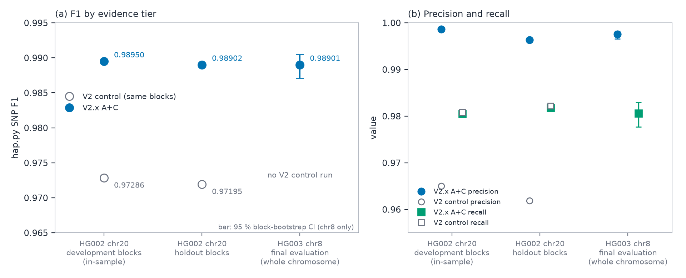
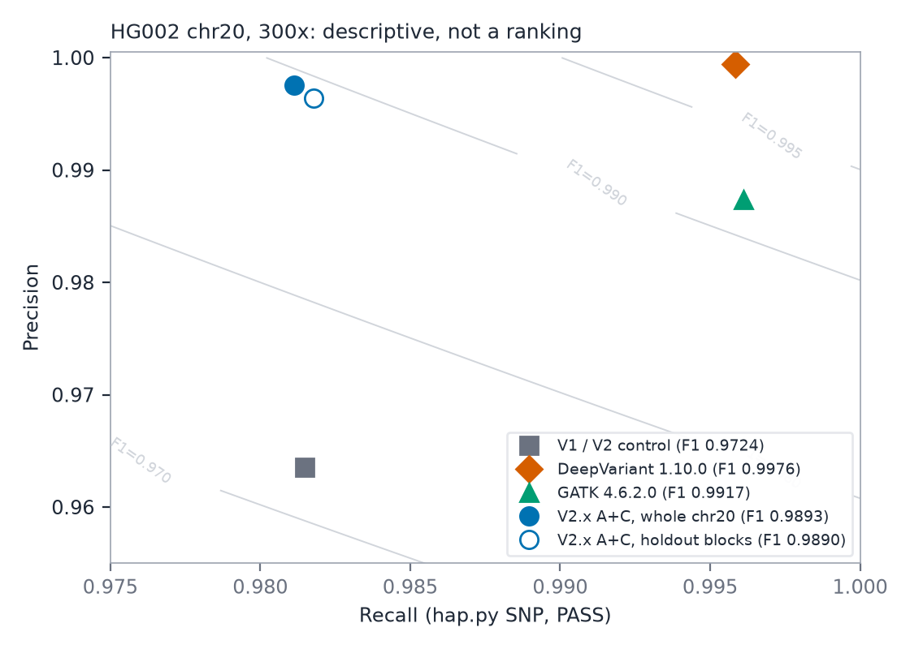

# AI_DNA_ANALYZER: a cascaded statistical SNP caller, a native execution engine and a lightweight accuracy layer, evaluated on GIAB samples

*Preprint draft, not peer reviewed. Every number in this paper comes from an artefact in the project repository (see Data and Code Availability). RO marks a number that rests on a project record whose raw artefact is no longer in the repository.*

---

## Abstract

AI_DNA_ANALYZER is a germline SNP caller for Illumina short reads, built from statistical components. It is reported in three versions that are kept separate. **V1** is a frozen protocol: a fixed-error binomial screen calls every locus, and a router sends only uncertain loci (0.04–0.16 % of loci in the regional experiments) to a per-read Poisson-binomial (PB) model. Its three constants were selected once and never changed. In eight experiments on GIAB samples HG002–HG004, routing kept F1 within 0.0027 of PB-everywhere. Two experiments were PRESERVED and five IMPROVED under the pre-specified rule, and one, whole chr20, was DEGRADED by a very small amount (ΔF1 −5.6×10⁻⁵, 10 discordant loci in 56.2 M). Ten true SNPs were lost across the validation cells. **V2** re-implements V1 as a multi-threaded C++ engine. On HG002 chr20 at 300× its VCFs are byte-identical to V1's, and it runs in about 2 minutes on 8 threads, against 5 h 10 min for the frozen V1 record (an indicative comparison from another day and cache state).

**V2.x** is a later accuracy layer that is not part of the V1 protocol. It combines cheap read-level evidence with a logistic classifier (A+C), fitted on the even 2-Mb blocks of HG002 chr20. On the withheld odd blocks it raised hap.py F1 from 0.97195 to 0.98902 (precision 0.9619 to 0.9964, recall 0.9822 to 0.9818) for about 1 % more CPU time and 221 MB of memory. In one final run, specified in advance, on a different sample and chromosome (HG003 chr8, 300×), it reached F1 0.989012 (block-bootstrap 95 % CI 0.98713–0.99048), precision 0.997567 and recall 0.980603 in 412 s at 326 MB. No control was run on that data. On HG002 chr20, DeepVariant 1.10.0 (F1 0.997613) and GATK 4.6.2.0 (0.991712) scored higher than V2.x (0.989271), under runtime conditions that are not matched, so the comparison ranks no caller. All results are SNP-only, on Illumina data, GRCh38 and GIAB high-confidence regions.

**Keywords:** variant calling; SNP; Poisson-binomial; cascade; confidence routing; Genome in a Bottle; hap.py; htslib; Amdahl's law

---

## 1. Introduction

A SNP call is a claim about one person's genome, so a change that saves computation has to be shown not to change the claim. This paper reports such a test for AI_DNA_ANALYZER, a germline SNP caller for Illumina short reads, and follows the project through three versions.

**Statistical background.** A simple way to call a SNP is to count the reads that support a non-reference base and compare the count with what a fixed sequencing-error rate would predict (a binomial model). This is fast, but it treats every read as equally reliable. Modelling each read's own error probability from its base quality improves discrimination at marginal loci. The price is that the distribution of a sum of independent, non-identical Bernoulli events, a Poisson-binomial (PB) distribution [1], must be evaluated at every candidate locus. Poisson-binomial modelling is established in variant calling: LoFreq uses per-base error probabilities to model the number of variant-supporting bases under a Poisson-binomial distribution [27]. In this project PB ran at roughly 6–10×10³ loci/s against 2.6–3.1×10⁶ loci/s for the binomial screen (throughput probes; document-level estimates of the ratio range from 240× to 520×).

**Cascades.** A cascade defers only hard cases to the costly stage. Cascaded classifiers are an established technique in vision [2], and tiered designs already exist in variant calling. Clair3 sends most candidates through a fast pileup network and the more complicated ones through a full-alignment network [18]. Psi-Caller assigns candidates to computational paths of differing cost using locus characteristics, and miniSNV applies binomial genotyping to high-quality loci and more expensive phasing and consensus procedures to the rest [25,26]. Routing in AI_DNA_ANALYZER differs in that it is based on the log-likelihood evidence of the initial statistical classifier and not on predefined locus-complexity or population-knowledge rules. The project sources do not document where the idea for this particular cascade came from, and only a brief literature search on its use in SNP calling was done. No claim of novelty or priority is made.

**The project.** The project started in August 2026 as a neural sequence caller trained on synthetic reads. On real reads, every neural stage was null or negative against the statistical baselines, apart from one weak positive (two of three seeds) on a side branch (Mamba-style models [16]; Supplement). The method that remained has three stages: a binomial log-likelihood ratio (LLR), a symmetric router around the binomial decision boundary, and a PB LLR on routed loci. This is **V1**. Its three constants were selected once, in August 2026, and never changed. They were tested unmodified on other regions, samples and one whole chromosome, and the state was archived as release v1.0 on 2026-09-20. After that, **V2** re-implemented V1 as a multi-threaded C++ engine with identical output, and **V2.x** added a small supervised second stage that changes the calls (Section 2). Evaluation uses GIAB truth sets [7,8] and hap.py [11].

**Questions.** For V1, does routing keep the accuracy of PB-everywhere, and where does the compute go? For V2, does an engine rewrite reproduce V1 exactly, and how much faster is it? For V2.x, can a cheap second stage fix the false positives that the router cannot reach, does the gain hold on withheld regions, and does it hold on a different sample and chromosome?

**Scope of the claims.** This paper reports the failures as well as the successes: one experiment-level NEGATIVE verdict, one DEGRADED chromosome, ten lost true SNPs, an evaluator artefact that produced F1 0.624, two native-code designs that failed their equivalence gates, and a comparison in which two established callers score higher than V2.x on the same data. It does not claim superiority over existing callers, genome-scale validity, cross-platform validity or clinical validity.

---

## 2. Versions and Evidence Tiers

AI_DNA_ANALYZER exists in three versions. They differ in purpose, and the results of one version are not evidence for another.

**Table 1. Versions of AI_DNA_ANALYZER and the evidence used for each.**

| Version | What it is | Changes calls? | Evidence in this paper |
|---|---|---|---|
| V1 (frozen protocol; release v1.0 archived 2026-09-20) | Binomial screen, router, Poisson-binomial (PB) model on routed loci, closed-form genotypes. Python with optional native C/htslib extraction. Constants selected once and never changed. | Defines the reference behaviour | Sections 4.1–4.5: eight experiments against a PB-only control, failure analysis, genotype layer |
| V2 (execution-engine rewrite, 2026-09-24) | C++20 engine that re-implements V1 with the same decision logic, no read tensor and multi-threading | No. VCFs are byte-identical to V1 on HG002 chr20 (300×) | Section 4.6: correctness gates and runtime |
| V2.x A+C (post-v1.0 accuracy layer, 2026-09-25) | Adds cheap read-level evidence and a logistic classifier fitted on HG002 chr20 development blocks | Yes. It is not part of the frozen V1 protocol | Sections 4.7–4.9: development, holdout, and a final evaluation on a different sample and chromosome |

The chronology is V1, then V2, then V2.x. V2.x was developed after the V1 protocol had been frozen and archived. It was not part of that protocol, and no V1 constant was modified for it.

The name AI_DNA_ANALYZER reflects the project's origin as a neural sequence caller. No neural network is part of any version described here. V1 and V2 are statistical procedures with hand-set constants. V2.x adds one supervised model, a logistic regression with 32 input features, fitted offline.

Results are grouped into four evidence tiers, and each table states which tier it belongs to.

1. *Development and optimisation evidence.* Data that were used to choose constants, features, coefficients or configurations: HG002 chr21:32–40 Mb for the V1 constants, and the even-numbered 2-Mb blocks of HG002 chr20 for V2.x. Whole-chromosome chr20 numbers mix development and holdout blocks and are labelled as engineering benchmarks.
2. *Holdout evidence.* Data from the same sample and chromosome that were withheld from fitting: the odd-numbered 2-Mb blocks of HG002 chr20 for V2.x. This is generalisation across regions, not across samples.
3. *Final independent evaluation.* One run of V2.x A+C on a different sample and a different chromosome (HG003 chr8), specified before it was run (Section 3.8).
4. *External caller comparison.* DeepVariant, GATK HaplotypeCaller and Clair3 run on the same inputs (Sections 4.9.1 and 4.9.2). These comparisons are descriptive and rank nothing.

## 3. Materials and Methods

### 3.1 Problem definition

The task is germline SNP calling at candidate loci from aligned Illumina short reads. Indels, multi-nucleotide variants and structural variants are neither called nor scored.

For a locus, let $n$ be the number of usable A/C/G/T observations and $k$ the count of the most-supported non-reference base. With a fixed per-base error $\varepsilon = 0.01$, the binomial success probabilities for the ALT base are $p_0 = \varepsilon/3$, $p_{\mathrm{het}} = \tfrac12(1-\varepsilon) + \tfrac12(\varepsilon/3)$ and $p_{\mathrm{hom}} = (1-\varepsilon) + \varepsilon/3$, each clipped to $[10^{-12}, 1-10^{-12}]$. The binomial log-likelihood ratio (LLR) is

$$\mathrm{LLR}_{\mathrm{bin}} = \max\{\log \mathrm{Bin}(k;n,p_{\mathrm{het}}),\ \log \mathrm{Bin}(k;n,p_{\mathrm{hom}})\} - \log \mathrm{Bin}(k;n,p_0),$$

with $\mathrm{LLR}_{\mathrm{bin}}=0$ when $n=0$. Because $\varepsilon$ is fixed, the LLR is a deterministic function of $(n,k)$.

### 3.2 V1: the frozen cascade

**Router.** A locus is routed to the PB model if $|\mathrm{LLR}_{\mathrm{bin}} - \tau_b| \le \delta$ with $\tau_b = 7.0$ and $\delta = 5.411872376933351$, that is, if $\mathrm{LLR}_{\mathrm{bin}} \in [1.588,\ 12.412]$. The cascade call is

$$
c(\ell)=\begin{cases}
\mathbf 1[\mathrm{LLR}_{\mathrm{PB}}(\ell)\ge 10.5] & \text{if routed},\\
\mathbf 1[\mathrm{LLR}_{\mathrm{bin}}(\ell)\ge 7.0] & \text{otherwise.}
\end{cases}
$$

The router measures uncertainty, not error. A locus at which the binomial model is confidently wrong is never routed.

**Poisson-binomial model.** For read $i$ with base quality $Q_i$, the error probability is $q_i = \mathrm{clip}(10^{-Q_i/10},\,10^{-4},\,0.25)$. The probability that read $i$ shows the candidate ALT base is $q_i/3$ under the null hypothesis $H_0$ (no variant), $\tfrac12(1-q_i)+\tfrac12 q_i/3$ under a heterozygous variant and $(1-q_i)+q_i/3$ under a homozygous variant. The ALT count is then a sum of independent, non-identical Bernoulli variables (a Poisson-binomial variable). Its exact log-pmf comes from the log-space recursion

$$\mathrm{dp}'[k]=\mathrm{logaddexp}\big(\mathrm{dp}[k]+\log(1-q_j),\ \mathrm{dp}[k-1]+\log q_j\big)$$

over at most 48 retained reads, and $\mathrm{LLR}_{\mathrm{PB}} = \max(\ell_{\mathrm{het}},\ell_{\mathrm{hom}}) - \ell_{H_0}$. The estimand of the V1 protocol is

$$\Delta F_1 = F_1(\text{cascade}) - F_1(\text{PB-only}),$$

paired on the same loci, where PB-only means PB evaluated at every locus with threshold 10.5.

An earlier PB implementation clipped the ALT count to the tensor width. This turned the strongest evidence into NaN and then 0.0 above 48× depth (426 of 924 SNPs at about 69×; PB F1 0.684). It was fixed on 2026-08-16, before the frozen cascade was validated, and it is bit-identical wherever depth is at most 48. PB still scores at most 48 reads per locus.

**Extraction.** The region is tiled into 64-bp windows. A window is dropped whole if any base lies outside the high-confidence BED or if more than half its reference bases are N. For each surviving locus the extractor emits nine channels (four base counts, deletion/skip reads, insertion reads, depth, quality sum, mapping-quality sum). Reads are admitted at mapping quality (MAPQ) of at least 20 and excluded if they are duplicate, QC-fail, unmapped, secondary or supplementary. A read adds to a base count only if its base quality is at least 13. The pileup depth cap is 8,000. Two `pysam.pileup()` defaults on which the code relies, `ignore_orphans=True` and `ignore_overlaps=True`, are part of the contract. For PB, a second extractor builds a per-locus tensor of up to 48 admitted reads ordered by the BLAKE2b digest of the read name. Coordinates are 0-based half-open internally and are converted once at VCF output. Labels come from the truth VCF, and the scoring frame is restricted to Normal and SNP loci.

**Figure 1.** Architecture and data flow of V1. Aligned reads, reference and confident regions feed window extraction (native C/htslib backend by default, pysam as reference and fallback). The binomial screen ($\varepsilon = 0.01$, threshold 7.0) calls every locus. The router sends loci with $|\mathrm{LLR_{bin}} - 7.0| \le 5.4119$ to the read-tensor extractor (at most 48 reads) and the PB model (threshold 10.5). Loci outside the band keep the binomial call. The genotype layer (Method C) assigns GT and GQ to the allele calls without changing them. The dashed branch is the PB-only control, which evaluates PB at every locus and is paired with the cascade for $\Delta F_1$. V2 re-implements this flow without changing it. V2.x adds a second-stage classifier that is not shown.

**Table 2. Frozen V1 parameters.**

| Parameter | Value | Source |
|---|---|---|
| Binomial threshold $\tau_b$ | 7.0 | maximised validation F1 |
| PB threshold | 10.5 | maximised validation F1 |
| Router cutoff $\delta$ | 5.411872376933351 | 0.1 % validation quantile of $-|\mathrm{LLR}_{\mathrm{bin}}-7|$ |
| $\varepsilon$ (binomial, Method C) | 0.01 | fixed, not fitted |
| PB read cap | 48 | design |
| MAPQ / BQ minimum | 20 / 13 | design |
| `cascade.py` sha256 | `b0ee9f4b24fe06dc…` | unchanged through v16–v20 (recomputed in audit) |
| `method_c_regression.py` sha256 | `b5cea1f1660eb472…` | same |

**Provenance of the constants.** The 8 Mb of HG002 chr21:32–40 Mb at about 15× (subsample 0.203, seed 20260811) were split into 1-Mb blocks by index mod 4. Blocks 0 and 4 formed the training set (1.89 Mb, 2,544 SNPs), blocks 1 and 5 the validation set (1.91 Mb, 2,410 SNPs) and blocks 2, 3, 6 and 7 the test set (3.81 Mb, 5,704 SNPs). The thresholds maximised validation F1. The cutoff is the smallest coverage whose validation F1 lay within 0.0005 of PB-everywhere; every coverage of at least 0.1 % tied at 0.9784. The test blocks were scored once after freezing. A learned logistic router lost to this rule.

Two qualifications apply. One internal project record describes the cutoff as an F-beta optimum on a training split. That contradicts the record kept at the time the router was frozen, and the latter is followed here. The constants are also depth-specific: at 30× the validation optimum in a separate benchmark was 11.5/14.0 (binomial/PB), so the frozen pair runs off-optimum at other depths.

### 3.3 Datasets and ground truth for the V1 experiments

HG002 (son), HG003 (father) and HG004 (mother) form the Genome in a Bottle (GIAB) Ashkenazi trio [10]. They were analysed from the NIST Illumina 2×250 novoalign [15] GRCh38 BAMs (native depth about 47–74×, depending on region). HG005 is unrelated to them. It was analysed from the NHGRI 300× HiSeq novoalign BAM (header: novoalign V3.02.07; regional reads up to 250 bp), downsampled with `samtools view -s 42.09` [13] to about 30×. A platform-matched 2×250 HG005 product returned HTTP 404 on 2026-09-04 and 2026-09-15, which is why HG004 served as the interim second sample. Lower depths of HG002–4 came from `samtools view -s 42.<fraction>`, so depth cells are correlated downsamples of one library. Whether the HG005 library or instrument differs from HG002–4 beyond read length and aligner is not established.

Truth: GIAB v4.2.1 GRCh38 benchmark VCFs and high-confidence BEDs. Strata: GIAB v3.1 (`lowmap_segdup`, `alldifficult`, `tandemrepeats`) [7–9]. Reference: Ensembl r110 per-chromosome FASTA, with a `chr`-renamed copy for hap.py and the external callers.

Regions for v14 onward were chosen by scripts from public annotation before any caller ran. Per-run independence audits reported `all_ok` (not re-checked in the freeze audit). The v20 region is the whole of chr20, and no region was chosen or filtered after results were seen.

**Table 3. V1 experiments and their relation to the constant-selection data.**

| ID | Sample | Region | Depth | Loci scored | Truth SNPs | Evaluator | Relation to selection data (HG002 chr21:32–40 Mb, ≈15×) |
|---|---|---|---|---|---|---|---|
| v13 | HG002 | 13 chr21 regions | mixed | 24,583,412 | 33,893 | internal | 3 regions inside the selection span |
| v14 | HG002 | chr20:33–34, chr19:1–2, chr4:101–102, chr1:120–121 Mb | full/30×/15× | 10,368,078 | 12,261 | internal | other chromosomes, same sample |
| v15 | HG002 | chr16, chr15, chr7 (segdup), chr14 | full/30×/15× | 9,498,705 | 10,863 | internal | other chromosomes, same sample |
| v16 | HG002 | chr13:70–73 Mb | full/30×/15× | 8,726,751 | 14,274 | internal | other chromosome, same sample |
| v17 | HG002 | chr17:18–21 Mb | full/30×/15× | 7,400,175 | 8,484 | internal | other chromosome, same sample |
| v18 | HG003 | chr13:70–73 Mb | full/30×/15× | 8,699,208 | 13,266 | internal | other sample, same trio |
| v19 | HG004 | chr2, chr3, chr5 (3 Mb each) | full/30×/15× | 25,336,365 | 38,340 | internal | other sample, same trio |
| v20 | HG002 | chr20 whole (0–64,444,167) | 15× | 56,242,693 (56,266,816 extracted) | 70,324 (locus frame); 71,333 (hap.py) | internal + hap.py | other chromosome, same sample, same depth; 1 Mb previously in v14 |
| U-H2 | HG002 | chr21:32–44 Mb | 15× | 10,975,654 | 16,898 | hap.py | **contains** the selection span |
| U-H5 | HG005 | chr1:1,000,001–4,000,000 | ≈30× | 2,402,190 | 4,090 (RO) | hap.py | other sample; raw output unavailable (RO) |

RO marks a number that rests on a project record whose raw artefact is no longer in the repository.

### 3.4 Statistical evaluation for V1

**Evaluators.** The *internal evaluator* compares boolean call and truth masks at matching array indices, ignores REF, ALT and genotype, and applies the BED at window granularity. *hap.py 0.3.15* [11] (xcmp engine, left-shift and confident-region preprocessing on, window 50; one image digest for all runs) is allele- and genotype-aware and applies the BED per record. The two are not interchangeable, and every table states which one it uses. Locus-level metrics are conditional on the retained windows (Section 4.1.3).

**Paired comparison.** $\Delta F_1$ carries a 95 % percentile interval from a paired multinomial bootstrap over loci (10,000 resamples; seed 20260812 or the module default) [4,5]. This treats adjacent loci as independent. From v19 a 50-kb block bootstrap [24] (v19: 537 blocks; v20: 1,185 blocks; 2,000 resamples) and an exact McNemar test [23] on discordant loci were added. In v19 the block interval was 2.3× wider than the locus interval. No interval exists for any hap.py result or for stratum enrichments.

**Decision rule.** The rule is defined in the project's internal development record and implemented in the benchmark classification code. No external registry exists, and it is not established whether the rule preceded the v13 analysis. Per cell with at least 100 SNPs, and pooled:

- PRESERVED: the interval contains 0 and $|\Delta F_1| < 0.001$.
- IMPROVED: the interval excludes 0 with $\Delta F_1 > 0$.
- DEGRADED: the interval excludes 0 with $\Delta F_1 < 0$, or $|\Delta F_1| \ge 0.001$. As written, the second clause also fires for positive differences. The defect was disclosed at the time, and the implementation tests the clause after PRESERVED and IMPROVED.
- UNDERPOWERED: fewer than 100 SNPs or an interval half-width above 0.01. No cell fell here.

The protocol originally called the overall result CONFIRMED only if every powered cell and pooled result was PRESERVED. Five pooled results are IMPROVED (one of them, v14, belongs to an experiment whose verdict is NEGATIVE) and one experiment is DEGRADED, so that condition cannot be met, and **no global verdict is asserted**. There is no equivalence test and no multiplicity correction. The 0.001 margin corresponds to about 1.5 false calls at 765 SNPs, and its origin is not documented in the project record.

**Failure taxonomy.** For loci where the cascade and PB-only disagree, four classes are used: `router_avoids_fp` (cascade correct, PB false positive), `router_fp` (cascade false positive that PB avoided), `router_fn` (cascade lost a true SNP that PB found; the locus was not routed) and `router_recovers_fn`. Events are counted per validation cell, so a locus scored at two depths counts twice.

**Validation design.** Table 3 lists how each experiment relates to the selection data. No experiment is independent in every respect. Regional experiments change chromosome, v18 and v19 change sample within one trio, U-H5 changes sample outside the trio, and v20 changes chromosome only. U-H2 contains the selection span and is used for genotype and external-caller work, not as a held-out accuracy test. Each experiment reports the PB-only control next to the cascade.

### 3.5 Genotype reconstruction

The cascade fixes the allele call set, and a genotype layer assigns GT and GQ afterwards. With $n = k + $ the reference-base count, three methods were compared:

- **Method A:** every call is `0/1`.
- **Method B:** `1/1` if $k/n > 0.69$, else `0/1`. The value 0.69 was swept on a 0.47-Mb development region (chr21:30.0–30.47 Mb; 555 calls).
- **Method C:** for $\theta \in \{\varepsilon, 0.5, 1-\varepsilon\}$ (GT `0/0`, `0/1`, `1/1`) with $\varepsilon = 0.01$ fixed, GT is the argmax of $\log\mathrm{Bin}(k;n,\theta)$ and GQ $=\min(10\log_{10}(P_{\text{best}}/P_{\text{second}}), 99)$ with a flat prior. If `0/0` wins, the call is written `0/1` with GQ capped at 5 (7 of 16,124 sites on the hold-out).

A vectorised implementation replaced the reference scipy loop and matched it on the full call sets (0 GT and 0 GQ mismatches). Method C is used in all V1, V2 and V2.x VCFs.

### 3.6 V1 implementation and the native backends

**Native counts backend.** The reference path calls `pysam.pileup()` [14] once per 64-bp window and runs a Python per-read loop. `native/pileup_native.c` (about 220 lines, raw htslib [12]) makes one `bam_mplp` streaming pass over the whole requested span instead. It applies read admission in a callback, enables mate-overlap adjustment and returns a `(span, 9)` buffer. It is the default when built, and `AI_DNA_ANALYZER_DISABLE_NATIVE_PILEUP=1` restores pysam.

**Native read-tensor backend.** `native/reads_native.c` builds the PB tensor in C with one fresh pileup pass per 64-nt window (BAM and index opened once) and the same BLAKE2b ordering. The O(#intervals) confidence scan in `providers._is_confident` became a bisect lookup. Inputs that the C code cannot reproduce (missing SEQ, non-integer `NM`) fall back to Python.

*Equivalence* means identical values in all recorded output arrays under the filter configuration in use. It is claimed only for the listed validated inputs. The C code hard-codes the filter behaviour, so a different configuration needs re-verification.

**Timing.** All timings come from one machine (Intel i7-6700, 4 cores and 8 threads, 31 GiB) with a desktop session using about 1–2 cores. Most timings are single runs or medians of three. Four kinds of number are kept apart: *function-level* (one function, same input), *extraction-stage*, *pipeline-level* (all stages, same output hash) and *projections* (throughput × counts, which are not results).

### 3.7 V2 and V2.x: engine and accuracy layer

**V2 engine.** V2 is a C++20 executable (`dnav2`) that reproduces V1's decision logic. One streaming htslib pileup per task (up to 2,048 consecutive windows) feeds per-column counting, the binomial LLR and the router. For routed loci, at most 48 (base, Phred) pairs go directly to a scalar PB kernel. No read tensor exists. Workers are threads that claim tasks from an atomic counter, and results are written strictly in genomic order, so the output is deterministic for any thread count. The engine reads the truth VCF only to reproduce V1's scored-locus frame. The decision logic never uses it. Exactness relies on ports of the SciPy (cephes) `gammaln` and `log1p` routines, the glibc math library and a build with `-ffp-contract=off`.

**V2.x accuracy layer.** In the V2 control, 91 % of the false positives on HG002 chr20 lay outside the router's reach, in low-VAF loci whose ALT reads have much lower base quality than the reads of true variants. V2.x therefore adds a second stage at *candidate loci* (loci with $k \ge 3$ ALT reads; 163,705 loci, 0.29 % of the 56,242,697 scored loci). Two components were evaluated:

- *A, a cheap evidence layer.* For each candidate, 24 statistics are collected in the same pileup pass: ALT and REF base quality, mapping quality, strand balance, distance to the read end, edit distance (`NM`), soft-clipping, fraction of ALT reads with distinct start positions, and the fraction of reads with a gap, insertion or adjacent deletion at the locus. No second pass over the BAM is needed.
- *C, a logistic-regression classifier.* Its 8 inputs from the binomial and router stages (depth, $n$, $k$, reference-read count, count of reads supporting a third base, VAF, binomial LLR, routed flag) are combined with the 24 A features into 32 standardised inputs (counts as $\log(1+x)$). The coefficients and the decision threshold are stored in a text file (`A_C.model`), and the engine only evaluates a dot product.

Two further components were tested and not adopted: *B* (PB on more reads, or on independent 48-read blocks) and *D* (features from the neighbouring loci within 2–25 bp). All 16 combinations of A–D were evaluated. Loci with $k < 3$ keep the V2 path, including PB for routed loci (33 PB evaluations on chr20 under A+C, against 707 for V2).

**Development and holdout protocol.** The split was written before any feature table or label join was inspected (`native_v2x/analysis/SPLIT_PREREGISTRATION.md`). HG002 chr20 was divided into 2-Mb blocks: even-numbered blocks are development, odd-numbered blocks are holdout. Features, coefficients, the decision threshold and the choice of configuration were fitted or selected on the development blocks only, with leave-blocks-out cross-validation inside them. Each finalist was frozen, and its file hash recorded, before its holdout score was computed. The threshold was chosen to maximise the out-of-fold development F1. Uncertainty for differences against V2 comes from a paired block bootstrap (whole 2-Mb blocks, 4,000 resamples). The frozen V1 constants, MAX_READS = 48, SNP-only scope and the V1 scoring frame were not changed.

One transparency note applies. In an early exploratory script the holdout numbers of the B variants were printed next to the development numbers, but the B variant was selected by development F1. No model was refitted after a holdout number had been seen.

**Timing protocol for V2.x.** Runtime is the median of three interleaved warm-cache runs of the full HG002 chr20 (300×) with 8 threads, measured with `/usr/bin/time -v`. CPU seconds (user + system) are compared as well, because wall time on this machine varies by about ±5 % with the state of the page cache.

### 3.8 Final independent evaluation

The final evaluation was specified in a pre-registration written before any V2.x output existed for the data (`research/final_independent_eval/PREREGISTRATION.md`). It fixed the sample, region, model, command, scorer and stopping rule in advance. In particular, the run was to be executed once, without tuning, and a failure would be reported instead of repaired.

| Item | Value |
|---|---|
| Sample | HG003 / NA24149 (GIAB, father of HG002). V2.x used no HG003 data in any way. |
| Region | Whole chr8 (145,138,636 bp, GRCh38). It was not used by any V2.x analysis and was not among the V1 chromosomes of Table 3. |
| Data | GIAB NHGRI Illumina 300× NovoAlign BAM (NIST HiSeq Homogeneity dataset, NovoAlign V3.02.07, 148-bp reads), obtained for chr8 by ranged reads from the official NCBI file |
| Truth and confident regions | GIAB v4.2.1 GRCh38 `HG003` benchmark VCF and `noinconsistent` BED |
| Model | V2.x A+C only: engine and model file with the SHA-256 digests given in Section 4.8 |
| Scorer | hap.py 0.3.15, xcmp engine, same image and options as the chr20 benchmarks |
| Not run | V1, V2 control, PB-only, other V2.x variants, ablations |

HG003 is a different individual from the development sample and was sequenced separately. It belongs to the same GIAB sequencing project as HG002, with the same platform family, aligner, read length, reference and truth-set methodology, and it is the father of HG002. The evaluation therefore separates sample and chromosome from the development data. It does not separate platform, and it does not test another ancestry or a non-Illumina technology.

### 3.9 External caller benchmarks

*chr21:32–44 Mb (V1 era).* On HG002 at 15×, DeepVariant 1.6.1 [17] (CPU, WGS model), Clair3 v1.0.10 [18] (`ilmn` model, full pipeline; the `:latest` tag silently ran pileup-only and was rejected) and GATK 4.5.0.0 HaplotypeCaller [19,20] (no BQSR, because no known-sites resource exists for a subset) used the same truth, BED, reference and hap.py invocation. Strelka2 [21] was blocked (its bundled htslib asserts in `bgzf_hopen` against this host's zlib), and FreeBayes [22] was not run.

*chr20 at 300× (post-v1.0).* On the whole HG002 chr20 (NovoAlign, HiSeq 2500, 2×148 bp, 300×), DeepVariant 1.10.0 (CPU only, `WGS` model, 8 shards) and GATK 4.6.2.0 HaplotypeCaller (six pair-HMM threads) were run on the same host as AI_DNA_ANALYZER. The BAM has no read-group line, so GATK needed a separate copy with an added read group (about 20 min, not counted in its runtime). hap.py 0.3.15 used the xcmp engine, because the container image lacks the `rtg` tool that the vcfeval engine needs. Clair3 was not run on this input.

---

## 4. Results

### 4.1 V1: does routing preserve PB-only accuracy? (frozen protocol)

Sections 4.1–4.5 describe V1 and its Python/C implementation. Sections 4.7–4.9 describe V2.x, which changes the calls and is evaluated separately.

#### 4.1.1 Primary accuracy results

The router sent 0.039–0.108 % of loci to PB in the seven regional experiments (per depth cell 0.003–0.218 %, higher at lower depth and in GC-rich or repetitive windows). It sent 0.137 % on whole chr20 and 0.155 % on chr21:32–44 Mb (both 15×).

**Table 4. V1 cascade versus PB-only (internal evaluator, depths pooled).**

| Exp. | Sample / region | PB-only F1 | Cascade F1 | ΔF1 [95 % CI] | Routed | Loci that differ | True SNPs lost | Verdict |
|---|---|---|---|---|---|---|---|---|
| v13 | HG002 chr21, 13 regions† | 0.98162 | 0.98172 | +0.000103 [0.0000, +0.00022] | 0.108 % | 15 | 0 | PRESERVED (12/13 regions; 1 IMPROVED) |
| v14 | HG002, 4 × 1 Mb | 0.955726 | 0.956306 | +0.000581 [+0.000075, +0.001089] | 0.070 % | 41 | 5 (4 loci) | **NEGATIVE**; pooled IMPROVED |
| v15 | HG002, 4 held-out contigs | 0.925079 | 0.927766 | +0.002686 [+0.001968, +0.003414] | 0.058 % | 80 | 1 | IMPROVED |
| v16 | HG002 chr13 | 0.994600 | 0.994565 | −0.000035 [−0.000171, +0.000070] | 0.039 % | 3 | 0 | PRESERVED |
| v17 | HG002 chr17 segdup | 0.948070 | 0.949962 | +0.001892 [+0.001250, +0.002615] | 0.058 % | 38 | 2 | IMPROVED |
| v18 | HG003 chr13 | 0.993751 | 0.994013 | +0.000262 [+0.000076, +0.000483] | 0.041 % | 7 | 0 | IMPROVED |
| v19 | HG004 chr2/3/5 | 0.986405 | 0.987419 | +0.001014 [+0.000787, +0.001254]; block [+0.000520, +0.001601] | 0.041 % | 87 | 1 | IMPROVED |
| **v20** | HG002 chr20 whole, 15× | 0.97809 | 0.97803 | **−0.0000564** [−0.000105, −0.0000141]; block [−0.000108, −0.0000075] | 0.137 % | 10 | 1 | **DEGRADED** |

† Three regions lie inside the selection span. The remaining chr21 pool (2,306,207 loci) gave PB = cascade = 0.99233 with 2 discordant loci.

hap.py gives the same picture with Method C genotypes (no confidence intervals exist for these).

| Evaluation | PB-only F1 | Cascade F1 | ΔF1 | Discordant loci |
|---|---|---|---|---|
| HG002 chr21:32–44 Mb | 0.954656 | 0.954569 | −0.000087 | 3 of 10,975,654 |
| HG005 chr1:1–4 Mb (RO) | 0.952098 | 0.951862 | −0.000236 | 2, both cascade FPs |
| HG002 chr20 | 0.962851 | 0.962796 | −0.000055 | 10 |

**Figure 2.** ΔF1 = cascade − PB-only. (a) One row per experiment, depths pooled, internal evaluator. Bars are the 95 % paired locus-bootstrap interval, and the thinner lower bar is the 50-kb block-bootstrap interval where one exists (v19, v20). The v13 lower bound is the printed 0.0000. Filled triangles are hap.py points (HG002 chr21:32–44 Mb −0.000087; HG002 chr20 −0.000055) with no interval, and the open triangle is HG005 (−0.000236), record-only. The U-H2 row is the internal evaluator on the same region as the hap.py chr21 point. (b) Individual v14 and v19 cells by region and depth, 95 % locus-bootstrap intervals. The DEGRADED v14 chr20:33–34 Mb cell at full depth (ΔF1 −0.001262, interval [−0.003849, +0.001228]) is shown. Marker and colour give the pooled or cell verdict under the pre-specified rule, and the grey band marks |ΔF1| < 0.001. The figure carries no global verdict: v14 is NEGATIVE at experiment level and v20 is DEGRADED. Source values: Table 4, `TABLES_FINAL.md` Tables 2, S1, S2 and the hap.py summaries. Cells of v15–v18 are not plotted because their per-cell values are not in the final tables.

Two results carry a negative verdict, and both are reported at full size.

**v14.** One cell, HG002 chr20:33–34 Mb at full depth (765 SNPs), gave 26 false positives (FP) for PB and 28 for the cascade: ΔF1 −0.001262, interval [−0.003849, +0.001228]. The interval contains zero. The cell was DEGRADED through the $|\Delta F_1| \ge 0.001$ clause, which two extra false positives were enough to trip, and that made the experiment NEGATIVE although the pooled result was IMPROVED. This 1-Mb cell is contained in the whole-chromosome v20 run.

**v20.** Section 4.1.3.

**Reading the positive verdicts.** The IMPROVED experiments are driven by loci in segmental duplications [6], where PB produces false positives from low-VAF paralogous reads and the binomial screen rejects them (26 of 41 v14 departures, 36 of 38 in v17, 83 of 87 in v19). The authors of those experiments describe this as PB miscalibration on paralogous pileups, not as a property of the cascade. That reading is an interpretation, because no read-level phasing was done. On chr20 this class contributes 1 departure of 10, and the sign of ΔF1 reverses. The sign depends on local composition. The pre-specified claim is therefore only that accuracy is not lost, and the data show that it was lost, by a very small amount, on one chromosome.

#### 4.1.2 Cross-sample results

HG003 (v18) and HG004 (v19) reproduce the regional pattern (Table 4). HG002–4 are a father, mother and son sequenced in one batch, so this is weak evidence of independence. Five of the seven v18 departures sit in one segdup block of about 200 bp, and the v18 authors state that the test cannot separate generalisation across human variation from within-trio batch effects. A re-scoring of the HG004 caches with an independently written 50-kb block bootstrap gave 7 PRESERVED, 2 IMPROVED (both chr3) and 0 DEGRADED cells. It read the same BAM bytes and adds no sequencing evidence.

HG005 is the only unrelated sample. On chr1:1–4 Mb the hap.py F1 was 0.9519 (cascade) and 0.9521 (PB-only), with two discordant loci, both cascade false positives (RO: the post-fix hap.py output and cache are not in the repository, and a pre-fix run left under the same names, F1 0.0085, is invalid and was quarantined). One region of one unrelated sample supports neither a generalisation claim nor a population claim. The HG005 F1 is not comparable with the HG002 values, because region, depth and truth scope differ, and the HG002 region contains the selection span.

#### 4.1.3 Whole-chromosome run (v20)

*Design.* The run covered all of HG002 chr20 (0–64,444,167) at 15× (`samtools view -s 42.2114` of the 71× native BAM; 14.87× mean over scored loci) in 500-kb chunks. The constants were asserted equal to the frozen values at run time. The analysis scripts were hashed and the hashes recorded before results were opened. Nine chunks in the centromere (26.5–31.0 Mb) contain no whole confident window. The first run of this analysis was lost, and a full re-run reproduced it exactly (56,266,816 loci, 70,324 SNPs, 69,291/69,297 calls, 2,826 rescuable loci).

*Result.* 56,266,816 loci were extracted and 56,242,693 scored.

| Arm (locus evaluator) | TP | FP | FN | Precision | Recall | F1 |
|---|--:|--:|--:|--:|--:|--:|
| Binomial only | 67,000 | 2,339 | 3,324 | 0.96627 | 0.95273 | 0.95945 |
| PB only | 68,278 | 1,013 | 2,046 | 0.98538 | 0.97091 | 0.97809 |
| Cascade | 68,277 | 1,020 | 2,047 | 0.98528 | 0.97089 | 0.97803 |

The cascade routed 77,248 loci (0.137 %). ΔF1 = −5.64×10⁻⁵, with a locus-bootstrap 95 % CI of [−1.049×10⁻⁴, −1.41×10⁻⁵] and a block-bootstrap CI of [−1.08×10⁻⁴, −7.5×10⁻⁶]. Relative to PB-only, the cascade has 1 fewer TP, 7 more FP and 1 more FN. Ten loci disagree (cascade wrong, PB right: 9; cascade right, PB wrong: 1; McNemar exact p = 0.021, resting on ten events). Excluding the 1 Mb scored earlier in v14 gives ΔF1 −5.70×10⁻⁵ [−1.06×10⁻⁴, −1.42×10⁻⁵]. A random router at matched PB coverage (77,248 loci) lost 0.0186 F1 against PB-only, close to the binomial-only level, so the frozen router does real work at this coverage. Diagnostic sweeps of the cutoff from −30 % to +20 % kept locus F1 between 0.97722 and 0.97808 (PB-only 0.97809), and a wider band does not remove the loss. Nothing was changed on the basis of these sweeps.

Under hap.py (same image and settings, Method C genotypes), PB-only reached TP 67,700, FP 1,591, FN 3,633, F1 0.96285 and the cascade reached TP 67,699, FP 1,598, FN 3,634, F1 0.96280. ΔF1 is −5.5×10⁻⁵, so the two evaluators agree in direction and size. The hap.py F1 is lower than the locus F1 because its denominator includes window-dropped SNPs and because it scores genotypes.

*Verdict.* The run is DEGRADED under the unchanged rule: clause 1 fires (the interval lies wholly below zero), and the block bootstrap and the exclusion sensitivity agree. The magnitude is 0.0056 F1 percentage points, 18× smaller than the 0.001 margin, from 10 discordant loci in 56.2 M. The cell is DEGRADED because 70,324 SNPs give it the power to detect an effect that small (interval half-width about 5×10⁻⁵). It is not a large loss, and it is not "no significant degradation". Whether such a difference matters depends on the use, and this paper takes no position.

*Independence.* chr20 is a different chromosome from the selection region, but the same sample, library and depth. One Mb of it was scored in v14. Only 15× was run. This run provides chromosome-level separation only.

**Table 5. Truth-SNP denominators.** Locus-level metrics are conditional on the retained windows. hap.py denominators include window-dropped SNPs.

| Quantity | HG002 chr20 | HG002 chr21:32–44 Mb | HG005 chr1:1–4 Mb (RO) |
|---|--:|--:|--:|
| Truth SNPs in confident BED (chr21, HG005: hap.py `TRUTH.TOTAL`) | 71,387 | 16,898 | 4,090 |
| In retained 64-bp windows | 70,357 | 16,597 | 3,948 |
| Dropped (no candidate possible) | 1,030 (1.44 %) | 301 (1.8 %) | 142 (3.5 %) |
| Excluded by overlapping indel label | 33 | — | — |
| Locus-evaluator denominator | 70,324 | 16,597 | — |
| hap.py `TRUTH.TOTAL` (SNP) | 71,333 | 16,898 | 4,090 |

On chr20, 71,387 − 1,030 = 70,357 and 70,357 − 33 = 70,324. hap.py's 71,333 differs from the BED count by 54 records through allele normalisation, which was not decomposed further. On chr20, 1,026 windows were partly outside the BED and 4 were chunk-end remainders. Whole-window dropping (`_build_windows`) is stricter than hap.py's per-record BED test, and it is not fixed. This *M-1 window filter* depresses recall by a region-dependent amount and does not affect the external callers. hap.py recall is bounded above by 0.986 on chr20 and 0.982 on chr21:32–44 Mb by construction. For HG005 the record gives recall 0.9403 as reported, 0.9742 restricted to retained-window truth (3,846/3,948), and at most 0.9751 if every dropped SNP were called. Dropped windows are enriched in difficult sequence, so that bound is not an estimate of achievable gain. A statement in an older HG005 report that 142 SNPs were "~35 %" of truth is an arithmetic error (142/4,090 = 3.5 %).

### 4.2 V1 failure analysis

#### 4.2.1 Taxonomy

The claim "the cascade never lost a true SNP that PB found" was made on 24.6 M chr21 loci (v13) and was refuted the next day.

A cascade-specific true-SNP loss is a truth SNP that PB-only calls, the cascade does not, and the router did not route. The historical consolidated count is 9 (v14: 5 events at 4 distinct loci; v15: 1; v17: 2; v19: 1). Raw `disagreements.json` records exist for 8 of these, and the v15 event is recorded in the project's internal development log without covariates. Whole chr20 adds one, so the expanded count is 10. v13, v16, v18 and HG005 have none. Whether any events coincide across depth cells beyond v14's own is not established.

**Table 6. V1 failure taxonomy (events per validation cell).**

| Class | Pre-chr20 events | v20 | Total | Status |
|---|---|---|---|---|
| Lost true SNP (`router_fn`) | 9 | 1 | 10 | observation; mechanism is interpretation |
| Cascade-introduced FP (`router_fp`) | 15 (v14 8, v16 2, v19 3, HG005 2 RO) | 8 (6 sites, 2 adjacent pairs) | 23 | observation |
| PB FP avoided (`router_avoids_fp`) | 153 (v14 26, v16 1, v17 36, v18 7, v19 83) | 1 (chr20:25,313,342) | 154 | interpretation: paralogous reads |

The events of each class share a signature:

- *Lost true SNP.* VAF 0.110–0.130 (v20: 0.125), mean base quality 36.7–38.8 (v20: 39.2), depth 27–107 (v20: 28). The binomial LLR is −5.30 to +1.57 (v20: 0.67), which is 0.02–6.9 below the router's lower edge, and the PB LLR is 11.8–24.1 (v20: 13.6). All were unrouted. They lie in `lowmap_segdup` and `alldifficult` regions where annotated, but the v20 event is in `alldifficult` and not in `lowmap_segdup`.
- *Cascade-introduced FP.* Binomial LLR 12.5–27 (v20: 12.5–13.6, a margin of 5.50–6.65, just outside the band) and PB LLR −5.5 to +10.45 (v20: 9.0–10.4, just under 10.5). Mean base quality 9.6–26.5 (v20: 11–22), VAF 0.15–0.60, and depth 6–17 in v20.
- *PB FP avoided.* VAF 0.07–0.13 and base quality 24.8–38.9, mostly in segdup. The v20 event (chr20:25,313,342) has VAF 0.13, depth 31, base quality 35.9 and lies in `lowmap_segdup`.

The three classes do not exhaust the departures. In v14, 41 departures split into 26 `router_avoids_fp`, 8 `router_fp`, 5 `router_fn` and 2 `router_recovers_fn` (raw `disagreements.json`; the sources name this class but do not restate its definition, and by its name it is the cascade recovering a PB false negative). The 80 v15 departures (cascade right 69, wrong 5, indeterminate 6) are not decomposed by class. The pre-chr20 row for `router_fp` includes 2 HG005 events (RO).

The lost SNPs sit at a variant allele fraction (VAF, the share of reads that support the variant) of about 0.12, with high base quality. There a fixed-ε binomial LLR is near zero, so the locus looks confidently negative. The router sees such a locus as "uncertain", not "wrong", but the locus lies outside the band by 0.02–6.9 LLR units and is never routed. This is an interpretation supported by an ε-shift analysis and was not tested at read level. The rate is about 1 per 10⁷ loci at VAF < 0.15, BQ ≥ 35 and depth ≥ 30× in segdup (internal project record). On chr20 it is 1 per 5.6×10⁷ scored loci. The cascade-introduced false positives have the opposite profile: high VAF, low BQ and low depth. Mapping quality does not separate failures (novoalign emits MAPQ 60–70 at 99.98 % of loci in v16). All 13 unfavourable v14 departures lay outside the band (margins 5.5–20.0 against the cutoff 5.412). In a diagnostic sweep on the v14 chr1 segdup cell, cutoffs 5.0–6.0 produced bit-identical calls, and raising the cutoff to 7.0 routed 8.7 % of loci while reducing departures only from 19 to 16.

**Figure 3.** Cascade-specific failure analysis. (a) Every disagreement between cascade and PB-only that has a stored record in `results/bench_v14`, `v16`, `v17`, `v18`, `v19` and `v20` (`disagreements.json`; `chr20_disagreements.json`), placed by binomial LLR and variant allele fraction against the router band [1.588, 12.412]: 154 PB false positives avoided, 21 cascade-introduced false positives and 9 lost true SNPs (the 8 with records in v14, v17, v19, plus the chr20 event). v20 events carry a black ring. The v15 lost SNP has no stored covariates, and the 2 record-only HG005 false positives are not plotted. (b) Composition of classified departures before chr20 (v14–v19: 15 cascade-introduced FP including 2 record-only HG005 events, 153 avoided PB FP, 9 lost true SNPs including the v15 event; n = 177) and on chr20 (8, 1, 1; n = 10). v14's 2 `router_recovers_fn` events and the 80 v15 departures are not classified in this panel. The counts in (a) were checked against Table 6 when the figure was generated.

#### 4.2.2 What the router captures

*Definitions.* A locus is PB-rescuable if PB-only is correct and the binomial screen is wrong. Router capture is the fraction of PB-rescuable loci that were routed. Both are relative to PB's correctness and not to truth recall. Two populations are kept apart: true-SNP rescuable (PB calls a real SNP that the binomial screen misses) and FP-avoidance (the binomial screen calls a non-variant that PB rejects).

**Table 7. PB-rescuable loci and router capture.**

| Dataset | Rescuable | Routed | Capture | True-SNP / FP-avoidance | Routed loci where binomial was already right |
|---|--:|--:|--:|---|--:|
| HG002 chr20, 15× | 2,826 | 2,817 | 0.9968 | 1,328 (1,327 routed; 0.9992) / 1,498 (1,490 routed; 0.9947) | 94.4 % |
| HG002 chr21:32–44 Mb, 15× (internal index) | 714 | 712 | 0.9972 | not split | 93.8 % |
| HG004 chr2/3/5, 9 cells (surviving caches) | 504 | 500 | 0.9921 | not split | 90.5 % |
| HG005 chr1:1–4 Mb, ≈30× (RO) | 142 | 140 | 0.9859 | 13 (all routed) / 129 (127 routed, 2 missed) | 88.1 % |

**Figure 4.** Router behaviour. (a) Fraction of scored loci routed to PB, pooled per experiment (bars). Dots show the individual v14 (12) and v19 (9) depth cells (full, 30×, 15×), and the hatched bar is HG005, record-only. Routed fractions: v13 0.1084 %, v14 0.0704 %, v15 0.0581 %, v16 0.0392 %, v17 0.0582 %, v18 0.0409 %, v19 0.0409 %, v20 0.137 % (77,248 loci), U-H2 0.155 % and HG005 0.0666 % (record-only). (b) Fraction of PB-rescuable loci that the router sent to PB, for two populations: chr20 true-SNP rescuable 1,327/1,328 and FP-avoidance 1,490/1,498, and HG005 (open markers, record-only) 13/13 and 127/129. Capture is relative to PB's correctness, not recall against truth, and the axis starts at 0.975. The mixed HG005 figure of 140/142 is deliberately not plotted. Source values: `TABLES_FINAL.md` Tables 2, S1, S2; `results/bench_v20/chr20_results.json` (`rescue_composition`); HG005 from the project record.

The HG005 capture of 0.986 mixes two functions and is not a true-SNP statistic. Only 13 of its 142 rescuable loci are true-SNP rescues. That composition does not carry over, since chr20 has 1,328 true-SNP opportunities (47 % of rescuable). On chr20, PB is worse than the binomial screen at 222 loci, 221 of them routed, so the cascade inherits PB's errors there. Roughly nine in ten routed loci did not need PB. Whether the fixed cutoff is well calibrated outside the tested depths and samples is not established. The routed fraction rises as depth falls (about 0.003–0.004 % at native depth, 0.013–0.015 % at 30× and 0.10–0.16 % at 15×).

#### 4.2.3 A rejected repair

An ε-sensitivity safety layer flagged loci whose binomial LLR changes under bracketing ε. It was frozen on validation data (50 candidate rules; the grid was informed by validation data) and scored on 9.5 M held-out loci. It flagged 1,016 loci and captured 74 of the 80 cascade–PB departures and the one lost SNP in v15. Escalating those loci to PB fixed 5 calls and broke 69, and random and reverse-confidence escalation at matched budget changed no call. The formal verdict of the safety-layer arm was WEAK POSITIVE, and the layer was rejected. The label belongs to that arm and not to cascade versus PB.

### 4.3 V1 genotype reconstruction

hap.py first scored the PB-only calls on chr21:32–44 Mb at F1 0.6238 (P 0.6394, R 0.6089; TP 10,290, FP 5,804, FN 6,608), against 0.9742 under the internal evaluator. The VCF writer had emitted `0/1` for every call. The truth set holds 11,120 hets, 5,777 hom-alt and 1 het-alt SNPs (16,898). Of the 5,777, 5,630 (97.5 %) were called with the right allele and the wrong genotype, which hap.py counts as both an FN and an FP. These are 85.2 % of the 6,608 FNs. Allele-level F1 with genotype ignored was 0.9651. The denominator difference of Section 4.1.3 (16,597 against 16,898) is a second, separate contribution. The first hap.py number was a correct measurement of a writer design choice and a misleading measurement of detection.

**Table 8. Genotype methods on the hold-out chr21:32–44 Mb (16,124 cascade calls; identical allele sets, symmetric difference 0).**

| Method | GT accuracy | hap.py P / R / F1 | het→hom / hom→het errors |
|---|---|---|---|
| A (always 0/1) | 0.6464 | 0.6382 / 0.6089 / 0.6232 | 0 / 5,637 |
| B (VAF > 0.69) | 0.9250 | 0.9135 / 0.8716 / 0.8921 | 1,195 / 1 |
| C (binomial likelihood) | 0.9888 | 0.9767 / 0.9319 / 0.9538 | 169 / 9 |

Method B reached genotype accuracy 1.000 on the 549-locus development region and 0.9250 on hold-out, where 65 % of truths are hets. Its 0.69 was fitted where 71 % of loci were hom-alt. Method C uses depth through the binomial likelihood and has no fitted parameter. Its remaining error concentrates in het truths with VAF > 0.69 (accuracy 0.8586) and low depth (< 10×: 0.9642).

On the final unified call sets (16,094 PB-only and 16,097 cascade sites), the same layer gave PB-only F1 0.9547 (TP 15,748, FP 346, FN 1,150; +0.3309 over forced 0/1) and cascade F1 0.9546 (FP 349). The 16,124-call hold-out and the 16,094-call scope come from different extraction passes, so 0.9538 and 0.9547 are not pooled and their genotype accuracies are not interchangeable. The layer does not change which alleles are called. It was tested for genotype accuracy on one region of one sample. The HG005 hap.py run (`FP.gt` 17, `FP.al` 3; RO) is the only other check.

### 4.4 V1 at 300× on chr20

The whole-chromosome V1 pipeline was also run on HG002 chr20 at 300× (Section 3.9; commit `9c0933e4`, worktree `opt-chr20`, not on `main`), together with DeepVariant and GATK (Section 4.9.2). Only 707 of 56,242,697 scored loci (0.001 %) fell inside the router band. At this depth the fixed-ε binomial LLR is almost always far from the decision boundary, so the cascade result is almost identical to binomial-only. That is a property of the frozen router at a depth far above its calibration regime (15×), not a defect of the run. Of 892 PB-rescuable loci, 191 were routed and rescued, and 122 routed loci were harmed (binomial right, PB wrong). At 300× and MAX_READS = 48, PB sees about 48 of roughly 300 reads per locus. hap.py scored the V1 cascade at TP 70,012, FP 2,649, FN 1,321 (precision 0.963543, recall 0.981481, F1 0.972429) and the PB-only arm at F1 0.971104 (Table 16). The 122 harmful routed loci have a higher VAF within PB's 48-read subsample (median 0.176) than the rescued ones (0.111), which suggests that the read cap influences PB's decision at this depth. This is a descriptive observation, and it was not tested by changing the cap in V1. V2.x tests it in Section 4.7.

### 4.5 V1 implementation work: native backends and the compute bottleneck

**Table 9. Speedups of the V1 Python/C backends by level. Only the first three levels are results.**

| Level | What | Data | Result | Conditions |
|---|---|---|---|---|
| Function | `load_counts`, native vs pysam | HG002 chr21:32.0–32.2 Mb, 187,200 loci | 16.14 → 0.54 s, 29.9× | single run |
| Function | same | HG005 chr1:1.0–4.0 Mb, 2,403,648 loci | 373.11 → 17.74 s, 21.03× | single run each |
| Function | same | HG002 chr21:32–44 Mb | 1,092.07 → 16.76 s, ≈ 65× | earlier measurement, not re-run |
| Function | `load_reads`, native vs pure Python | HG005 30×, chr1:1.0–1.4 Mb | 79.95 → 2.98 s, 26.9× | median of 3 |
| Function | same | HG002 15×, chr21:32.0–32.4 Mb | 89.63 → 2.56 s, 35.1× | median of 3; baseline n = 2 |
| Function | `load_reads`, Python threads ×4 | HG005 30× | 0.73× | GIL contention |
| Function | `load_reads`, Python multiprocessing ×4 / ×8 | HG005 30× | 2.86× / 4.39× | |
| Pipeline | native counts + reads, serial vs pure-Python serial | HG005 chr1:1.0–1.8 Mb, 8 × 100 kb | 271.7 → 99.9 s, **2.72×** | same output hash in all nine configurations |
| Pipeline | native + 4 processes | same | 38.2 s, **7.11×** vs pure-Python serial; ≈ 2.6× vs native serial | 4 physical cores |
| Pipeline | async prefetch | same | 1.21× (Python reads); 1.05× (native reads) | overlap with the numpy PB stage; not a `load_reads` speedup; the baseline of the 1.21× is not stated unambiguously in the sources |
| Pipeline | native, 1 worker / 4 workers | HG005 chr1:1–4 Mb | 309 s / 146 s (2.1×) | stage seconds, 1 worker: counts 5, reads 15, PB 287 |
| Pipeline, historical (RO) | only `load_counts` native | HG005 chr1:1–4 Mb | 1,392 → 1,140 s, 1.22× | `load_reads` 696 vs 775 s and PB 351 vs 349 s unchanged; source report lost |
| Measured BAM→calls | cascade (PB restricted to routed loci) vs PB-only | HG004 chr2:210.0–210.5 Mb | 284.66 s (sd 1.5) vs 469.96 s (sd 64.5), 1.65× | n = 3; both arms extract everything |
| Projection | caller-stage speedup | v13–v19 | 171–396× | per-locus throughput × routed counts; excludes I/O; **not a result** |

Ratios are medians of unrounded times, so recomputing from the rounded seconds printed here can differ in the last digit.

**Bottleneck.** In the counts-only configuration (RO), `load_counts` fell from 344 to 15 s and the pipeline gained 1.22×. Amdahl's bound for removing the 24.7 % counts share was 1.33× [3]. Removing the counts stage moved the bottleneck to `load_reads` and PB (98.7 % of that run's wall time). Native `load_reads` moved it again. The 26.9–35.1× function-level factors became 2.72× at pipeline level, against a ceiling of 3.06× for eliminating `load_reads` entirely ($p = 183/272$; observed 89 % of the ceiling). PB is now 287/309 s = 93 % of the HG005 3-Mb pipeline. On chr20, PB was 15,036 s of 15,674 s (95.9 %; the sum of the three timed stages, summed over workers; `load_counts` 194 s, `load_reads` 444 s; the binomial stage was not timed separately), with 6 workers on 4 physical cores, which inflates PB time. Removing PB alone would bound the speedup near 14×. The older 3-Mb times were not re-measured under current machine load, so the same-day comparison is the 800-kb matrix.

**Figure 5.** Where the time goes in V1. (a) Speedups against the pure-Python or pysam reference on a log axis, grouped by level: function level (`load_counts`, `load_reads`), pipeline level (native serial, native with four processes against pure-Python serial, native one against four workers) and the one measured BAM-to-calls comparison (cascade against PB-only, HG004 0.5 Mb, n = 3). Hatched = historical counts-only configuration, record-only. Projected caller-stage speedups (171–396×) and whole-genome estimates are projections and are not plotted. (b) Share of summed stage time: pure-Python and counts-only native pipelines on HG005 3 Mb (record-only), native one worker on HG005 3 Mb (287 of 307 stage-seconds in PB), and native six workers on whole chr20 (15,036 of 15,674 s; contention-inflated; the binomial stage was not timed separately). Values are in Table 9.

**Routing was not a CPU saving in V1.** The benchmark extractor computes PB at every locus, because the PB-only control needs it. The only measured BAM-to-calls gain from restricting PB to routed loci is the 1.65× above. Router-gated extraction (reading reads only for routed loci) was not implemented in V1. Two statements from an earlier native-backend report are withdrawn: that 65.1× was end-to-end, and that the pipeline was "17–80× faster" than GATK, DeepVariant and Clair3. Both used frozen PB masks and excluded `load_reads` and PB. htslib BGZF threading gave no speedup (`load_counts`, 300 kb, 1/2/4/8 threads: 15.25/16.23/15.74/16.00 s, n = 3), consistent with decompression being about 0.06 % of runtime.

**Equivalence gates and their failures.**

- *Counts backend, first attempt.* It differed from pysam in up to 282,335 of 1,684,800 cells on a 200-kb check, because of pysam's implicit `ignore_orphans` and `ignore_overlaps`. After the fix, the record reports 0 of 109,813,120 cells on 12 Mb of HG002 and 0/0/0 through the production entry on 187,200 HG002 and 75,072 HG005 loci (RO: those reports were lost when a working copy of the repository was wiped). The repository's equivalence-gate output records two full chr20 chunks (chr20:40.0–40.5 and 46.0–46.5 Mb; 980,928 loci) recomputed with all native code disabled, with all nine arrays byte-identical to the production cache. *Scope:* native/reference equivalence on chr20 was established on these two chunks only (980,928 of 56,266,816 loci, 1.7 %), not for every chr20 locus, and the gate was not extended. PB-only and cascade share the same extraction, so the paired ΔF1 is less exposed to an extraction difference than absolute or hap.py F1. That argument does not cover a difference that changes which loci are routed.
- *Counts backend, known limitation.* The native pass covers the whole span at once, while the reference makes one pass per 64-bp window. On synthetic BAMs with unique pair names and consistent mate fields, native equals pysam (20 of 20). On adversarial synthetic BAMs (a 12-name pool reused across hundreds of reads, mate fields matching no real mate) the two differ in thousands of cells per BAM (20 of 20 adversarial cases fail as expected in the fuzz-test suite; in the separate repeated-name regression suite 1 of 6 cases diverged and 5 passed, so divergence is not universal on such inputs). No divergence was seen on any validated real region. "Bit-exact" is not claimed for this backend. The code was not changed, because the frozen chr20 run used it, and a per-window pass, as in the read-tensor backend, would remove the difference.
- *`load_reads`, first design.* One pass over a run of windows differed in 30 cells on a randomised BAM with repeated read names, because htslib's mate-overlap adjustment pairs reads by name among those alive in the pileup, and a longer pass pairs them differently. The design was replaced by one fresh pass per 64-nt window. The final design showed 0 mismatches in more than 6.7×10⁸ tensor cells over five real chunks, 8 fuzz BAMs, about 574 k bisect-lookup queries against the original scan, and the two chr20 chunks above. A stronger whole-region gate from the first session was lost and not re-run.
- *Tests.* The original tests (a 12-category suite, 11 coordinate tests, "102/102") were lost. Three replacements were written from scratch and are not the originals. The full suite as recorded in the freeze report (2026-09-20; not re-run for this draft) had 490 passed, 0 failed, 1 skipped, 21 expected failures (the adversarial cases), 5 unexpected passes in the same category and 2 collection errors (two unrelated test modules failing to collect because of a pre-existing missing symbol).

No whole-genome time was measured for V1, and any genome-scale figure in the project documents is a linear extrapolation.

### 4.6 V2: execution-engine rewrite

V2 was built to change how V1 is executed and not what it computes. Its acceptance criterion was byte-identical output.

**Correctness (HG002 chr20, 300×).** All numeric kernels (the cephes `gammaln` and `log1p` ports, the binomial LLR and router mask, the PB kernel, Method C and the BLAKE2b ordering key) are bit-identical to the frozen V1 NumPy/SciPy code on the tested grids. A gate of 3,491 real loci (all 707 routed, all 892 PB-rescuable, 226 true-SNP losses, 1,906 PB≠binomial, 1,593 cascade≠PB-only and 1,000 seeded-random loci) passed 17 of 17 field checks with 0 mismatches, including 1,340,544 bytes of V1 read-tensor rows. A full `pb_all` run on 8 threads gave binomial and PB LLRs bit-identical to V1 on all 56,266,816 loci, the same 707 routed loci and calls, and cascade and PB-only VCFs byte-identical to the archived V1 VCFs (3,471,975 and 3,481,518 bytes). Every timed full run was re-checked against the V1 cascade VCF. Output is identical for 1, 2, 4 and 8 threads. The PB result depends on `alt_index` recounting, not on the `min(k, n_counted)` variant (2,400 of 3,491 loci differ between the two). The fused single-pileup path matched V1's per-window pileups on this BAM, and the V1-literal `--exact-windows` path is kept because V1's own source warns that the two can differ when read names repeat. Equivalence was verified on this BAM only.

**Performance.** V2 does not read reads into a tensor, and the PB arithmetic is not its bottleneck. In a single-thread profile of a 0.58-Mb slice, htslib pileup including BAM decoding took 52 % of the time, `count_column` 22 % and the PB arithmetic about 3 % of the `pb_all` mode. Table 10 gives the full-chromosome timings.

**Table 10. V2 versus V1 on HG002 chr20 at 300× (single runs unless stated; V1 from the frozen benchmark record).**

| Configuration | Wall time | Peak RSS | Note |
|---|---|---|---|
| V1 (frozen record: counts 790.5 s + read tensor 6,553.8 s + PB 11,137.8 s + router/genotype/VCF 96 s) | 18,578 s (≈ 5 h 10 min) | PB stage ≈ 8.0–8.2 GB; read tensor 21.6 GB | 1 thread; other day and cache state |
| V2 `pb_all` (both VCFs, all loci), 1 thread, warm | 1,059.5 s | 114 MB | ≈ 17.5× vs V1; same work |
| V2 `pb_all`, 4 threads, warm | 309.0 s | 162 MB | ≈ 60× vs V1; 3.43× vs 1 thread |
| V2 `pb_all`, 8 threads, warm | 182.5 s | 225 MB | ≈ 102× vs V1; 5.81× vs 1 thread |
| V2 cascade, 8 threads, warm | 119.6 s | 225 MB | ≈ 155× vs V1; PB on 707 loci only, so different work |
| V2 cascade, 4 threads, cold cache | 281.4 s | — | I/O-limited on a 5400-rpm HDD |
| V2 control in the V2.x benchmark, 8 threads, warm | 127.3 s (median of 3; range 118.4–129.9) | 219 MB | Section 4.7 |

The V1 baseline was measured on another day and cache state, so the ratios are indicative to about ±15 %. Three different quantities are mixed in the table and must be kept apart. The `pb_all` rows compare like with like (both VCFs, PB at every locus) and measure the implementation speedup. The cascade row also benefits from computing PB only where the cascade uses it, which is an algorithmic saving, and it cannot produce the PB-only control. Thread scaling adds the third factor. Hyper-threads added about 1.4–1.7× over four workers. Extra BGZF decompression threads made the cascade slower, and an AVX2+FMA build was not faster (null result), so V2 ships without SIMD. Memory-bandwidth and hardware-counter measurements were not available on this machine, so no claim about the memory-bound or compute-bound character of the engine is made.

**Scope of the V2 claim.** V2 is a re-implementation whose output equals V1's on one chromosome of one sample. It inherits every V1 limitation, including the M-1 window filter (1,041 of the 1,321 hap.py false negatives on this run lie outside V1's frame by design), MAX_READS = 48, fixed ε and the SNP-only scope. hap.py was not re-run on the V2 VCFs at the time, because the Docker image store was unavailable. The byte-identical VCFs make the V1 hap.py result apply to them by construction, but that is an inference. It was later confirmed when the V2 control was re-scored under hap.py for the V2.x benchmark (Section 4.7), which reproduced TP 70,012, FP 2,649 and FN 1,321 exactly.

### 4.7 V2.x: development and holdout evidence (HG002 chr20, 300×)

This section reports the *development and optimisation tier* and the *holdout tier* (Section 2). All numbers are hap.py 0.3.15 SNP results against GIAB v4.2.1 with the confident BED, on the whole chr20 or on its development or holdout blocks. Only the holdout rows are evidence about generalisation, and even those cover other regions of the same chromosome of the same sample.

**Motivation.** The V2 control reached hap.py F1 0.972429 on the whole chromosome (TP 70,012, FP 2,649, FN 1,321). Of its 2,649 false positives, 91 % lie outside the router's reach. They are low-VAF loci (median VAF 0.17) whose ALT reads have a mean base quality of about 19, against about 36 for true variants. A binomial model with a fixed ε does not see this. The router touches only 707 of 56 million loci.

**Table 11. Holdout results (odd 2-Mb blocks of HG002 chr20). Tier: holdout.** ΔF1 is against the V2 control on the same blocks, with a 95 % paired block-bootstrap interval (4,000 resamples of whole 2-Mb blocks).

| Model | F1 | Precision | Recall | FP | FN | ΔF1 vs V2 [95 % CI] |
|---|---|---|---|---|---|---|
| V2 control | 0.97195 | 0.96193 | 0.98219 | 1,323 | 606 | — |
| B (PB on independent 48-read blocks, minimum) | 0.97359 | 0.96517 | 0.98216 | 1,206 | 607 | +0.00164 [+0.00105; +0.00233] |
| D (neighbouring-locus context) | 0.97572 | 0.97416 | 0.97728 | 882 | 773 | +0.00377 [+0.00162; +0.00626] |
| A (evidence layer, one veto rule) | 0.98769 | 0.99331 | 0.98213 | 225 | 608 | +0.01574 [+0.01043; +0.02185] |
| C (classifier on binomial outputs only) | 0.98826 | 0.99544 | 0.98119 | 153 | 640 | +0.01631 [+0.01111; +0.02248] |
| **A+C (V2.x, final model)** | **0.98902** | **0.99636** | **0.98178** | **122** | **620** | **+0.01706 [+0.01183; +0.02326]** |
| A+B+C+D (all components) | 0.98890 | 0.99586 | 0.98204 | 139 | 611 | +0.01695 [+0.01176; +0.02307] |

The holdout F1 of A+C is 0.989017, with precision 0.996362 and recall 0.981781 (TP 33,410, FP 122, FN 620). The V2 control has F1 0.971953 on the same blocks (TP 33,424, FP 1,323, FN 606). The difference is ΔF1 = +0.01706. False positives fell by 1,201 and false negatives rose by 14. The other 9 combinations of A–D are in `research/V2X_ABLATION_RESULTS.csv`.

**Whole chromosome and development blocks.** On the whole of chr20 (development and holdout mixed, an engineering benchmark and not independent validation), A+C reached F1 0.989271 (TP 69,986, FP 171, FN 1,347; precision 0.997563, recall 0.981117) against 0.972429 for the V2 control, ΔF1 = +0.01684 [+0.01345; +0.02060]. On the development blocks, where it was fitted, A+C reached 0.989503. The out-of-fold development estimate was 0.98899, and the holdout 0.98902 is consistent with it. The in-sample development number carries some optimism of about 0.0005.

**What produced the gain.**

- *A alone is enough for most of it.* A single hard rule on the mean base quality of the ALT reads (veto if ≤ 25.33) gives ΔF1 +0.01574. The threshold reflects this data set's base-quality distribution and would not transfer to another platform or quality binning without refitting.
- *C adds expectations about allele fractions.* The classifier on the 8 binomial and router outputs alone gives ΔF1 +0.01631 and removes more false positives than A (153 against 225), at the price of more false negatives (640 against 608, with 606 for the V2 control). Shallow trees and a gradient-boosted ensemble were tried in place of the logistic regression. On the development blocks their out-of-fold F1 on the A+C features was 0.98833 for shallow trees, and 0.98942 for the boosted ensemble (used as an upper bound), against 0.98899 for the logistic regression. Neither was selected. The shallow trees happened to score 0.9892 on the holdout blocks, but the choice had been made on development results.
- *B did not help.* Running PB on more reads is monotonically worse under the frozen PB threshold of 10.5. Holdout F1 was 0.97195 with 48 reads, 0.97056 with 128 reads and 0.96957 with all reads, while 24 reads gave 0.97259. The LLR grows with the number of reads, and the fixed threshold is implicitly calibrated for about 48. PB on independent 48-read blocks, taking the minimum, was the best PB variant (+0.00164), and its effect disappears once C is present. This addresses the observation of Section 4.4 that PB's decision follows the retained reads. PB on 48 reads is better than PB on hundreds of reads, and neither is needed once C is present.
- *D did not help.* Adding the neighbouring-locus context to A+C changed holdout F1 by between −0.00016 and +0.00003 for every variant tried (windows of ±2 to ±25 bp gave 0.98896–0.98905 and reference-context features 0.98886, against 0.98902 without context). Local context carries no information beyond the per-locus model.
- *PB is not needed after the classifier.* Treating PB as an exception path for loci near the classifier's decision boundary did not raise F1. In the classifier's uncertain zone (|p − threshold| ≤ 0.5), which held 81 development and 114 holdout loci, the classifier was correct more often than PB on the development blocks (61 loci against 46 for PB on 48 reads).

A+C was chosen on development results: it had the highest out-of-fold development F1 of the 15 configurations (0.98899, tied with the identical A+B+C). A+C+D and A+B+C+D were statistically indistinguishable from it on the holdout blocks (ΔF1 against A+C −0.0001, interval includes 0) at greater complexity.

**Cost.** The extra work is done only on candidate loci in the same pileup, so there is no second pass over the BAM.

**Table 12. Runtime and memory of V2 control and V2.x variants (HG002 chr20, 300×, 8 threads, warm cache; three interleaved runs; median with range).**

| Model | Wall time, s | CPU time (user+sys), s | Peak RSS, MB | PB evaluations on chr20 |
|---|---|---|---|---|
| V2 control | 127.3 (118.4–129.9) | 795 | 219 | 707 |
| V2.x A | 124.7 (119.3–130.5) | 804 | 221 | 707 |
| V2.x C | 130.5 (119.5–131.7) | 801 | 221 | 33 |
| **V2.x A+C** | **128.0 (119.3–129.7)** | **803** | **221** | **33** |
| V2.x A+B+C+D | 128.0 (120.4–131.8) | 803 | 222 | 36 |

Compared with the control, A+C adds about 1.0 % CPU time, +2.4 MB of peak memory, and reduces PB evaluations from 707 to 33. The wall-time difference (+0.5 %) is inside the run-to-run spread of about ±5 % that this machine shows with the page cache, so only the CPU-time difference is interpretable. With a cold cache the times were 160.1 s (control) and 160.8 s (A+C), and with one thread 548.1 s and 566.4 s (+3.3 %, one run each). Each of the five measured models produced a single VCF body checksum for 1, 2, 4 and 8 threads, cold and warm caches and three repetitions. Models without a separate timing run share the compute path of a measured model, and no runtime is claimed for them.

**Where the remaining errors are.** Of the 620 holdout false negatives of A+C, 558 (90 %) are truth SNPs that the V2 frame cannot reach (outside a retained 64-bp window, the M-1 filter) or that have fewer than 3 ALT reads. A further 38 are candidates that were not called and 24 were called with a wrong genotype. The classifier therefore is not the limit on recall. Changing the frame would change the protocol and was not done. The transition/transversion ratio of the query set moved from 2.172 (V2 control) to 2.307 (A+C), which is closer to the ratio of the chr20 truth set (2.315 in the hap.py summary). This check does not depend on matching calls to truth records, and it points in the same direction as the removal of false calls.

**Provenance and reproducibility.** The classifier is a text file of 32 standardised coefficients (SHA-256 recorded for all 23 model files in `research/V2X_MODEL_FILES_SHA256.csv`). The engine reproduces an independent NumPy/scikit-learn implementation of the models without a single disagreement, for 15 models, and the read-evidence features matched an independent pysam implementation in 300 loci × 16 features with 0 disagreements. All V2.x code is in the uncommitted `native_v2x/` tree of the project worktree and is not part of the frozen V1 code.

---

### 4.8 V2.x: final independent evaluation (HG003 chr8, 300×)

This section reports the *final independent evaluation tier*. It is a single run of V2.x A+C, executed after all V2.x development and holdout work was finished, on a sample and a chromosome that no V2.x analysis had used (Section 3.8). The design was written down before the run. The run was executed once. Nothing was tuned, no repeat was made, and the reported numbers are those of that run.

**Run record.** The engine binary (`dnav2`, SHA-256 `adb2f4a0…bb7bdb`) and the model file (`A_C.model`, SHA-256 `e9942a22…2d51ce`) are those of the development work, and the model digest is the one recorded in `V2X_MODEL_FILES_SHA256.csv`. The command differs from the chr20 runs only in `--contig chr8 --contig-len 145138636 --sample HG003 --tag chr8_300x`. The BAM slice is 28,246,120,656 bytes (SHA-256 `248bb9aa…489e4626`). Its read counts equal those of the official index of the parent file exactly (297,503,843 mapped reads and 2,622,496 unmapped reads placed on chr8), and the reads are 148 bp long. The mean depth over the whole contig is 302.7× (`samtools coverage`; 99.2 % of positions covered, mean base quality 35.5, mean mapping quality 69.5). The run started on a page cache that held part of the BAM, and it was not dropped, as pre-registered.

**Table 13. V2.x A+C accuracy by evidence tier (hap.py 0.3.15, SNP, PASS). The V2 control was not run on HG003 chr8.**

| Tier | Data | TP | FP | FN | Precision | Recall | F1 |
|---|---|---|---|---|---|---|---|
| Development (in-sample) | HG002 chr20, even 2-Mb blocks | 36,576 | 49 | 727 | 0.998662 | 0.980511 | 0.989503 |
| Holdout | HG002 chr20, odd 2-Mb blocks | 33,410 | 122 | 620 | 0.996362 | 0.981781 | 0.989017 |
| **Final independent evaluation** | **HG003 chr8, whole chromosome** | **182,904** | **446** | **3,618** | **0.997567** | **0.980603** | **0.989012** |

For chr8, `TRUTH.TOTAL` is 186,522 SNPs and the query holds 183,350 SNP calls (`QUERY.UNK` = 0). hap.py reports 91 false positives with the right allele and a wrong genotype (`FP.gt`) and 65 with a wrong allele (`FP.al`). The 95 % block-bootstrap intervals (whole 2-Mb blocks, 73 blocks, 4,000 resamples) are [0.98713, 0.99048] for F1, [0.99655, 0.99828] for precision and [0.97770, 0.98299] for recall. The bootstrap point estimates recomputed from the annotated hap.py VCF are identical to the hap.py summary. The transition/transversion ratio of the calls (1.9322) and the heterozygous/homozygous ratio (1.7008) are close to those of the truth set (1.9302 and 1.6968).

**Figure 6.** V2.x A+C by evidence tier (hap.py SNP, PASS). (a) F1 for the development blocks (in-sample), the holdout blocks and the final evaluation on HG003 chr8. Open circles are the V2 control on the same HG002 chr20 blocks, and no V2 control was run on chr8. The bar on the chr8 point is the 95 % block-bootstrap interval (73 whole 2-Mb blocks, 4,000 resamples). No interval was computed for the chr20 points. (b) Precision and recall for the same tiers. Values are read from `V2X_ACCURACY_PERFORMANCE_BENCHMARK.csv` and `final_independent_eval/results_chr8_analysis.json` by `FIGURES/make_v2x_figures.py`.

**Table 14. Processing, runtime and memory of the chr8 run (single run, 8 threads).**

| Quantity | Value |
|---|---|
| Loci extracted / scored | 133,987,200 (2,093,550 windows) / 133,935,319 |
| Candidate loci with $k \ge 3$ (classifier applied) | 338,184 (0.25 % of scored loci) |
| Calls written (`n_calls`) | 183,350, of which 219 genotypes forced from 0/0 to 0/1 by Method C |
| Routed loci / PB evaluations | 1,018 / 102 |
| Wall time | 412.5 s (6 min 52.5 s), 324,800 loci/s |
| CPU time (user + system) | 1,930.2 s (467 % of one core) |
| Peak resident memory | 333,900 kB (326 MB) |

**Interpretation.** On a different sample and a different chromosome, V2.x A+C reached F1 0.989012 (block-bootstrap 95 % CI 0.98713–0.99048). This equals the holdout value on HG002 chr20 (0.989017) to within 0.00001, and the holdout point estimate lies inside the chr8 interval. Precision (0.997567) was slightly higher and recall (0.980603) slightly lower than on the chr20 holdout. The result is therefore consistent with the accuracy level seen on the withheld chr20 blocks. It does not show that the gain over V2 transfers, because no V2 control was run on HG003 chr8 and the pre-registered design excluded one. On chr20 the V2 control scored 0.971953 on the holdout blocks and 0.972429 on the whole chromosome. The V2 control on chr8 was not measured, and no number is inferred for it.

The frame audit explains most of the recall. The V1/V2 window frame keeps 2,093,550 windows on chr8. Of the 186,522 truth SNPs, 2,873 (1.54 %) lie outside all retained windows, and all 2,873 are false negatives. They make up 79 % of the 3,618 false negatives and cap recall at 0.98460 by construction. The remaining 745 false negatives lie inside retained windows. They were not decomposed further on chr8. The chr20 figures were similar (1,041 of 1,321 false negatives for the V2 control, and a recall ceiling of 0.986).

The runtime and memory are those of one single run with the BAM read from a 5400-rpm disk, with part of it in the page cache (467 % CPU use, against 641 % in the warm chr20 runs). They are not comparable with the warm-cache medians of Table 12 and were not repeated. The peak memory (326 MB) is higher than on chr20 (221 MB), and this was not investigated. The run took 2.84 s per Mb, against 1.99 s per Mb for the warm chr20 A+C median.

**What this evaluation shows and what it does not.** It shows that one frozen model, fitted on one sample and one chromosome, produced an F1 of 0.989 on another sample and another chromosome of the same platform and depth class, with a precision of 0.9976 and a recall of 0.9806 at 8 threads and 326 MB. It does not show generalisation to other sequencing platforms, read lengths, depths, ancestries or sample types. HG003 is the father of the development sample and shares its platform family, aligner and read length, so relatedness and shared technical properties could favour transfer. It is a single run on one sample. This paper therefore does not call it an independent biological replication or a sample-level validation across populations.

---

### 4.9 External caller comparisons

Both comparisons in this section are descriptive. They do not rank callers, for the reasons listed in each subsection. DeepVariant, Clair3 and GATK HaplotypeCaller solve the problem differently from AI_DNA_ANALYZER. DeepVariant classifies pileup images with a neural network, GATK re-assembles local haplotypes and applies a pair-HMM, and both call SNPs and indels, whereas AI_DNA_ANALYZER is a per-locus SNP-only statistical caller.

#### 4.9.1 chr21:32–44 Mb at 15× (V1 era)

The setting is described in Section 3.9. This region contains the 8-Mb span from which the V1 constants were selected, so it is a development-tier region for V1.

**Table 15. hap.py 0.3.15, SNP, PASS, `TRUTH.TOTAL` = 16,898 for every row (HG002 chr21:32–44 Mb, 15×).**

| Caller | Precision | Recall | F1 | TP | FP | FN | Calling-stage runtime |
|---|---|---|---|---|---|---|---|
| V1 PB-only + Method C | 0.9785 | 0.9319 | 0.9547 | 15,748 | 346 | 1,150 | not measured for this scope |
| V1 cascade + Method C | 0.9783 | 0.9319 | 0.9546 | 15,748 | 349 | 1,150 | not measured for this scope |
| DeepVariant 1.6.1 | 0.9340 | 0.9654 | 0.9494 | 16,313 | 1,153 | 585 | 819 s, 8 threads |
| Clair3 1.0.10 | 0.8965 | 0.9638 | 0.9290 | 16,287 | 1,880 | 611 | 1,342 s, 4 threads |
| GATK HC 4.5.0.0 (no BQSR) | 0.9877 | 0.9493 | 0.9682 | 16,042 | 199 | 856 | 287 s |

The V1 precision and recall were recomputed from the raw `happy.summary.csv` files. A pair of about 0.989/0.923 that circulated in project briefings for these arms appears in no hap.py output. The values of about 0.989/0.959 are the internal evaluator's result on a 16,597-locus denominator and are not comparable.

In this region the V1 arms have higher precision than DeepVariant (0.9785 against 0.9340) and lower recall (0.9319 against 0.9654), and GATK is higher than the V1 arms on precision, recall and F1. The V1 recall is also depressed by the window filter (bounded above by 0.982), which does not affect the external callers. The comparison covers one region, one sample and one depth, SNP-only, novoalign alignments, GATK without BQSR, single runs with unnormalised thread counts, and a region that contains the span from which the V1 constants were selected. It shows the shape of each caller's errors and does not rank them.

**Figure 7.** External caller comparison, hap.py 0.3.15, HG002 chr21:32–44 Mb at 15×, SNP, PASS, `TRUTH.TOTAL` = 16,898 for every row. (a) Precision against recall with F1 isolines. The two V1 markers overlap (PB-only F1 0.9547, cascade 0.9546). The dotted line marks the recall ceiling of 0.982 imposed by the window filter (Section 4.1.3). (b) False positives and false negatives per caller (Table 15). The region contains the chr21:32–40 Mb span used to select the V1 constants, GATK ran without BQSR, all results are single runs, and no runtime is compared. The figure implies no ranking.

#### 4.9.2 Whole chr20 at 300× (post-v1.0)

This comparison uses the whole of HG002 chr20 at 300× (Section 3.9), the same data as the V2 and V2.x development work. It is therefore not an independent evaluation of V1, V2 or V2.x. DeepVariant and GATK were not fitted on these data by this project, but the training data of their models were not audited for overlap with HG002.

**Table 16. hap.py 0.3.15 (xcmp), SNP rows, HG002 chr20 at 300×, `TRUTH.TOTAL` = 71,333. Runtimes are wall-clock on the same workstation and are not matched (see text).**

| Caller | Precision | Recall | F1 | TP | FP | FN | Wall-clock time | Calls indels |
|---|---|---|---|---|---|---|---|---|
| V1 cascade | 0.963543 | 0.981481 | 0.972429 | 70,012 | 2,649 | 1,321 | about 5 h 10 min (V1 record, single-threaded stages) | no |
| V2 control (byte-identical to V1) | 0.963543 | 0.981481 | 0.972429 | 70,012 | 2,649 | 1,321 | 127.3 s (8 threads, median of 3) | no |
| V2.x A+C, whole chr20 (development and holdout blocks mixed) | 0.997563 | 0.981117 | 0.989271 | 69,986 | 171 | 1,347 | 128.0 s (8 threads, median of 3) | no |
| V2.x A+C, holdout blocks only (Table 11) | 0.996362 | 0.981781 | 0.989017 | 33,410 | 122 | 620 | as above | no |
| DeepVariant 1.10.0 (CPU) | 0.999395 | 0.995836 | 0.997613 | 71,036 | 43 | 297 | 1 h 27 min 53 s | yes |
| GATK HaplotypeCaller 4.6.2.0 | 0.987347 | 0.996117 | 0.991712 | 71,056 | 911 | 277 | about 3 h 43 min, plus 20 min of read-group preprocessing | yes |

**Figure 8.** Precision against recall (hap.py SNP, PASS) for the callers of Table 16 on HG002 chr20 at 300×, with F1 isolines. The V1 and V2 control arms are identical. V2.x A+C is shown for the whole chromosome (development and holdout blocks mixed) and for the holdout blocks only. The figure is descriptive, and it does not compare runtime, memory or indel calling. Values are read from the hap.py summary files of the benchmark by `FIGURES/make_v2x_figures.py`.

The holdout row uses a different truth subset (the odd blocks) and is not comparable in absolute counts with the whole-chromosome rows. It is shown because the whole-chromosome V2.x row includes the blocks on which V2.x was fitted.

On this data, DeepVariant has the highest F1 (0.997613), followed by GATK (0.991712) and V2.x A+C (0.989271 on the whole chromosome, 0.989017 on the holdout blocks). The V2.x recall (0.981) is lower than DeepVariant's (0.996) and GATK's (0.996). A large part of that gap comes from truth SNPs that the V1/V2 frame cannot reach (Section 4.7). The V2.x precision (0.9976 on the whole chromosome) lies between those of GATK (0.9873) and DeepVariant (0.9994), and the V2.x recall is about the same as that of the V1 and V2 control arms (0.981). The V1 and V2 control arms score below all three on F1.

The runtimes in Table 16 were measured on the same workstation, but the conditions are not matched. The AI_DNA_ANALYZER runs use 8 threads on a BAM read from a 5400-rpm disk, with the V2 engine in C++ and the extra decision work confined to about 164,000 candidate loci. DeepVariant ran in a container with 8 shards and no GPU, and GATK ran with 6 pair-HMM threads after a read-group step that was needed to run at all (the BAM has no `@RG` line). The V1 record is a single-threaded Python/C pipeline. Neither external caller was tuned for this hardware, the runs were single, and memory was not profiled for DeepVariant or GATK, so no memory comparison is made. The caller architectures also differ in what they compute: DeepVariant and GATK call SNPs and indels over the whole region, whereas AI_DNA_ANALYZER calls SNPs only within 64-bp windows fully inside the confident regions. The precision figures are not perfectly like-for-like either, because hap.py classifies the multi-allelic and complex records of DeepVariant and GATK (19,234 and 42,700 `QUERY.UNK` in the SNP rows) differently from AI_DNA_ANALYZER's simple biallelic records. No general statement about relative speed follows from Table 16. It shows what each tool did on this input, on this machine, under these settings.

---

## 5. Discussion

**V1: routing preserved accuracy to within small margins, not exactly.** The cascade tracked PB-only closely in every experiment: pooled ΔF1 between −5.6×10⁻⁵ and +2.7×10⁻³ on the internal evaluator, and −2.4×10⁻⁴ to −5.5×10⁻⁵ on hap.py. The defensible summary is "preserved to within small margins in the evaluated GIAB/GRCh38 SNP-only setting", and not "preserved". One 1-Mb cell and one whole chromosome were DEGRADED under the rule the project wrote for itself, and the larger of the two carries the more informative number: ten discordant loci in 56 M, 18× inside the margin.

The sign of ΔF1 is set by composition. Where PB emits false positives from paralogous reads, the cascade gains, and those gains produce the five IMPROVED verdicts. Where that class is nearly absent (chr20: 1 event), the cascade has little to gain, and its 8 low-quality false positives and one lost SNP are not offset. The IMPROVED verdicts are therefore evidence about PB and not about the cascade, and the chr20 result is the cleaner test of the claim that accuracy is not lost. It failed by a very small amount.

**V1 routing works where the binomial screen is uncertain, and fails where it is confident.** On chr20 the band captured 1,327 of 1,328 PB-rescuable true SNPs and 1,490 of 1,498 FP-avoidance loci. The blind spot is structural. Lost SNPs at VAF ≈ 0.12 look confidently negative to a fixed-ε binomial, and low-quality false positives look confidently positive. The safety-layer experiment shows that escalating such loci to PB is not a repair, because in segdup PB is the less reliable model. At 300× the router engages on only 0.001 % of loci, so the V1 cascade is close to binomial-only there. Its accuracy depends on the depth at which the constants were chosen.

**Evaluators matter.** An F1 of 0.624 was a real measurement of the wrong thing, and it is the reason every table in this paper names its evaluator. An evaluator artefact (F1 0.624), a coordinate defect (HG005 F1 0.0085), a scope error (F1 0.237) and a truth-window filter each looked like model behaviour before they were traced. The first three were found because a number was too bad to accept. The window filter surfaced as a denominator mismatch (16,597 against 16,898). The reverse risk, a number that looks acceptable and is wrong, cannot be excluded for the HG005 rows, whose raw files are gone.

**V2: the speedup is mostly implementation and parallelism, and the science did not change.** The C++ engine reproduced V1's output byte for byte on one chromosome, and it removed the read tensor, so the memory need fell from gigabytes to a few hundred megabytes. The like-for-like speedup (both VCFs, PB at every locus) was about 17.5× on one thread and about 102× on eight threads, against a V1 record measured on another day. The V1 bottleneck (PB at 93–96 % of compute) was specific to that implementation. In the engine, PB arithmetic is about 3 % of the all-locus mode, and htslib decoding and per-read counting dominate. V2 inherits every accuracy limit of V1, including the window filter that makes about 79 % of the remaining false negatives unreachable.

**V2.x: most of the V1/V2 error was outside the router's reach, and cheap evidence removes most of it.** In the V2 control, 91 % of the false positives on chr20 lay in low-VAF, low-base-quality loci that neither the fixed-ε binomial screen nor the router touches. A rule on the ALT-read base quality captured most of the gain (ΔF1 +0.01574), and a logistic classifier on 32 inputs captured slightly more (+0.01706, holdout). The gain came from precision (0.9619 to 0.9964), while recall changed from 0.9822 to 0.9818 (14 more false negatives). The other mechanisms examined, PB on more reads, neighbouring-locus context, and PB as an exception path, added nothing once the classifier was present. In this architecture the PB stage could be dropped without loss on the tested data (33 PB evaluations remained, all on loci with fewer than 3 ALT reads). That statement rests on the chr20 holdout blocks. The final run on HG003 chr8 gave an F1 (0.989012) equal to the chr20 holdout value to five decimals, and its interval includes it. A single run on the same platform cannot say how much of this equality is luck, and a control on HG003 would have been needed to measure the gain itself.

The mechanism is the reason for caution. The rule that captures most of the gain uses the base quality of the ALT reads (about 19 in the false positives of the V2 control, against about 36 for true variants), and the classifier also uses the allele fraction, which suits a diploid germline model (heterozygous near 0.5, homozygous near 1). Both describe germline calls with this platform's quality profile. It should not be expected to hold for somatic or low-frequency variants, for other quality-score binning, or for other sequencers, and the model would have to be refitted for them. The result is one supervised model that is simple to inspect, not a general improvement of variant calling.

**External callers score higher on the same data.** On HG002 chr20 at 300×, DeepVariant 1.10.0 (F1 0.997613) and GATK 4.6.2.0 (0.991712) scored above V2.x A+C (0.989271 on the whole chromosome, which includes the blocks on which it was fitted; 0.989017 on the holdout blocks). V2.x precision (0.9976) is above GATK's (0.9873) and below DeepVariant's (0.9994). Its recall (0.981) is below both (0.996), and about four in five of its false negatives are truth SNPs that its window frame cannot reach (79 % on chr8, and 1,041 of 1,321 for the V2 control on chr20). DeepVariant and GATK also call indels and were run with different thread counts and in containers, so the wall-clock times of Table 16 (about 2 minutes for V2.x, 1 h 28 min for DeepVariant, about 3 h 43 min for GATK) describe what these tools did on this machine and do not show that one architecture is faster than another. What AI_DNA_ANALYZER offers, on the evidence here, is a small, inspectable, SNP-only statistical caller that processed this chromosome in about 2 minutes with 221 MB of memory. The data do not support a claim of parity with DeepVariant or GATK.

**Provenance.** The final evaluation was specified before it was run, and a failure would have been reported and not repaired. That protects the number against selection, but it also means that some analyses that would now be informative were not run (a V2 control on HG003, an external caller on chr8, a repeat run, a second sample). They are outside the scope of this report.

---

---

## 6. Limitations

**Table 17. Limitations and what they restrict.**

| Limitation | Restricts |
|---|---|
| SNP-only; no indels, MNPs, SVs. hap.py indel rows are zero by construction. | every claim |
| GIAB high-confidence regions only. Truth is least reliable in segdup, where cascade and PB differ most. Difficult regions outside the BED were not evaluated. | segdup-driven IMPROVED verdicts; all accuracy figures |
| V2.x was fitted on one sample, one chromosome, one depth and one platform (HG002 chr20, 300×, Illumina HiSeq/NovoAlign). The final evaluation adds one other sample and one other chromosome, but the same platform family, aligner, read length and depth class. | generalisation of V2.x to other samples, platforms, depths and ancestries |
| The final evaluation is a single sample (HG003, the father of the development sample) and a single chromosome. It was run once, without a repeat, and without an in-run V2 control or external callers. | any statement about variance between samples, or about the size of the V2.x gain on HG003 |
| The V2.x classifier encodes a germline diploid model. The base-quality rule of A was fitted to one data set. | somatic, mosaic, low-VAF, contaminated or polyploid samples; other quality binning |
| The V2.x threshold and coefficients come from development blocks. The in-sample development F1 (0.989503) is optimistic by about 0.0005 relative to the holdout. | in-sample numbers |
| The V1 whole-chromosome run (v20) shares sample, library and depth with the V1 selection data, and 1 Mb of it was scored earlier. chr20 is also the development chromosome of V2.x, so whole-chromosome V2.x numbers on chr20 mix development and holdout blocks. | independence of v20 (V1) and of Table 16 (V2.x) |
| HG002–4 are one related trio in one batch. HG005 is one 3-Mb region. V1 depth cells are downsamples of one library. There is no ancestry diversity. | generalisation of V1 across samples |
| HG005 raw post-fix artefacts (cache, region-scoped truth, hap.py output, error and rescue tables, performance reports) are not in the repository. | HG005 hap.py, M-1, rescue composition, enrichment and the counts-only 1.22× are record-only |
| V1 constants were selected at about 15× on chr21:32–40 Mb and are depth-specific (30× optimum 11.5/14.0). At 300× the router engages on 0.001 % of loci. | V1 performance at other depths and samples; U-H2 and the chr21 external comparison are not held-out |
| The V1 locus bootstrap treats loci as independent. Block CIs exist only for v19, v20 and the V2.x results. There is no CI for hap.py in V1, no multiplicity correction, no equivalence test, and the decision rule has a disclosed clause defect. | all V1 interval statements |
| The v20 DEGRADED verdict rests on 10 discordant loci, and taxonomy classes have single-digit counts on chr20. | mechanism claims from chr20 |
| True-SNP losses are counted per validation cell. The distinct-locus count is not established. | loss-rate statements |
| Window-level BED filtering (M-1) is unresolved: 1.44 % (chr20), 1.8 % (chr21) and 3.5 % (HG005, RO) of truth SNPs cannot be called by the V1/V2/V2.x frame. | recall of all versions; locus F1 is conditional on retained windows |
| The native counts backend of V1 is equal to pysam on validated real regions and realistic synthetic BAMs, not on adversarial repeated-name BAMs. On chr20 the bytewise gate covers 2 chunks (1.7 % of loci). | use on data with repeated read names or damaged mate fields |
| V2 equivalence to V1 was verified on HG002 chr20 (300×) only. The fused-pileup path can differ from V1's per-window path when read names repeat. | V2 on other data |
| Original V1 tests were lost. Replacements are reconstructions, and two unrelated test modules do not collect. | test-based support for the native backends |
| One machine with a desktop load, mostly single runs or n ≤ 3. Wall time varies by about ±5 % with the page cache. V1 chr20 PB time was inflated by 6 workers on 4 cores. Function-level speedups are not pipeline speedups. | all timing claims |
| External comparisons: one region (chr21) or one chromosome (chr20) of one sample. GATK ran without BQSR on chr21. Strelka2 and FreeBayes were not run. Clair3 was not run on chr20. Runtime conditions and thread counts are not matched, and DeepVariant and GATK memory were not profiled. hap.py used the xcmp engine. | any ranking, and any general runtime or memory statement |
| Router-gated extraction is not implemented in V1. The PB read cap of 48 is unresolved for V1 and is not needed in V2.x A+C. | V1 compute-saving claims |
| No environment lockfile. | environment reproducibility |
| The V2.x code is uncommitted, in a separate worktree. | code provenance beyond the recorded SHA-256 digests |
| No clinical validation of any kind. | clinical use |

---

## 7. Conclusion

Within the evaluated setting (GIAB samples, Illumina short reads, GRCh38, SNP-only, high-confidence regions), four things were shown, each at a different level of evidence.

1. *V1 (frozen protocol).* Sending under 0.25 % of loci from a binomial screen to a Poisson-binomial model kept pooled |ΔF1| within 0.0027 of PB-everywhere in eight experiments: two PRESERVED, five IMPROVED and one (whole chr20) DEGRADED by ΔF1 −5.6×10⁻⁵, with 10 discordant loci in 56.2 M. The experiment-level verdict of v14 was NEGATIVE, and ten true SNPs were lost across the validation cells.
2. *V2 (execution engine).* A C++ engine reproduced V1's VCFs byte for byte on HG002 chr20 at 300×, with 8 threads in about 2 minutes and 219–225 MB of memory. Routing itself was never shown to shorten a V1 run.
3. *V2.x A+C (accuracy layer, not part of the V1 protocol).* On withheld blocks of the development chromosome it raised F1 from 0.97195 to 0.98902 (ΔF1 +0.01706, block-bootstrap interval +0.01183 to +0.02326) for +1.0 % CPU time. In one pre-specified run on another sample and chromosome (HG003 chr8) it reached F1 0.989012 (interval 0.98713 to 0.99048), precision 0.997567 and recall 0.980603.
4. *External callers.* On HG002 chr20 at 300× DeepVariant 1.10.0 and GATK 4.6.2.0 scored higher than V2.x, under runtime conditions that are not matched.

Nothing here supports a claim beyond the tested setting: one platform family, one aligner, two samples for V2.x, two chromosomes, no other ancestry, depth, sample type or sequencing technology, and no indels. The remaining errors are a recall ceiling of about 0.985 imposed by the window frame (0.986 on chr20 and 0.9846 on chr8), ten lost true SNPs in V1, and false negatives with fewer than 3 ALT reads.

---

## Data and Code Availability

The project repository is `AI_DNA_ANALYZER` (https://github.com/Kramkost/AI_DNA_ANALYZER), which is public. An archived release of the V1 state is on Zenodo, DOI [10.5281/zenodo.22895746](https://doi.org/10.5281/zenodo.22895746) (tag `research-freeze-2026-09-20`, release v1.0.0). That release contains the V1 code, the native backends (`native/`), the chr20 validation (`experimental/chr20_validation/`, `results/bench_v20/`, `bench_v20_chr20.py`), the tests and the V1 research reports. Local history has since been rewritten, so some commit ids recorded in the project's freeze manifests no longer resolve against the current history. The SHA-256 hashes of the frozen files (`cascade.py` `b0ee9f4b24fe06dc…`, unchanged) are therefore the stable identifiers of V1.

The V2 engine (`native_v2/`), the V2.x engine, models and analysis scripts (`native_v2x/`), the reports and tables of V2 and V2.x (`research/V2_*`, `research/V2X_*`), the chr20 300× benchmark (`research/benchmark_chr20_300x/`) and the final evaluation (`research/final_independent_eval/`, including the pre-registration, exact commands, run logs, the output VCF, the hap.py outputs and all checksums) are present in the working tree of the repository at the time of writing. They are not part of the archived v1.0.0 release, and they have not been committed. The V2.x work was done on the base commit `ca60e12` with uncommitted changes. The engine binary and the model file are identified by their SHA-256 digests (`adb2f4a0…bb7bdb` and `e9942a22…2d51ce`), and the SHA-256 digests of all 23 V2.x model files are in `research/V2X_MODEL_FILES_SHA256.csv`. A future archived release is needed to give this code a citable identifier.

Input data are public GIAB files. Paths and SHA-256 checksums are in `experimental/stress_test/HG005_MANIFEST.json`, `research/REPRODUCIBILITY.md`, `experimental/chr20_validation/FROZEN_MANIFEST.json` and `research/final_independent_eval/checksums.txt`. Regional BAMs are not redistributed. The HG005 post-fix raw artefacts and the original native-validation reports were lost when a working copy of the repository was wiped on 2026-09-20, and they are not independently reproducible. The chr20 run reproduced its own lost first run exactly. Five HG005 evidence-map rows that were originally validated directly against raw hap.py output can no longer be checked against that raw output, because it was lost in the same incident. Their recorded values are unchanged, and they are now treated as record-only.

Environment: Python 3.14.3, pysam 0.24.0 (htslib 1.23.1), numpy 2.4.4, scipy 1.17.1, samtools/bcftools 1.23.1 [13], gcc/g++ 15.3.1 (C++20 for V2 and V2.x), Docker 29.4.1, Fedora 43, Intel i7-6700 (4 cores, 8 threads), 31 GiB. No lockfile exists. hap.py 0.3.15 (image `quay.io/biocontainers/hap.py:0.3.15--py27hcb73b3d_0`, manifest digest `sha256:d63b963a6cb01b4830393b22369e7b91d298e4156dde353739e74e4cfa4f96d0`) was run with Docker for V1 and with rootless Podman for V2.x and the final evaluation, because the Docker storage was not mounted. The Podman pull gave the same manifest digest. Other image digests: DeepVariant 1.6.1 `sha256:ccab95548e6c3ec28c75232987f31209ff1392027d67732435ce1ba3d0b55c68`; Clair3 v1.0.10 `sha256:57cf5d20f2ee39c1b91493ad1fb5c1b9fa838691efce818c3139caa5e6c6b974`. The V1 extension needs `native/build.sh` (Python headers and pysam's bundled htslib headers), and the V2 engines are built with `make -C native_v2x`.

## Author Contributions

The author conceived the study, designed the cascade architecture and validation protocol, directed the analysis, investigated discrepancies and failure cases, and reviewed and approved all results, interpretations and the final text. Claude (Anthropic) was used to write code, run experiments and analyses, and draft and edit the manuscript text under the author's direction.

## AI assistance disclosure

Claude (Anthropic) was used throughout this project for code implementation, running experiments and statistical analyses, investigating discrepancies, and drafting and editing this manuscript, as detailed in `research/AI_ASSISTANCE_DISCLOSURE.md`. That includes the V2 engine, the V2.x feature and classifier code, the final evaluation runs and the rewriting of this manuscript. The research question, experimental design, frozen constants and acceptance criteria were set by the author, who reviewed, verified, and takes responsibility for the final results, interpretations and conclusions.

## Conflict of Interest

The author declares no competing interests.

## References

*References 5, 9, 10, 14, 15, 20 and 23–27 were checked against publisher, indexing or repository records on 2026-09-21. The others are carried from the project bibliography.*

**Background**

1. Hong Y. On computing the distribution function for the Poisson binomial distribution. *Comput Stat Data Anal* 59:41–51 (2013). doi:10.1016/j.csda.2012.10.006
2. Viola P, Jones M. Rapid object detection using a boosted cascade of simple features. *Proc IEEE CVPR* I-511–I-518 (2001). doi:10.1109/cvpr.2001.990517
3. Amdahl GM. Validity of the single processor approach to achieving large scale computing capabilities. *Proc AFIPS '67 Spring Joint Computer Conference*, 483 (1967). doi:10.1145/1465482.1465560
4. Efron B. Bootstrap methods: another look at the jackknife. *Ann Stat* 7(1) (1979). doi:10.1214/aos/1176344552
5. Efron B, Tibshirani RJ. *An Introduction to the Bootstrap*. Monographs on Statistics and Applied Probability 57. Chapman & Hall, New York (1993). ISBN 978-0-412-04231-7.
6. Bailey JA, et al. Recent segmental duplications in the human genome. *Science* 297(5583):1003–1007 (2002). doi:10.1126/science.1072047

**Datasets and truth sets**

7. Zook JM, et al. An open resource for accurately benchmarking small variant and reference calls. *Nat Biotechnol* 37(5):561–566 (2019). doi:10.1038/s41587-019-0074-6
8. Wagner J, et al. Benchmarking challenging small variants with linked and long reads. *Cell Genomics* 2(5):100128 (2022). doi:10.1016/j.xgen.2022.100128
9. Dwarshuis N, et al. The GIAB genomic stratifications resource for human reference genomes. *Nat Commun* 15:9029 (2024). doi:10.1038/s41467-024-53260-y
10. Zook JM, et al. Extensive sequencing of seven human genomes to characterize benchmark reference materials. *Sci Data* 3:160025 (2016). doi:10.1038/sdata.2016.25

**Methods and software**

11. Krusche P, et al. Best practices for benchmarking germline small-variant calls in human genomes. *Nat Biotechnol* 37(5):555–560 (2019). doi:10.1038/s41587-019-0054-x. hap.py: https://github.com/Illumina/hap.py
12. Bonfield JK, et al. HTSlib: C library for reading/writing high-throughput sequencing data. *GigaScience* 10(2) (2021). doi:10.1093/gigascience/giab007
13. Danecek P, et al. Twelve years of SAMtools and BCFtools. *GigaScience* 10(2) (2021). doi:10.1093/gigascience/giab008
14. pysam developers. pysam, version 0.24.0 (bundles htslib 1.23.1) [software]. https://github.com/pysam-developers/pysam (accessed 2026-09-21). No journal citation is designated by the project.
15. Novocraft Technologies. Novoalign, version 3.02.07 as recorded in the HG005 BAM header [software]. RRID:SCR_014818. No peer-reviewed primary paper is designated by the vendor.
16. Gu A, Dao T. Mamba: linear-time sequence modeling with selective state spaces. arXiv:2312.00752 (2023).

**External callers**

17. Poplin R, et al. A universal SNP and small-indel variant caller using deep neural networks. *Nat Biotechnol* 36(10):983–987 (2018). doi:10.1038/nbt.4235
18. Zheng Z, et al. Symphonizing pileup and full-alignment for deep learning-based long-read variant calling. *Nat Comput Sci* 2(12):797–803 (2022). doi:10.1038/s43588-022-00387-x
19. McKenna A, et al. The Genome Analysis Toolkit. *Genome Res* 20(9):1297–1303 (2010). doi:10.1101/gr.107524.110
20. Poplin R, et al. Scaling accurate genetic variant discovery to tens of thousands of samples. bioRxiv doi:10.1101/201178 (preprint; no journal version found)
21. Kim S, et al. Strelka2: fast and accurate calling of germline and somatic variants. *Nat Methods* 15(8):591–594 (2018). doi:10.1038/s41592-018-0051-x
22. Garrison E, Marth G. Haplotype-based variant detection from short-read sequencing. arXiv:1207.3907 (2012).

**Statistical methods**

23. McNemar Q. Note on the sampling error of the difference between correlated proportions or percentages. *Psychometrika* 12(2):153–157 (1947). doi:10.1007/BF02295996
24. Künsch HR. The jackknife and the bootstrap for general stationary observations. *Ann Stat* 17(3):1217–1241 (1989). doi:10.1214/aos/1176347265

**Related variant callers**

25. Liu Y, Jiang T, Gao Y, Liu B, Zang T, Wang Y. Psi-Caller: a lightweight short read-based variant caller with high speed and accuracy. *Front Cell Dev Biol* 9:731424 (2021). doi:10.3389/fcell.2021.731424
26. Cui M, Liu Y, Yu X, et al. miniSNV: accurate and fast single nucleotide variant calling from nanopore sequencing data. *Brief Bioinform* 25(6):bbae473 (2024). doi:10.1093/bib/bbae473
27. Wilm A, et al. LoFreq: a sequence-quality aware, ultra-sensitive variant caller for uncovering cell-population heterogeneity from high-throughput sequencing datasets. *Nucleic Acids Res* 40(22):11189–11201 (2012). doi:10.1093/nar/gks918

---

## Supplementary material (existing files)

S1 v14 per-cell results, S2 v19 per-cell results, S3 genotype methods including the development region, S4 rescue analysis, S5 router-cutoff sweep (chr1 segdup cell), S6 correction ledger (coordinate bug C1, hap.py scope error C3, evaluator ambiguity C2, native-code provenance incident C4, empty-region crash C5, depth clipping, D1–D5 documentation errors, C7–C9): `research/TABLES_FINAL.md`. Neural-phase history and failed approaches F1–F11: `research/RESEARCH_TIMELINE.md`. Claim-to-source map: `research/CLAIM_EVIDENCE_MAP.csv`. V2 reports: `research/V2_NATIVE_ENGINE_REPORT.md`, `research/V2_ROUTING_ANALYSIS.md`, `research/V2_CORRECTNESS_RESULTS.csv`, `research/V2_PERFORMANCE_RESULTS.csv`. V2.x reports and tables: `research/V2X_FINAL_REPORT.md` and the `research/V2X_*.csv` files. chr20 300× benchmark: `research/benchmark_chr20_300x/BENCHMARK_CHR20_300X_FINAL.md`. Final evaluation: `research/final_independent_eval/FINAL_EVALUATION_REPORT.md`.

Figures 1, 3, 5 and 7 are generated by `research/FIGURES/make_v2_figures_more.py`, Figures 2 and 4 by `research/FIGURES/make_v2_figures.py` and Figures 6 and 8 by `research/FIGURES/make_v2x_figures.py`. Figure 3 is drawn from the frozen `disagreements.json` files. All other plotted values are copied from the tables cited in the captions.
